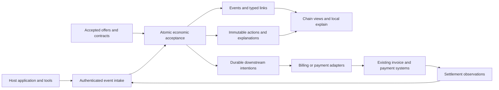

# Ledger Lab: atomic events, composable economics

Focused product and architecture review · September 20, 2026

Implementation update: the [Rust/SQLite/PostgreSQL foundation plan](LEDGER-LAB-RUST-FOUNDATION-PLAN.md) supersedes this report's TypeScript-engine package recommendation. The atomic-event product model and worked examples remain applicable.

Platform update: the [platform, cloud and hardware neutrality review](LEDGER-LAB-PLATFORM-NEUTRALITY-REVIEW.md) defines the proposed certified targets, deployment contract and release evidence for that Rust implementation. These remain plans, not completed certifications.

This report supersedes both the earlier venture verdict and the outcome-adjusted-ledger framing. It assumes development of the corrected concept and specifies the product boundary and first implementation. No product code was changed. Proposed interfaces and examples are designs, not implemented capabilities. Ecosystem findings use current primary sources; documentation comparison does not establish tested integration parity.

## 1. Category and firm product definition

**Ledger Lab is an Apache-2.0 event-native economic engine for AI products and composable tools. It accepts immutable atomic events, links them through typed relationships, applies authorized versioned policies, and atomically records every economic consequence and its explanation.**

**Developer promise: “Chain events. Compose pricing. Export the result anywhere.”**

The primitive is the independently addressable event. A chain supplies economic context; it does not replace event identity. Charges, costs, premiums, discounts, credits, allocations and shares are immutable actions attached to events or typed relationships. Customer, service, workflow and period totals are projections over those actions. An invoice is one possible downstream representation.

| Candidate category | Assessment |
|---|---|
| Event-native pricing engine | Best precise starting category, but “pricing” alone understates costs, responsibility, allocations and shares. Use **event-native economic engine** as the fuller category. |
| Economic runtime for AI workflows | Useful explanation of where it runs. “Runtime” can imply it executes tools or orchestrates workflows; explicitly bound it to economic decisions. |
| Programmable economics for composable tools | Strong positioning language and a good description of the extension. Too broad to define the initial package or API. |

The product is centered on `accept(event)`, not invoice adjustment, scenario simulation, delayed outcomes, or a Stripe wrapper. Generation, optimization, publication and acquisition are all ordinary events. Some arrive later; that changes neither their status as primitives nor the acceptance guarantee.

**Acceptance invariant:** event identity and deduplication, its authorized links, the applicable policy/contract snapshot, all resulting actions, their explanations, and downstream intentions commit in one local transaction—or none do. A valid event can produce zero actions, but its explanation must say why. Acceptance is never shorthand for “we queued the event and will decide its economics later.”

This is local economic atomicity. It does not promise an atomic transaction spanning a tool call, a card processor, a blockchain and the local database.

## 2. First-party and third-party tools share one invariant

The same calculation works whether all services belong to the host or an optimizer and publisher belong to outside providers:

> Authorized event + authorized relationships + accepted contract/pinned policy + explicit parties → one complete, immutable economic decision.

Third-party participation adds offer acceptance and authority boundaries. It does not require another engine. A first-party host can publish its own tariff; an external provider can publish a price manifest. Both become applicable only through a binding accepted by the party authorized to incur the obligation.

**A provider's event is evidence, not permission to charge.** An authenticated signature can establish who made a claim. It does not establish that the customer accepted that price, that the work succeeded, or that the provider may link itself to another party's revenue.

The coherent extension is pay-per-tool economics across `generation → optimization → publication → acquisition`: the host can charge customers, incur supplier costs, apply customer-specific terms and allocate a contracted outcome share while retaining the evidence for each decision. A provider may quote a per-call fee, a contextual premium, or a share formula. Ledger Lab evaluates only the accepted version, within its authorized scope.

Keep six roles explicit, even when one entity fills several:

| Role | Meaning |
|---|---|
| Service provider | Performs the service. |
| Cost originator | Identified source of the expense, such as a model vendor or subcontractor. |
| Contractual cost bearer | Party that agreed to incur the expense. |
| Invoice payer | Party designated to pay a particular payable/invoice. |
| Beneficiary | Party or business unit receiving the benefit. |
| Revenue recipient | Party entitled to the corresponding charge or share. |

These are per-obligation roles, not six global fields on a customer. An agency can incur a tool cost, its parent can pay the invoice, its client's brand can benefit, and the tool provider can receive revenue. An explicit payer delegation links agency and parent. Benefiting from work does not itself authorize billing.

## 3. Current tool-payment ecosystem: integrate below the decision layer

### What current protocols already cover

**x402:** the current repository/specification covers payment requirements, payment payloads, verification and settlement. Its documented schemes include exact charges and capped `upto` authorization; the repository also describes batch settlement. It is too narrow to describe today's x402 simply as a fixed-price HTTP paywall. Scheme and facilitator support must be checked individually. [Official repository](https://github.com/x402-foundation/x402), [v2 specification](https://github.com/x402-foundation/x402/blob/main/specs/x402-specification-v2.md)

The optional signed offer/receipt extension adds seller-authenticated offers and receipts. Its documentation warns that wire shape and field placement are not yet stable. Reuse its evidence through a versioned adapter; do not make its current JSON layout Ledger Lab's permanent domain schema. A signed seller offer still needs buyer authorization. [Offer and receipt extension](https://github.com/x402-foundation/x402/blob/main/specs/extensions/extension-offer-and-receipt.md)

**Machine Payments Protocol (MPP):** Stripe and Tempo introduced this open machine-payment standard in March 2026. Its MCP guide describes native Challenge → Credential → Receipt handling for paid tool calls. That is already a concrete solution for charging an agent to invoke a tool. Ledger Lab should not duplicate that transport and verification machinery. [Stripe announcement](https://stripe.com/blog/machine-payments-protocol), [MPP MCP guide](https://mpp.dev/guides/monetize-mcp-server)

MPP also documents scoped spending controls and, for its Tempo charge path, splitting a charge among recipients in an atomic on-chain transaction. The latter currently documents 1–10 splits, positive split amounts, and a sum strictly below the charge. These are real allocation/settlement capabilities; “payment protocols cannot split money” would be false. Their presence does not establish a full cross-event contract engine. [Spend controls](https://mpp.dev/guides/managing-agent-spend), [Split-payment guide](https://mpp.dev/guides/split-payments)

**AP2:** the currently reviewed v0.2 specification uses linked Checkout and Payment Mandates and receipts, including constrained autonomous authority and verification responsibilities. It places catalog and commerce APIs outside its scope. This is relevant authorization evidence for Ledger Lab to verify and reference. It is not a reason to invent a competing mandate standard. The current spec leaves agent-to-agent mandate delegation outside its defined scope, so do not assume arbitrary delegation is solved. [AP2 specification](https://ap2-protocol.org/ap2/specification/)

**Agentic Commerce Protocol (ACP):** its payment specification supplies delegated payment mechanics and supports merchant payment-provider integration. It belongs at the checkout/payment boundary, alongside the chosen commerce integration. [Official payment specification](https://agentic-commerce-protocol.com/docs/commerce/specs/payment)

**MCP:** use the tool invocation interface and its SDKs where appropriate. Tool descriptions and annotations are discovery/context signals, not a financial authority boundary. Host-controlled validation must determine whether the invoked principal may incur a specific obligation. [MCP's explanation of annotation limits](https://blog.modelcontextprotocol.io/posts/2026-03-16-tool-annotations/)

### The remaining product boundary

The reviewed sources establish paid calls, payment authority, offers, receipts, spending restrictions and some splitting. They do **not establish the complete packaged combination** of typed economic chains, deterministic composition across events and contracts, independently modeled responsibility roles, local atomic decision records and reproducible explanations. That is a bounded inference from these documents, not a claim that competitors cannot add it.

Ledger Lab should import protocol evidence, bind it to a local contract and invocation, calculate obligations, and export instructions or reconcile completed payments. If a protocol already charged for a call, record the resulting payment against that same obligation; do not create a second billable copy. Payment success is evidence of payment, not proof of commercial outcome or permission for another charge.

## 4. Billing incumbents: substantial primitives, different organizing objects

The distinction is the complete acceptance contract, not whether an incumbent can express the arithmetic. All these systems can participate in a solution assembled with application code. “Not established” below means absent from the reviewed documentation, not impossible or conclusively unavailable.

| System | Existing documented primitives worth reusing | Chain-engine conclusion |
|---|---|---|
| Stripe Billing/Meters and Invoicing | Usage ingestion, invoice items, customer balance transactions and credit notes. | Useful downstream recording and collection. A native atomic commit of typed links, contracts, all actions and explanations was not established. |
| Stripe/Metronome | Event metrics/rating, contracts, payer hierarchies, balance entries and event previews. | Strong direct overlap in rating. Reviewed primitives do not establish the entire multi-provider chain and authority model. |
| Lago | Usage billing, invoice/fee-linked credit notes and self-hosted code. | A possible invoice backend; exact event-chain acceptance semantics were not established. |
| OpenMeter | Event metering, customer attribution, invoicing and Stripe integration; Apache-2.0 code. | Strong reusable/competing primitives. Do not rebuild metering merely to claim an economic layer. |
| m3ter | Bill-linked credits/debits, locking and account balance records. | Economic corrections exist; they do not by themselves define atomic event-chain decisions. |
| Orb | Usage backfills, balance transactions, credit notes and pricing simulations. | Substantial rating/testing overlap. Full typed-chain contractual composition was not established. |

Evidence: [Stripe invoice items](https://docs.stripe.com/api/invoiceitems/create), [Stripe balance transactions](https://docs.stripe.com/invoicing/customer/balance); [Metronome customer hierarchies](https://docs.metronome.com/guides/pricing-packaging/billing-model-guides/model-hierarchical-customer-relationships), [event preview](https://docs.metronome.com/api-reference/invoices/preview-events), [manual balance entries](https://docs.metronome.com/api-reference/credits-and-commits/add-a-manual-balance-entry); [Lago credit notes](https://getlago.com/docs/api-reference/credit-notes/credit-note-object), [Lago license](https://github.com/getlago/lago/blob/main/LICENSE); [OpenMeter metering](https://openmeter.io/docs/metering/overview), [invoice lifecycle](https://openmeter.io/docs/billing/invoicing/invoice-lifecycle), [license](https://github.com/openmeterio/openmeter/blob/main/LICENSE); [m3ter credit lines](https://docs.m3ter.com/guides/billing-and-usage-data/running-viewing-and-managing-bills/adding-credit-line-items-to-bills), [debit lines](https://docs.m3ter.com/guides/billing-and-usage-data/running-viewing-and-managing-bills/adding-debit-line-items-to-bills); [Orb backfills](https://docs.withorb.com/api-reference/event/close-backfill), [balance transactions](https://docs.withorb.com/api-reference/customer/list-balance-transactions), [simulations](https://docs.withorb.com/simulations/evolve-pricing).

Current Stripe guidance recommends Metronome for most new usage-based integrations. Keep Billing Meters distinct from Metronome, but do not count Stripe's Metronome offering and Metronome direct as separate engines. [Stripe usage guidance](https://docs.stripe.com/billing/subscriptions/usage-based/recording-usage)

Use exactly one rating authority for each economic component. Either Ledger Lab calculates it and exports a pre-rated obligation, or an incumbent calculates it and Ledger Lab records an externally rated result with provenance. A duplicated rater creates reconciliation work without adding value.

Outcome-conditioned pricing itself is already in production: Intercom documents billable Fin outcomes, including defined resolution criteria. This demonstrates an application-specific outcome model, not a general-purpose multi-tool economic engine. An incumbent meter can also receive an application's prequalified outcome event; the remaining question is who owns qualification, contractual composition and evidence across tools. Ledger Lab must not market “charging for outcomes” as its invention. [Fin outcome definitions](https://www.intercom.com/help/en/articles/8205718-fin-ai-agent-outcomes)

## 5. Exact owned layer and operating boundary



Ledger Lab owns the economic schema, source/relationship permissions, accepted binding references, deterministic policy evaluation, action identity, local commit, explanations, projections and export/reconciliation contract. The host executes work, obtains commercial consent and selects trusted evidence sources. Tool providers supply offers and work evidence. Billing systems issue their documents. Payment systems authorize and move funds.

An output may be “customer owes host $3.35,” “host owes optimizer $0.15,” or “allocate $0.50 of this outcome component to publisher.” It is an obligation or settlement instruction, not proof that money moved. Represent observed payments separately. Do not build custody, wallets, payouts, KYC, tax calculation, chargeback operations, foreign exchange, a general ledger, or revenue recognition.

Own only the graph needed for economic decisions. A chain is a bounded typed DAG within a tenant, with stable root/work-product identifiers. Do not build a general graph database, workflow orchestrator, attribution model, tool marketplace or autonomous contract negotiator.

## 6. Developer model: events, offers, bindings and actions

### Event and link schema

Use a CloudEvents-compatible envelope plus versioned JSON Schemas for economic data. CloudEvents contributes event context, not pricing semantics. Keep trace identifiers as diagnostics rather than billable identity. [CloudEvents specification](https://github.com/cloudevents/spec/blob/main/cloudevents/spec.md)

Illustrative submission, with authentication supplied by the transport rather than trusted from the body:

```json
{
  "specversion": "1.0",
  "id": "opt-call-41-completed",
  "source": "urn:provider:optimizer",
  "type": "tool.optimization.completed.v1",
  "time": "2026-09-20T14:00:00Z",
  "subject": "asset:optimized-41",
  "data": {
    "chain_id": "campaign-17",
    "operation_id": "opt-call-41",
    "binding_id": "optimizer-contract-7",
    "authorization_id": "invocation-auth-41",
    "quantity": "1",
    "unit": "successful_optimization",
    "evidence_digest": "sha256:...",
    "links": [{
      "relation": "optimized_from",
      "target": {
        "source": "urn:host:generation",
        "id": "generation-19-completed"
      }
    }]
  }
}
```

The server supplies tenant/environment scope and resolves the principal's allowed source identity. It rejects a provider that simply asserts another provider's source. Event payloads cannot set authoritative payer, rate or outcome eligibility by fiat.

The submitted `binding_id` identifies the tool-side binding. Host-controlled chain configuration resolves every additional applicable binding, including the retail customer contract. Acceptance snapshots and evaluates that complete set together; an external provider cannot select which customer policies to omit.

Start with `generated_from`, `optimized_from`, `published_as`, `attributed_to` and `consumes_service`. Give each relation allowed source/target types, cardinality, linking authority and economic meaning. Provenance alone must not trigger a revenue share: a separate accepted policy must authorize that consequence. Bound hop count, events per chain and fan-out. Cross-tenant links require an explicit future sharing design; v0 rejects them.

### Offer → accepted binding → invocation authorization

An offer contains provider/service identity, immutable version/content hash, unit, currency, price formula, success/failure semantics, allowed contextual modifiers, caps, validity and evidence requirements. It may include commercial outcome terms, such as an approved-source acquisition premium. Discovery catalogs and descriptions are advisory; the binding records the exact accepted content.

A binding records offer hash, contract version, payer/bearer/recipient roles, authorized acceptor, assent evidence, permitted policy overrides, scope, effective interval, outcome authority and policy bundle hash. First-party pricing can use a host-controlled binding without public offer discovery. External offers can initially be local, operator-approved fixtures; a marketplace is unnecessary.

Before dispatch, the host issues an invocation authorization tied to binding, provider, operation, chain, principal, expiry, allowed units and maximum exposure. Include the relevant input digest when substitution would change what was authorized. Reserve local budget when enforcing a finite budget; settle or release that reservation exactly once. A reservation is not a charge. Supplier terms that permit later premiums must include their triggers, window and maximum exposure in this authorization.

Repricing a public manifest cannot change an accepted invocation. Exceeding a quote requires new authorization before more work. Expired authority prevents new invocations; it does not erase obligations for work already authorized. A contractual dispute is a new recorded decision, not silent deletion of work evidence.

### Immutable economic actions

Each action needs an action ID, transaction-group ID, effect key, kind, monetary component/book, currency and exact amount, source event IDs, relationship IDs, triggering match, contract and policy versions/hashes, rule ID, party roles and a structured explanation. Keep the policy contents or a durable content-addressed copy, not just a version label that can disappear.

Kinds include `charge`, `cost`, `premium`, `discount`, `credit`, `allocation`, `share` and `reversal`. The action's posting semantics determine which projection it affects. A supplier obligation can appear as the host's cost and the supplier's receivable without creating two independently billable obligations. An allocation partitions a named amount; it does not mint revenue. A share can create a supplier obligation from a named customer-revenue basis; it must not increase the customer's invoice again.

Use integer monetary quanta encoded as strings, with currency and scale, and exact rational/decimal intermediate calculations. Define signed rounding, the rounding stage and deterministic remainder allocation. Do not use JavaScript floating-point money. v0 uses one currency per chain and explicitly rejects cross-currency formulas.

Undo means a new action referencing the exact original entry and negating its **booked amount**. Undoing a +$5 premium creates −$5 even when today's premium is $7; undoing a −$0.75 discount creates +$0.75. Correction is reversal plus replacement in a linked group. Never edit or rerate an accepted action. This lifecycle rule applies to every action; it is not the product's organizing thesis.

## 7. Who authorizes each boundary

| Boundary | Authorizer and evidence | What the engine enforces |
|---|---|---|
| Event source | Host administrator grants principal scoped event types and source IDs. | Authenticated principal matches scope; schema, size and rate limits pass. |
| Relationship | Host's link policy names which source can assert each relation. | Both endpoints accessible, correct types, permitted scope, no forbidden cycle or duplicate effect. |
| Provider offer | Provider publishes authenticated/versioned content. | Integrity, provider identity and version; an offer alone creates no obligation. |
| Contract acceptance | Authorized bearer/payer representative or previously delegated host authority accepts terms. | Accepted content, party mapping, scope and assent record exist. Host cannot invent consent for someone else's bill. |
| Invocation | Host integration operating within that binding authorizes a specific call. | Operation, provider, units, exposure, audience, expiry and budget fit. |
| Policy | Host's designated pricing administrator publishes immutable bundles; counterparty assent applies where supplier terms change. | Only permitted modifiers can affect the binding; exact version pinned. |
| Outcome | Contract designates an attribution source and eligibility rules. | Claim identity, evidence, window, relation and revision meet that contract. Provider self-assertion is insufficient unless explicitly authorized. |
| Invoice payer | Contract/payer delegation identifies who pays which obligation. | Beneficiary or event emitter cannot substitute the payer. |
| Export/payment execution | Operator's adapter configuration and external payment authority. | Instructions match committed actions; payment credentials stay with the external executor. |

A host may discount its own retail charge without reducing the optimizer's contracted receivable. If it promises a customer cap while supplier costs exceed that cap, the host absorbs the difference unless separate accepted terms say otherwise. This separation is essential to the third-party model.

Use established authentication/signature libraries and protocol verifiers. Keep secrets outside events and explanation bundles. A hash detects change only relative to a trusted reference; it does not authenticate a sender. Avoid unrestricted policy code, network lookups during evaluation, and LLM decisions inside the monetary commit.

## 8. Deterministic composition and atomic acceptance

### Composition rules

Use a small declarative expression language with schema-checked, bounded predicates. v0 needs fixed/unit amounts, percentages of named bases, eligibility predicates, explicit exclusive groups, caps/floors and shares. Arbitrary JavaScript, recursive graph queries and user-supplied SQL do not belong in the first engine.

Publish a fixed evaluation order: contractual base amounts → eligible premiums → named-basis discounts → scope-specific cap/floor adjustments → shares/allocations. Every generated monetary delta is its own immutable action. The order is part of the pinned policy, not incidental array or arrival order.

Every percentage names its base: “20% of generation base” differs from “20% of base plus premium.” Stacking explicitly names additive or sequential behavior. Exclusive rules require a declared precedence; conflicting equal-priority matches fail validation. Caps/floors identify party obligation, component set, currency and evaluation window. Reject floor-above-cap and circular share bases.

Illustrative policy syntax, compiled and validated before a binding can reference it:

```yaml
policy: publisher-share-v2
trigger:
  type: outcome.acquisition.accepted.v1
  authority: approved-attribution
match:
  relation: attributed_to
  target_type: tool.publication.completed.v1
  target_binding: publisher-contract-2
  max_hops: 1
effect:
  kind: share
  component: publisher_outcome_payable
  phase: after_caps
  amount:
    percent: "25"
    basis: retail.acquisition_premium.net_after_caps
  debtor: binding.cost_bearer
  creditor: binding.revenue_recipient
  ceiling: {currency: USD, amount: "0.50"}
uniqueness: [binding, acquisition_claim, publication_operation, component]
```

The basis must resolve to an authorized component in the same acceptance or immutable prior inputs. The compiler rejects missing bases, currency mismatches, cycles and unauthorized party references. A concrete SDK call can remain small: `ledger.accept(event, {principal})` returns `accepted`, `duplicate`, `waiting_dependencies`, `conflict` or `rejected`, with a committed receipt only for the first two. `ledger.link(...)` creates a relationship-assertion event through the same path rather than editing graph storage directly. These are proposed interfaces.

For v0, caps/floors apply to the current acceptance group or a bounded chain stage with all required dependencies present. Do not sneak in retroactive monthly rerating. Broader running caps require serialized state and an explicit allocation/finality policy; event arrival order must not accidentally choose which provider loses revenue. Minimum charges should fire at a defined closure event, not once per incoming event.

### Commit algorithm

1. Authenticate and validate the candidate; locate its immutable binding and required dependencies. Any external evidence retrieval happens before the transaction and yields verifiable immutable inputs.
2. Enter a database write transaction; check scoped identity and payload digest, dependency versions, invocation/budget state and semantic claim uniqueness.
3. Resolve authorized links and evaluate the complete policy bundle against a consistent chain snapshot. Produce all actions and both applied/skipped rule explanations.
4. Insert event, dedupe record, links, exact snapshots, actions, explanations, applicable reservation changes and durable outbox intentions together.
5. Commit, then return the committed receipt. Dispatch externally only after commit. If the process dies after commit and before replying, retry returns that receipt.

Identity is scoped by tenant, environment, source and event ID. Identical identity/content is a duplicate; identical identity/different content is a conflict. A content digest uses a documented canonical representation and a cryptographic hash. Distinct delivery IDs for the same billable operation must still collapse through a semantic effect key—for example binding + economic component + operation/claim + authorized relationship/match. Preserve rule/version as provenance rather than allowing a renamed rule to evade semantic uniqueness. A retry or deployment of a new policy must not generate another effect. A deliberate replacement needs an explicit correction operation.

Two concurrent acceptances cannot each consume the same reservation or pass the same cap check. Start with a single SQLite writer and transactional constraints; do not rely on a preceding application-level “exists” check. Local SQLite WAL supports concurrent readers but still has one writer and filesystem constraints, which suit this bounded local deployment. [SQLite WAL documentation](https://www.sqlite.org/wal.html)

### Out-of-order events without half-acceptance

If a required predecessor or accepted binding is missing, place the raw candidate in a separately named inbox and return `waiting_dependencies`. It is **not an accepted canonical event**, has no accepted dedupe reservation, no economic actions and no settlement intentions. Inbox delivery deduplication may exist separately. Revalidate and atomically accept when dependencies are available. A permanently invalid candidate returns `rejected`; a changed payload for an already accepted identity returns `conflict`.

Optional future outcomes are not missing dependencies. Generation can be accepted with its complete current consequences; a later acquisition is independently accepted with its own complete consequences. A relationship asserted after both endpoints already exist is a new authorized relationship-assertion event, not a mutable edit to old event data. The effect key prevents the same relationship from charging again through a second assertion.

Determinism means the same accepted inputs, binding and policy yield the same actions. It does not mean an evolving chain has no new consequences. For supported DAG inputs, permutations of delivery should converge to the same result after pending dependencies resolve. Where a future feature intentionally uses processing order, that order must be explicit contractual input.

### Explain and replay

`explain(eventId)` and `explain(actionId)` show the trusted principal, accepted offer/binding, source events, traversed relation, evaluated inputs, rule/basis, rounding, party responsibility and destination intent. `explain(chainId)` projects the complete chain without hiding zero-charge or excluded matches.

Replay defaults to a read-only branch with no production outbox. Distinguish exact reproduction under original snapshots from hypothetical evaluation under a new policy. A simulation cannot become an accepted monetary history through a UI toggle.

## 9. Worked example A: a first-party AI application

All figures below are fictional USD policy fixtures. Tax and payment fees are excluded. Customer C accepted Host H's policy `retail-v3` before work. H runs generation and publication; an approved acquisition source supplies the final event.

```text
generation g1 ──published_as──> publication p1 ──attributed_to──> acquisition a1
```

The relation arrows express lineage; the acquisition event references p1 when submitted. Stored edge direction must follow the schema consistently rather than relying on this visual shorthand.

| Acceptance | Evidence and policy | New immutable actions | Customer projection |
|---|---|---|---:|
| g1 | Generation succeeded; accepted priority context and enterprise tier | Generation charge +$1.00; priority premium +$0.20; enterprise discount −$0.20, explicitly 20% of the $1.00 base | $1.00 |
| p1 | Authorized publication of g1 | Publication charge +$0.50 | $1.50 |
| a1 | Approved source claims one eligible acquisition for p1 under the accepted attribution window | Acquisition premium +$5.00 | $6.50 |

The generation acceptance creates three actions and its explanation/outbox intent in one commit. A crash cannot leave the +$1 charge without the promised discount. The tier and priority context come from authorized, snapshotted inputs rather than user-editable event labels. The acquisition event follows the same API and invariant as generation.

If a1 is later invalidated by the authorized correction source, a new reversal references its +$5 entry and appends −$5. The projection becomes $1.50. A current policy offering a $7 acquisition premium is irrelevant to that reversal. No earlier action changes.

## 10. Worked example B: several independently priced tools

Host H composes its generator, Optimizer O and Publisher P for Brand B. Brand's agency A is the contractual customer; Parent Q is its explicitly delegated invoice payer. H bears and pays external tool costs. Brand B benefits. Each recipient and obligation remains explicit.

Accepted terms, pinned before dispatch:

| Binding | Terms |
|---|---|
| A/Q → H, retail-v4 | Generation $0.80, optimization $0.30, publication $0.40; 10% discount on these base charges; acquisition premium $2.00; customer total cap $3.35 for this completed chain. |
| H → O, optimizer-offer-v7 | $0.10 per successful optimization; an additional $0.05 for one eligible approved acquisition linked to that output, within the agreed window. Maximum exposure $0.15. |
| H → P, publisher-offer-v2 | $0.15 per successful publication plus 25% of the named, capped retail acquisition-premium component. Maximum outcome share $0.50. |
| H → model supplier | Authoritative supplier cost record of $0.20 for generation. It is a cost observation tied to the existing supplier obligation, not permission to pay again. |

O and P cannot introduce a new price by emitting completion events. Their signed or authenticated receipts must match H's invocation authorizations and accepted terms. H's customer discount changes its retail proceeds, not either supplier's base fee.

```text
generation g2 → optimization o2 → publication p2 → acquisition a2
               optimized_from   published_as    attributed_to
```

| Acceptance | Customer actions, owed to H | Supplier-side actions, owed by H |
|---|---|---|
| g2 | +$0.80 base; −$0.08 discount | $0.20 model cost observation |
| o2 | +$0.30 retail optimization; −$0.03 discount | +$0.10 payable to O |
| p2 | +$0.40 retail publication; −$0.04 discount | +$0.15 payable to P |
| a2 | +$2.00 acquisition premium; cap evaluated, $0 additional cap credit | +$0.05 premium payable to O; +$0.50 share payable to P |

At the final acceptance, the completed dependencies determine base net $1.35 and outcome $2.00. The $3.35 customer cap is exactly met. The zero cap adjustment is an explanation result, not a fictitious monetary entry. To exercise the binding cap in tests, reduce it to $3.15 in a separate accepted fixture: a2 appends −$0.20 cap credit, its capped outcome basis becomes $1.80, and P's share becomes $0.45. O's fixed acquisition premium stays $0.05. Do not change the live binding mid-chain to run this experiment.

Under the original terms, Q owes H **$3.35**; H owes O **$0.15** and P **$0.65**, with **$0.20** of model cost already identified. Total attributable cost is **$1.00**, leaving **$2.35** before other expenses. The $0.50 publisher share is a cost allocation from H's proceeds, not another customer charge. Retail and supplier books cannot be summed indiscriminately.

At a2, its identity, link, accepted attribution evidence, policy snapshots, retail premium, both supplier consequences, explanations and all resulting instructions commit together. A simulated failure while writing P's share rolls back the entire a2 acceptance. Previously accepted g2/o2/p2 remain intact.

Exports are separate obligations: a customer invoice instruction to Q, supplier settlement instructions to O and P, and the model cost/payment reference. No wallet or actual transfer is required to demonstrate this. If the optimizer was already paid through x402 or MPP, its payment receipt reduces the outstanding O obligation; it never creates a second $0.10 charge.

## 11. Narrow v0, package boundaries and solo implementation

### First slice

Build one local end-to-end chain with generation, optimization and publication, plus acquisition as another supported event type. Include both first-party and third-party fixtures, accepted versioned offers, invocation authorizations, explicit party roles and the atomic commit. One tenant per local database, one currency per chain, two authenticated fixture sources plus host, bounded links, fixed/unit/percentage policies, stage cap, share and full reversal are sufficient.

Ship `accept`, `get`, `explain`, `project`, `replay` and a fake export adapter. Provide a small chain inspector with event → action → obligation drill-down. The front door should be “submit an event and explain the committed result.” Keep the existing simulator as a secondary policy debugger.

**Use a fake adapter first. No live billing or real money is needed for v0 acceptance.** Durable intentions, simulated timeouts, retries and reconciliation prove the owned boundary more directly. A live Stripe integration would primarily prove Stripe integration. Add the first real adapter only after an external developer can reproduce their chain and identifies a concrete settlement target.

### Proposed Apache-2.0 packages

| Package | Scope |
|---|---|
| `@ledgerlab/schema` | Event/link/action/offer/binding schemas and version compatibility. |
| `@ledgerlab/core` | Pure deterministic policy evaluator, effect identities, exact arithmetic and explanation model; no network dependencies. |
| `@ledgerlab/store-sqlite` | Migrations, transactional acceptance, uniqueness, reservations, immutable journal and outbox. |
| `@ledgerlab/sdk` | Typed submission/receipt APIs and host authorization integration. |
| `@ledgerlab/cli` | Local fixtures, validation, replay, explain and export. |
| `@ledgerlab/adapter-fake` | Failure injection, deterministic receipts and reconciliation fixtures. |
| Later protocol/provider adapters | x402/MPP/AP2 evidence and billing targets, individually versioned and capability-tested. |

The packages can initially be folders in one repository. Do not turn a solo prototype into seven separately operated releases. Keep core, schemas, local storage, replay, explanation and adapter contract open under Apache-2.0. The license includes copyright and patent grants with conditions; preserve required notices and audit dependency licenses. Apache-2.0 does not make AGPL code available for relicensing—Lago should be integrated through its API rather than copied into this core. [Apache license](https://www.apache.org/licenses/LICENSE-2.0), [Lago license](https://github.com/getlago/lago/blob/main/LICENSE)

Possible future paid value is managed operation, hosted collaboration, retention and supported integrations. Local economic correctness must not require a paid service. v0 needs no cloud account, model calls, paid data or hosted database; it runs on the developer's existing machine. That is $0 additional infrastructure, not a claim that implementation time or eventual production operations cost nothing.

### Reuse the prototype selectively

The inspected prototype already has scoped event deduplication, accepted/duplicate/conflict/rejected concepts, decimal parsing, immutable calculation snapshots, pricing-versus-measurement replay, coverage tracking and UI components. Preserve those ideas and relevant fixtures.

Its fixed image-transformation schema, in-memory receiver and aggregate allowance calculation should not become the new domain model. Replace in-memory acceptance with transactional storage. Replace the 32-bit noncryptographic digest with documented canonicalization and a cryptographic digest. Keep exact amounts as integer/decimal strings through storage and export rather than converting authoritative values to JavaScript numbers. Define signed rounding explicitly. Rework event allocations that currently follow event counts when fractional quantities require exact allocation. Deep freezing an object is helpful inside a process, but is not durable immutability.

Implement in four bounded passes: schema/pure engine with golden examples; transactional store and failure tests; source/contract/role enforcement with adversarial fixtures; SDK/CLI/inspector and fake export. Reuse existing TypeScript tooling and established validation/crypto libraries. Coding agents can help implement and review modules; no LLM belongs in authoritative evaluation. No delivery-time estimate is justified until the storage and policy surfaces are specified.

Use Codex for the cross-module transaction and API work, and available local models for bounded schema fixtures, documentation and repetitive adapter tests. Review their output against the same golden cases and failure conditions. This is a development workflow recommendation; this review did not invoke local models or delegate implementation. Neither tool becomes a required deployed dependency, and no model subscription is included in the $0 infrastructure claim.

### Exit criteria

1. Both worked examples reproduce exact actions and totals, including the separate capped fixture, from a clean database.
2. Failure injection after each planned write leaves either the entire acceptance or none of it; crash-after-commit retry returns the original receipt.
3. Concurrent retries produce one event/effect; a new delivery ID cannot duplicate the same operation or acquisition claim.
4. Missing dependencies stay pending; supported delivery permutations converge after dependencies arrive. Conflicting identities are visible and preserve accepted history.
5. Unauthorized sources, links, modified offers, payer substitutions and self-awarded outcome claims cannot create obligations.
6. Policy order, percentage bases, signed rounding and allocation remainders have explicit golden cases; no share is counted twice.
7. Restart preserves history; exact replay reproduces it without production export. New-policy replay leaves accepted actions unchanged.
8. A timed-out fake export can be reconciled and retried without duplicating a downstream obligation. Every exported amount traces to committed actions.

## 12. Traps, adapter limits and external validation

**Becoming a billing platform.** Invoice issuance, taxes, collections and payment operations will overwhelm a solo effort. Keep instructions portable and let existing systems execute them.

**Becoming a generic rules engine.** Constrain the vocabulary to economic effects on typed events/relationships. A policy is inspectable data with bounded evaluation, not a plugin that executes arbitrary code.

**Confusing graphs with authority.** A link saying “I helped this sale” does not establish entitlement. Outcome disputes remain a business process; the engine records the accepted evidence and decision without claiming causal truth.

**Confusing payment atomicity with acceptance atomicity.** An on-chain split can be atomic within its rail. A local SQLite commit cannot make multiple remote systems commit atomically. Export uses an outbox, provider idempotency where available, durable mapping and reconciliation. Keep unknown outcomes explicit.

**Promises that only work when ingestion is perfect.** Required predecessors must wait without half-acceptance. Corrections need exact-target actions. A cap cannot erase already authorized supplier obligations. If customer economics are less favorable than supplier commitments, that is the host's commercial exposure.

**Provider adapters masquerading as neutral sinks.** Publish a capability matrix before each live integration: pre-rated amounts, supported currencies/precision, invoice states, credit versus refund semantics, idempotency retention and reconciliation. Stripe's idempotency keys may be pruned after at least 24 hours; retain local identity and downstream mappings beyond that window. [Stripe idempotency](https://docs.stripe.com/api/idempotent_requests)

**Reconstructing a reversal through negative usage.** A provider may rate a later negative increment under a current price. Export the booked monetary action through an appropriate adjustment path instead of assuming negative units undo its original value. This is an adapter constraint, not Ledger Lab's domain model. [Metronome non-monotonic metrics](https://docs.metronome.com/guides/implement-metronome/core-concepts/non-monotonically-increasing-metrics)

**Claiming uniqueness from incomplete documentation.** Existing providers have substantial primitives, and protocol capabilities are moving quickly. The defensible product claim is a smaller, coherent, open developer experience for the complete invariant. The external test is whether it removes real application code and reconciliation burden.

**Final recommendation:** build the atomic event acceptance engine with typed chains and authorized composable economics. Position it as **“the open economic engine for AI products and composable tools.”** The first slice is a local generation → optimization → publication chain whose acceptance commits complete, explainable customer and supplier consequences, with a fake export destination; acquisition demonstrates another event type under the same rules.

**One hard external-validation question:** Can an independent team bring a real three-tool workflow—with accepted supplier terms, a different customer payer and at least one contextual discount or share—and replace its existing economic glue code with Ledger Lab's event/binding API, while reproducing every obligation and explanation, without adding customer-specific engine code?
