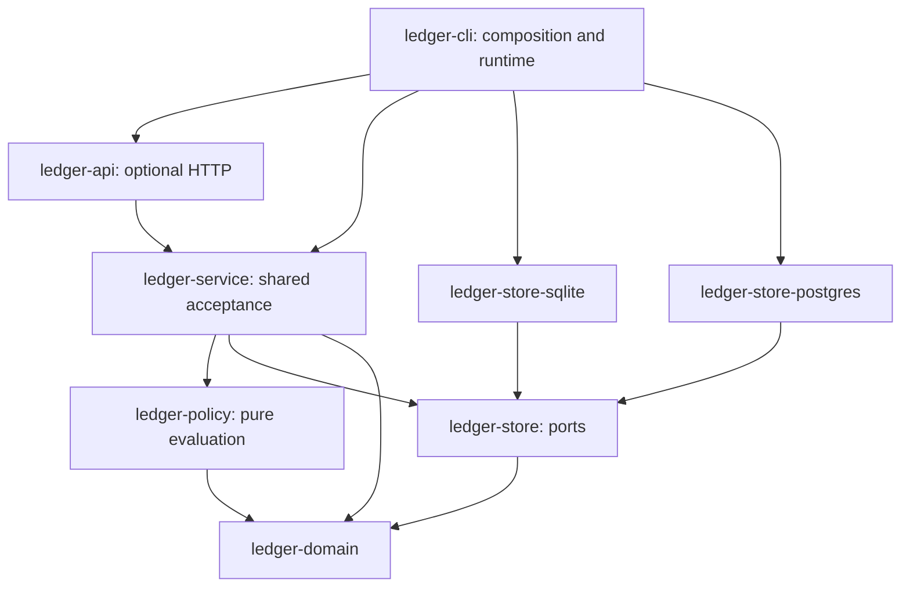

# Ledger Lab: Rust, SQLite and PostgreSQL foundation

Architecture plan · September 20, 2026 · Planning only

Adoption update: the [adoption, cost and cold-start review](LEDGER-LAB-ADOPTION-COST-REVIEW.md) recommends a smaller crate/package surface, template-led onboarding and a narrower public v0. It supersedes this plan's packaging breadth while preserving the atomic acceptance and two-store correctness requirements.

Platform amendment: the [platform, cloud and hardware neutrality review](LEDGER-LAB-PLATFORM-NEUTRALITY-REVIEW.md) supersedes this plan's broad platform, distribution and deployment assumptions. It defines the proposed native support matrix, server/storage contract, release artifacts and CI gates; section 13 identifies the exact foundation sections to amend before implementation.

This plan preserves the product defined in [Atomic events, composable economics](LEDGER-LAB-ARCHITECTURE.md) and supersedes that report's TypeScript-engine implementation recommendation. The authoritative engine, acceptance path and API should be Rust. TypeScript remains useful for the UI and SDK. No product code, database or deployment was changed during this review.

Recommendations below are design judgments. Linked sources establish technology behavior; they do not prove this proposed implementation correct. The existing prototype was inspected, but no Rust build, database race test, benchmark or migration was executed. All implementation gates below remain to be completed.

## 1. Firm recommendation

**Build one Rust application with a pure economic core, a shared acceptance coordinator, two explicitly different transactional stores, an embedded CLI, and an optional thin HTTP server. Ship SQLite and PostgreSQL as supported v0 backends with the same economic contract.**

Keep the promise: **“Chain events. Compose pricing. Export the result anywhere.”** The organizing operation is atomic acceptance of an authorized event and all its economic consequences. Generation, publication, acquisition, BYOK usage and third-party paid tools enter through that same operation. Neither database changes the meaning of an event, contract, premium, discount or share.

The proposed stack is sound with five corrections:

1. Add **`ledger-service`**, which owns the one acceptance algorithm. A store trait alone will not prevent two implementations from quietly developing different business rules.
2. Use **SQLx with concrete SQLite/PostgreSQL adapters**, not `Any` or a universal SQL repository. Share semantics and domain types, not locking syntax.
3. **Tokio belongs to infrastructure, including the CLI and database execution**, not exclusively HTTP. Keep it out of the domain and policy crates; do not promise a runtime-free SQLx/PostgreSQL integration.
4. Start **embedded/CLI first**, then add Axum before the developer-facing v0 so the TypeScript SDK and UI have one supported path. HTTP is optional to run, not mandatory for local engine use.
5. Require **a verified patched SQLite build**, and finish PostgreSQL parity before v0. A placeholder PostgreSQL trait is not first-class support.

Rust is justified by explicit types, checked money operations, constrained ownership of transactions and a distributable local binary. It does not establish correct prices, prevent database anomalies, make dependencies memory-safe, or eliminate operational work. Its solo-founder cost is slower initial integration and a more demanding async/trait/toolchain surface. Limit that cost through one executable, ordinary SQL, shallow traits and no plugin framework or FFI in v0.

The zero-cost baseline is a local binary and SQLite file, or the same binary connected to PostgreSQL the user supplies. No Ledger Lab account, hosted collector, model API, queue service or cloud database is required.

## 2. Workspace and dependency direction

One Cargo workspace, one release train, Apache-2.0 first-party code. The following are logical crate boundaries; create them when their phase begins rather than scaffolding empty abstractions.

| Crate/directory | Owns | Permitted direct internal dependencies |
|---|---|---|
| `ledger-domain` | Validated events, typed links, parties, offers, bindings, policy data/AST, amounts, identities, canonical records, decision plans and explanations. Serde wire DTOs are a separate module from validated types. | None |
| `ledger-policy` | Pure bounded compilation/evaluation of the policy AST; exact arithmetic and named economic bases. | `ledger-domain` |
| `ledger-store` | Narrow transaction/read/export ports, snapshot types, persistence error taxonomy and contract documentation. No driver types. | `ledger-domain` |
| **`ledger-service`** | Shared acceptance sequence, authorization checks, dependency resolution, retry classification, read/replay operations and outbox orchestration against ports. | `ledger-domain`, `ledger-policy`, `ledger-store` |
| `ledger-store-sqlite` | SQLite connections, SQL, migrations, locking, record encoding and backup implementation. | `ledger-domain`, `ledger-store` |
| `ledger-store-postgres` | PostgreSQL equivalents, with its own SQL and concurrency behavior. | `ledger-domain`, `ledger-store` |
| `ledger-api` | Axum routes, authentication extraction, transport DTO mapping, limits and stable HTTP error mapping. A library, not another service. | `ledger-domain`, `ledger-service` and port types where needed |
| `ledger-cli` | The `ledger` executable, configuration, runtime setup and composition of stores/service/API; commands including `serve`. | Infrastructure crates above, fake adapter as an optional feature |
| `ledger-adapter-fake` | Deterministic downstream simulator, delivery receipts, failure modes and reconciliation. | `ledger-domain`, the adapter port in `ledger-store`; no concrete store |
| `ledger-conformance` | Development-only harness, independent fixture loader, reference model and backend runners. | All implementation crates as test dependencies |
| `contracts/`, `fixtures/`, `sdk/typescript/`, `ui/` | Versioned language-neutral contracts, reviewed golden data, generated SDK and React UI. | UI → SDK → HTTP; no copied pricing engine |

The store crate's name means “persistence contract,” not a generic CRUD layer. Keep the adapter port in a small module there initially; split it into a separate crate only if actual reuse warrants it.

Enforce the boundary in CI by inspecting the resolved dependency graph: `ledger-domain` and `ledger-policy` must have no SQLx, Tokio, Axum, filesystem, network, wall-clock or model-client dependency. Ban first-party unsafe code in the core. Domain constructors accept time/identity/evidence values supplied by callers; they never generate them through environmental access. Use deterministic collections or explicit sorting before economic evaluation and serialization.

The service and store ports may expose standard Rust futures with explicit `Send` bounds; they do not need a Tokio dependency. Use static dispatch for the two backends, selected by the executable, instead of a plugin registry or heavily boxed transaction framework. Transaction handles are not cloneable, do not escape their request, and expose only the operations the acceptance algorithm requires. Prove the minimal trait/lifetime design in the first integration slice before freezing it.

## 3. Acceptance transaction contract

### Shared algorithm and commit contents

The service receives a validated command plus authenticated principal, fixed request context and referenced immutable contract material. It obtains a **transaction-scoped, locked snapshot**, calls the pure policy evaluator, validates the resulting plan, persists it and commits. The store must not expose a public “append arbitrary action” API that lets callers bypass this sequence.

An acceptance transaction commits all of the following:

- The canonical event and its scoped identity/content digest, plus the stable accepted receipt.
- Authorized typed relationships and their uniqueness records.
- References to retained canonical offer, contract, policy, authorization and input snapshots, inserting missing content-addressed objects in the same transaction when necessary.
- Every independently identified charge, cost, premium, discount, credit, allocation, share or reversal, including its economic provenance and party roles.
- Applied/skipped rule explanations, basis/rounding details and the decision manifest enumerating the exact action and intention IDs.
- Semantic claim/effect uniqueness records; invocation consumption and any relevant reservation/budget changes.
- Immutable downstream intentions and the initial mutable delivery-state rows.
- Chain revision advancement and any authoritative concurrency counters required to keep those decisions consistent.

If any required write or validation fails, none of those changes survives. Existing independently accepted events remain intact. A zero-action event can be accepted with a complete explanation. Outbox dispatch happens after commit and never inside this transaction.

Previously accepted offers, grants and invocation reservations are separate, durable control-plane facts. Their existence before a work event is not partial acceptance of that work event. Consumption/release decisions caused by the work event are atomic with its economic record. A manifest is not consent; the service must resolve both supplier and retail bindings rather than trusting a supplier-supplied list of applicable policies.

### Transaction port, not two business implementations

The minimum port operations are: begin acceptance transaction; acquire required scope locks; load/check identity and claims; load authorized bounded chain snapshot and immutable documents; append validated decision bundle; advance locked control state; commit/rollback. A single service function orchestrates them. Each backend implements these operations using its own SQL and isolation requirements. Domain errors remain domain errors; `Busy`, `RetryableSerialization`, `CommitUnknown`, `Unavailable` and corruption/integrity failures remain distinguishable infrastructure errors.

Pre-parse and verify bounded immutable evidence before opening a write transaction. Recheck mutable authority, binding activation, dependencies, reservations and uniqueness inside it. Cache immutable documents by hash; never use a cache as the authority for revocation or spend state. If resolving the snapshot discovers another required lock, restart with the expanded, ordered lock set rather than acquiring locks out of order.

All acceptance rules must operate on a bounded snapshot. Proposed initial limits, to confirm against the golden workflows before coding: 256 KiB candidate, 32 submitted links, 1,000 events per chain, 16 traversed hops, 256 policy nodes and 128 generated actions. Limit evidence and explanation bytes separately. Reject oversized work explicitly; do not truncate financial inputs or create partially evaluated events.

### Pending and duplicates

`waiting_dependencies` means the candidate is retained in an operational inbox, **outside canonical accepted history**. It reserves no accepted event identity, generates no actions and creates no settlement intention. Inbox receipt/delivery deduplication is separate. Different pending payloads claiming one identity remain visible; they do not overwrite each other. When prerequisites arrive, retry through the full service path. A periodic local scan complements notifications so a crash cannot permanently strand a ready candidate.

An identical accepted identity and canonical content returns the original accepted receipt. Changed content under that identity is a conflict. A differently named delivery of the same contract-scoped work claim returns a semantic duplicate only if its economically relevant fact digest agrees; changed quantity, links, party responsibility or evidence is a conflict requiring correction. Record delivery aliases operationally, without inventing another accepted economic event. Distinct facts about one operation remain possible through explicit claim kinds, such as completion versus acquisition attribution.

The service never waits for an optional future outcome before accepting complete current consequences. Late links are relationship-assertion events. Reversals target booked actions exactly; policy changes cannot silently rerate them. Delivery permutation invariance is promised only for policies whose required dependencies and closure stages are explicit. A cumulative cap must not accidentally give the first arriving provider preferential treatment.

### Commit ambiguity and cancellation

The linearization point is durable database commit. A process may die after that point but before returning a receipt. A caller retries the same event/claim identity and resolves the original result. On a network failure during PostgreSQL commit, return/record **unknown outcome**, reconnect to the authoritative primary and resolve identity; absence observed while the old transaction is still running is not proof of rollback. A retry may block on the same uniqueness/lock and must still use the same identity.

Use driver-managed transaction guards and explicit rollback on ordinary failures. A dropped/cancelled task must not return a connection with an open or ambiguous transaction to the pool. Verify cancellation behavior in tests; close/discard uncertain connections. Never turn a timeout into a fresh event ID or a new downstream idempotency key.

## 4. Portable domain representation

### Identity and serialization

External event identity is `(tenant, environment, source, event_id)`, all bounded strings. Chain, party and binding identifiers are opaque application-supplied IDs; optional UUID creation belongs outside the core. Database row IDs and auto-increment counters never become public economic identity.

Derive internal identifiers with full SHA-256 and a versioned domain separator over canonical structured tuples—never separator-concatenated unescaped strings. Event record ID hashes its scoped identity; content digest separately hashes the normalized event. Link IDs hash typed endpoints and scope. Action IDs hash a stable semantic effect key: binding, component, operation/claim, eligible relationship/match and explicit correction namespace where relevant. Policy version and price belong in provenance/content, not in an identity key that lets a policy rename charge twice. A reused effect key with different content is a conflict.

Define **`ledger-canonical-v1`**: strict UTF-8 JSON, duplicate object keys rejected before normal deserialization, explicit schema normalization, then RFC 8785 JCS and SHA-256. Money, rates, quantities and large counters are strings. Other JSON numbers are restricted to safe integers in the schema; no fractional JSON-number financial values. Canonicalization does not use locale sorting or silently normalize Unicode. Absent and null fields remain distinct unless a schema explicitly defines equivalence. Reject unknown economic fields; put future optional metadata in a bounded, named extension object. [JCS specification](https://www.rfc-editor.org/rfc/rfc8785)

Preserve canonical bytes in SQLite `BLOB` and PostgreSQL `BYTEA`. Store indexed relational columns alongside them and verify consistency on read/import. PostgreSQL JSONB may be a derived search representation; never reconstruct original canonical bytes or signatures from it. PostgreSQL documents that JSONB does not preserve whitespace, object-key order or duplicate keys. [PostgreSQL JSON types](https://www.postgresql.org/docs/18/datatype-json.html)

Validate numeric tokens before any lossy parse. Normalize decimal strings such as `1.00` to the schema's `1` form before hashing. Treat link collections as explicitly sorted sets with duplicate links rejected, while preserving order in policy stages and other ordered arrays. JCS sorts object keys; it does not decide which domain arrays are sets. Include these distinctions in cross-language golden vectors.

Protocol signatures authenticate the bytes/profile that their protocol specifies. Keep those original evidence bytes and signature metadata separately from Ledger Lab's normalized representation. Hashing a provider's claim does not prove its truth or authorize its payer. Do not invent a new signing protocol for v0; authenticated local principals plus explicit accepted-binding fixtures suffice, with a signature-verification port for later protocol adapters.

### Time, money and policy semantics

| Item | Recommended v0 representation and rule |
|---|---|
| Time | UTC RFC 3339 with exactly six fractional digits after normalization; accept explicit offsets and up to microsecond precision, reject excess precision, leap-second strings and missing zones. Persist checked epoch microseconds as signed 64-bit integers. |
| Time meaning | Keep producer occurrence, host receipt, decision time and acceptance receipt metadata separate. Wall clocks do not order money; chain revisions do. Supply a fixed decision context to retries/replay. Authority changes are checked transactionally. |
| Posted amount | `Money { currency, scale, atoms }`; canonical signed integer string on the wire, validated `i128` internally. Proposed absolute posted limit `10^30−1` atoms; scale 0–18 fixed per economic book/binding. Zero has one representation; no negative zero. |
| Rates/quantities | Exact decimal strings, normalized coefficient/scale, at most 30 coefficient digits and scale 18. Reject excess precision rather than silently rounding inputs. Units are explicit and type-checked. |
| Intermediate arithmetic | Bounded BigInt rational/decimal arithmetic, using an established integer library. Cap intermediate bit length at 512 and expression complexity. Convert to posted atoms through one explicit rounding operation; reject overflow. |
| Rounding | v0 supports one named rule, nearest with ties away from zero, pinned in policy. Round each declared posting component at its specified stage. Reversal negates the stored integer, never recalculates it. |
| Allocation | Partition a named rounded amount using exact weights, largest remainder, deterministic recipient/effect-ID tie-break. Allocate the absolute magnitude and restore the sign. Sum must equal the source amount exactly. |
| Currency | One currency/scale per book and one currency per v0 chain. No implicit exchange rates. A downstream currency/minor-unit mismatch is an export decision, not mutation of journal precision. |
| Totals | Derived from typed actions/obligations using checked exact arithmetic. Customer proceeds, supplier costs and shares have separate projections; do not sum every action into one invoice total. |

Example rounding fixtures: `1.005` at scale 2 → `101` atoms; `−1.005` → `−101`; undo of `101` → `−101` regardless of new rates. Splitting `100` atoms equally among three stable recipient IDs yields `34, 33, 33`. Per-event rounding and rounding an aggregate are intentionally different policies; tests must not assert false associativity.

`rust_decimal` is credible for bounded decimal business arithmetic, but its documented 96-bit coefficient and finite scale do not by themselves solve intermediate range, allocation or when rounding occurs. Recommend explicit integer/rational domain types backed by `num-bigint`, not database NUMERIC as the authority and not a hand-built arbitrary-precision integer library. Finalize the bounded numeric envelope in the contract gate. [Decimal representation](https://docs.rs/rust_decimal/latest/rust_decimal/), [num-bigint](https://docs.rs/num-bigint/latest/num_bigint/)

Policy snapshots include source AST bytes/hash, DSL version, evaluator-semantics version, contract/offer versions, trusted input digests, named bases and rounding rules. Preserve every input needed to reproduce the decision locally. Compiled AST caches are disposable. A compiler/evaluator upgrade cannot reinterpret old accepted actions; exact replay uses the original semantic version, while hypothetical replay is isolated and emits no production outbox.

Explanations are structured records: evaluated predicate and inputs, applied/skipped reason code, contributing events/links, rule/binding, party responsibility, exact basis and intermediate values, rounding, resulting action IDs and export intentions. Human prose is a rendering of this data. Do not use prose as the only evidence or include credentials, raw prompts or unnecessary personal data. Referenced external evidence needs its own retention policy; an inaccessible URL is not reproducible evidence.

Distinguish current permission to submit evidence from the historical authorization that incurred an obligation. An invocation's expiry/revocation prevents new work; it does not erase an already authorized supplier fee merely because its completion report arrives later. Pin which occurrence/invocation time each eligibility window uses. Administrative rejection of an untrusted report leaves a pending/disputed operational case rather than silently declaring that no real-world debt exists.

## 5. Schema ownership and two persistence implementations

### Shared logical model

Own these table families, with tenant/environment-scoped keys and composite foreign keys wherever records connect:

| Family | Authoritative content or operational state |
|---|---|
| `documents`, `offers`, `bindings`, `policy_snapshots`, `source_grants` | Immutable versions and acceptance/authority evidence. Separate mutable activation/revocation heads have append-only change records. |
| `chains`, `invocations`, `reservations` | Locked control heads and bounded concurrency state; changes retain audit provenance. |
| `events`, `links`, `accepted_receipts`, `decision_manifests` | Immutable accepted facts, revisions and complete decision membership. |
| `claims`, `effects` | Permanent accepted semantic uniqueness; keys and content references are immutable. |
| `actions`, `action_sources`, `explanations`, `intentions` | Immutable economic journal and outbound intent payloads. |
| `inbox`, `delivery_aliases`, `outbox_delivery`, `dispatch_attempts` | Operational pending work, leases and append-only delivery observations; not economic truth. |
| `projection_*`, `projection_checkpoints` | Disposable read caches with explicit format/version and rebuild status. |

Use `NOT NULL` uniqueness fields, binary/case-sensitive identity semantics, explicit foreign keys, and unique event/claim/effect/intent keys. Do not depend on differing NULL, collation, JSON or implicit type-coercion behavior across stores. No cascade deletes of canonical economic history. Canonical amounts can be text columns on both engines initially because money is calculated in Rust; relational columns index party, component, currency, time and identity. Future analytical numeric columns remain derived.

Enforce append-only tables with PostgreSQL privileges and defensive triggers; SQLite triggers and the supported write path protect against accidental updates. A database owner or filesystem owner can still tamper. Hashes and an exported trusted manifest detect some changes; this is not a tamper-proof ledger against its operator. Keep destructive maintenance outside the runtime role.

### Schema migrations

Each adapter owns ordered SQL migrations in separate directories, plus a shared logical schema version. SQLx's migration facility is suitable for checksums/applied history; add the project's explicit version handshake and tests. Never edit an applied migration. [SQLx migration tooling](https://github.com/transact-rs/sqlx/blob/main/sqlx-cli/README.md)

`ledger init` creates an empty store. `ledger migrate` is an explicit maintenance operation, with a verified backup and exclusive deployment/migration lock. Normal startup checks versions and refuses unsupported schemas; it does not let every API replica run DDL. SQLite uses its exclusive maintenance path and tested table rebuilds. PostgreSQL uses a dedicated migration role and migration lock on a direct connection. v0 permits a maintenance window and transactional DDL; postpone concurrent index builds/rolling mixed-schema upgrades.

Physical schema versions may differ internally, but both map to one supported logical contract. Migration tests cover fresh installation, every supported upgrade path and interrupted upgrades. Preserve original canonical bytes and IDs through schema changes. No promise of automatic downgrade: restore the pre-upgrade backup only while writes/exports are fenced, and reconcile external effects before resuming.

### SQLite: local default

**Support policy:** minimum SQLite **3.51.3**, with the latest tested patched bundled build at release. Official docs identify a WAL-reset corruption bug affecting versions through 3.51.2, fixed in 3.51.3; older branches have selected backports, but v0 should not maintain that exception matrix. Check the library actually linked into the binary, not the `sqlite3` command found on the machine. [SQLite WAL bug and constraints](https://www.sqlite.org/wal.html)

Use SQLx's bundled SQLite feature, lock dependencies and assert `sqlite_version()`/source ID at startup and in release tests. SQLx documents bundled and unbundled choices; “bundled” alone does not certify the selected patch level. If the resolved library is too old, update the compatible dependency or stop the release. Do not quietly use the OS library. [SQLx SQLite features](https://github.com/transact-rs/sqlx)

| Concern | SQLite decision |
|---|---|
| Deployment | One Ledger Lab process owns writes on one host and local disk; other clients use its API. A direct CLI writer requires the service stopped or calls the running service. No NFS/SMB/cloud-synced database directory. |
| Connections | One dedicated write connection/queue, a small bounded read pool. All mutation paths, including outbox state and configuration, use the write gate. The queue bounds memory; it is not durable acceptance. |
| Transaction | `BEGIN IMMEDIATE` before loading decision state, held through evaluation and commit. Do not start deferred and attempt to upgrade a stale read snapshot. Use SQLx's tracked custom-begin API rather than issuing untracked SQL `BEGIN` against a pooled connection. |
| Isolation | SQLite serializes writes; readers in WAL mode see snapshots. No shared-cache mode and no `read_uncommitted`. Application serialization supplements, rather than replaces, database uniqueness and locks. |
| Settings | Assert WAL; `synchronous=FULL`, `foreign_keys=ON`, normal locking, finite busy timeout on every connection. Use STRICT tables and explicit checks. Verify settings, do not rely on defaults. |
| Busy handling | Bound writer queue wait and busy retries within a request deadline. Retry a rolled-back whole acceptance for retryable contention. Treat `BUSY_SNAPSHOT` as a transaction restart; investigate it under the chosen immediate-write path. |
| Failure | Full disk, I/O/corruption or failed integrity checks fail closed for writes. Reopen/recover before reuse; a lost reply is resolved by identity. Never delete WAL files as a recovery tactic. |
| Checkpointing | Keep the normal automatic checkpoint policy initially. Monitor WAL growth/reader duration; use coordinated passive checkpoints and explicit maintenance for truncation. No aggressive per-event checkpointing. |

SQLite allows only one writer and WAL requires same-host storage; long readers can impede checkpoint progress. Those constraints are acceptable for local use, not hidden production scaling promises. [SQLite WAL](https://www.sqlite.org/wal.html) The immediate/deferred distinction is documented in [transaction control](https://www.sqlite.org/lang_transaction.html); durability/foreign-key settings in [PRAGMA documentation](https://www.sqlite.org/pragma.html), table typing in [STRICT tables](https://www.sqlite.org/stricttables.html), and tracked custom begin in [SQLx Connection](https://docs.rs/sqlx/latest/sqlx/trait.Connection.html).

For native backups, prefer a maintenance command using `VACUUM INTO` to a new file through the existing connection, followed by validation, durable file handling and an atomic rename. This avoids adding a second SQLite FFI binding just for backup. The online Backup API is another supported SQLite mechanism if later operational needs justify it. Never copy only a live main `.db` file. Restore to a new location, verify integrity/foreign keys/history hashes, and open with export paused. [VACUUM INTO](https://www.sqlite.org/lang_vacuum.html), [Backup API](https://www.sqlite.org/backup.html)

### PostgreSQL: concurrent deployment

**Support policy:** v0 certifies PostgreSQL **17 and 18**, running the current patch release. As of this review the official table lists **17.11 and 18.6**. Treat those as the initial tested floors, update patch requirements for fixes, and test new majors before claiming support. Supporting every still-maintained major is unnecessary for the first release. [PostgreSQL version policy](https://www.postgresql.org/support/versioning/)

| Concern | PostgreSQL decision |
|---|---|
| Deployment | User-operated single authoritative primary, bounded connection pools and durable persistent storage. Multiple Ledger Lab processes may write different chains. Direct connections initially; no mandatory proxy, extension or broker. |
| Transaction | `SERIALIZABLE` for economic acceptance plus explicit locks on shared mutable decision scopes. This favors correctness while the workload is unmeasured. No automatic fallback to weaker isolation after retries. |
| Chain serialization | Lock the chain control row `FOR UPDATE` and increment its revision on every accepted event. Chain creation uses a unique key and transactional insert/retry. Locking an absent row alone is insufficient. |
| Shared scopes | Chain lock alone is insufficient for shared payer budgets, invocation consumption or revocation. Lock all affected control rows in a documented stable order. v0 restricts budgets/caps to bounded supported scopes; unsupported cross-chain policies are rejected. |
| Authority races | Acceptance takes appropriate shared locks on relevant grant/activation heads; revocation/update takes conflicting locks. Document whether an in-flight acceptance precedes revocation. Do not let cached authority bypass this order. |
| Retries | Roll back and retry the entire transaction on SQLSTATE `40001` or `40P01`, with bounded exponential backoff/jitter and the same command identity. Re-read snapshot, revalidate and reevaluate; retrying only the failed statement is incorrect. |
| Uniqueness | Use real unique constraints for event, claim, effect and intent identities. Resolve a uniqueness race by reading/comparing the winner after rollback. Never classify every unique violation as a harmless duplicate. |
| Durability | Require `fsync=on`, `full_page_writes=on`, durable tables and acceptance `synchronous_commit=on`. If configured replication/failover can lose acknowledged primary commits, the operator must choose stronger replication or accept that explicitly. |
| Timeouts | Set statement, lock, idle-transaction and application deadlines. Bound snapshot size so policy work does not hold locks indefinitely. Retries ending at a deadline return retryable/unknown status without claiming rejection. |
| Operational ownership | User owns patching, disk capacity, backups, TLS, credentials, autovacuum, monitoring and failover. Runtime role has minimal privileges; migration role is separate. All correctness reads use the primary. |

PostgreSQL serializable isolation detects anomalies but can abort transactions; row locks reduce intended conflicts but do not eliminate retries. [Isolation](https://www.postgresql.org/docs/18/transaction-iso.html), [locking](https://www.postgresql.org/docs/18/explicit-locking.html) The documented retry codes and full-transaction guidance support the retry contract. [Serialization failures](https://www.postgresql.org/docs/18/mvcc-serialization-failure-handling.html) The durability settings and asynchronous-commit tradeoff are documented in [WAL configuration](https://www.postgresql.org/docs/18/runtime-config-wal.html).

Use a fixed lock order such as authority heads → binding heads → budget scopes → chains → invocation state, sorting IDs within each class. Every service command that touches those scopes must obey it. Unique-index conflicts can still deadlock; handle them. If a transaction waited for a changed chain row under a stale serializable snapshot, retry it rather than assuming the lock refreshed the snapshot.

Initial retry defaults are design settings, not measured optima: at most five transaction attempts within a five-second acceptance deadline, jittered backoff starting at 10 ms and capped at 250 ms, and lock/statement waits bounded by the remaining deadline. SQLite's busy timeout and PostgreSQL's lock timeout must fit inside that budget. Expose retry/queue metrics and return a retryable result when it is exhausted. Do not retry invalid input, authorization denial, arithmetic overflow or corruption. Use authenticated TLS with certificate/hostname verification for remote PostgreSQL; local Unix-socket deployments may use documented OS/database authentication. No replication topology or connection proxy is required or certified by v0.

For backups, document a tested `pg_dump`/restore workflow for small deployments and base backups plus WAL archiving/PITR for production recovery objectives. Include database roles/configuration and secret restoration separately. Restore drills must check journal manifests and external delivery state. Native backup format is distinct from Ledger Lab's portable export. [PostgreSQL backup options](https://www.postgresql.org/docs/18/backup.html), [pg_dump](https://www.postgresql.org/docs/18/app-pgdump.html), [PITR](https://www.postgresql.org/docs/18/continuous-archiving.html)

### Projections, ordering and outbox on both stores

Keep chain-local monotonically increasing revisions assigned under the chain lock. They order accepted history within a chain. Do **not** use a PostgreSQL sequence or maximum row ID as a global committed high-water mark: concurrent transactions can allocate IDs and commit in another order. v0 promises chain-scoped cursors, not a globally ordered stream.

Authoritative capacity/reservation counters participate in the acceptance transaction. Read-only totals and UI indexes can be synchronous initially or asynchronously rebuilt, but must identify their applied chain revision. Rebuild them from recorded actions and control transitions, not by rerunning current pricing. A rebuild changes no action or outbox identity. Exact replay is a separate verification operation. Use short bounded reads; avoid holding SQLite snapshots open while rendering a UI.

The intention payload is immutable. Lease owner, attempt count, retry time and observed status are separate operational rows; attempts/receipts append evidence. PostgreSQL workers may claim queue rows with `FOR UPDATE SKIP LOCKED`; SQLite uses its serialized write path. Network calls occur after a short claim transaction commits. Leases include fencing tokens; late workers cannot overwrite newer delivery state. A lease cannot by itself stop a remote duplicate, so adapters need stable intent-based idempotency and reconciliation. [PostgreSQL queue-locking behavior](https://www.postgresql.org/docs/18/sql-select.html)

Outbox discovery scans eligible rows, not IDs above a presumed global committed sequence. Preserve per-obligation ordering when an adjustment depends on a prior export. A fake destination must maintain its own durable receipt state and support “committed remotely, response lost.” Both a restore and a migration start with dispatch disabled: restoring local history cannot undo money or documents already created externally.

## 6. SQLx decision and alternatives

**Choose SQLx, provisionally gated by the first two-store transaction slice.** The currently reviewed crate docs are SQLx 0.9.0; pin a tested release and matching CLI, not `latest`. The reason is direct readable SQL, typed rows, optional query checking, pools and both required drivers. This choice is not a claim that one SQL statement behaves the same on both databases. [SQLx API](https://docs.rs/sqlx/latest/sqlx/)

| Option | Credible strengths | Decision for Ledger Lab |
|---|---|---|
| SQLx | Direct SQL, async I/O, optional compile-time query checks, SQLite/PostgreSQL support and migrations. | Best fit for explicit transactions and dialect-specific SQL. Accept runtime/metadata maintenance cost. |
| Diesel + diesel-async | Strong typed query DSL; supported database connections; async PostgreSQL and a sync-wrapper path for SQLite. | Viable. Adds DSL/type machinery without removing the need to understand locking SQL; less attractive for this small journal-focused team. |
| rusqlite + tokio-postgres | SQLite-native API access, including backup; a focused PostgreSQL driver. Very explicit backend ownership. | Strong fallback if SQLx cancellation/custom-transaction/bundling behavior fails the spike. Two driver/pool/migration paths mean more integration work. |
| SeaORM | Entities, relations, ActiveModel/CRUD, migrations and async application integration. | Useful for ordinary application models; adds an ORM layer to an append-only transactional journal whose critical SQL should remain visible. |

Primary references: [Diesel guide](https://diesel.rs/guides/getting-started), [diesel-async](https://docs.rs/diesel-async/latest/diesel_async/), [rusqlite](https://docs.rs/rusqlite/latest/rusqlite/), [tokio-postgres](https://docs.rs/tokio-postgres/latest/tokio_postgres/), [SeaORM](https://www.sea-ql.org/SeaORM/docs/introduction/sea-orm/).

SQLx's SQLite driver uses a background thread for blocking SQLite calls; adding a thread per query or wrapping its normal async calls in `spawn_blocking` would be needless layering. The application still serializes whole write transactions, rather than merely serializing individual SQL statements. [SQLx SQLite connection](https://docs.rs/sqlx/latest/sqlx/sqlite/struct.SqliteConnection.html)

Maintain separate query files and migrations. Use `query_as!`/equivalent checked queries where stable; runtime parameterized queries are acceptable for bounded dynamic filters, with real-database tests. Compile-time checking catches query/type drift, not transaction correctness. Generate/check offline metadata separately against each backend's actual schema, preserving both sets; prove the workspace layout does not overwrite one with the other. Ordinary source builds use committed metadata with offline mode so they need no running database. [Query macro limitations](https://docs.rs/sqlx/latest/sqlx/macro.query.html), [offline workflow](https://github.com/transact-rs/sqlx/blob/main/sqlx-cli/README.md)

The driver spike must verify immediate SQLite begin, PostgreSQL serializable begin, rollback/drop/cancellation, uniqueness error classification, both offline query sets, linked SQLite patch level and build portability. Failure of a convenience macro is not reason to weaken acceptance guarantees; use explicit tested SQL or change the infrastructure driver behind the port.

## 7. API boundary: embedded first, optional Axum server in v0

**Choose Axum for HTTP, but do not begin by building a web service.** First prove `ledger accept fixture.json` and embedded `ledger-service` use against both stores. Then expose the same operations through Axum; handlers perform authentication, validation, service calls and response mapping, with no economic logic.

Axum uses Tokio/Hyper and Tower's service/middleware model. That fits the chosen infrastructure runtime and supplies ordinary middleware integration without another application framework. It does not make authentication, safe timeouts or backpressure automatic; configure and test them. A smaller hand-built Hyper server would shift routine HTTP work onto the founder. There is no requirement here that justifies a second framework or runtime. [Axum documentation](https://docs.rs/axum/latest/axum/)

One binary exposes `init`, `doctor`, `accept`, `get`, `explain`, `replay`, `export`, `import`, `verify`, `backup`, `migrate` and optional `serve`. Configuration selects one store; runtime backend selection occurs at the executable boundary. Provide a documented async embedded Rust API. Do not implement Rust/Python/Node native bindings or WASM persistence in v0. The CLI owns its runtime; an embedded host provides a compatible runtime rather than nesting runtimes.

HTTP operations should include:

| Operation | Contract |
|---|---|
| `POST /v1/events` | One candidate; 201 accepted, 200 duplicate with original receipt, 202 pending with dependency receipt, 409 identity/semantic conflict, 422 invalid economic input. Authentication/authorization use 401/403. |
| `GET /v1/events/{id}`, `/actions/{id}` | Canonical accepted record under tenant/principal access checks. |
| `GET /v1/chains/{id}` and `/explanations/{id}` | Chain revision and complete scoped decision evidence, paginated with chain-scoped cursors. |
| Offer/binding/policy administration | Explicit version publication and acceptance commands; separate administrative permission. No generic PATCH of immutable records. |
| Invocation authorization | Reserve permitted scope/exposure before tool execution; idempotent command with a stable operation key. It does not perform the tool call. |
| Replay | Isolated read-only evaluation or an explicitly separate sandbox store, with no production outbox access. |
| Export/migration/backup | CLI-only administrative operations initially; avoid unaudited remote database-management endpoints. |
| Capabilities/health | Protocol/DSL/schema versions, backend and limits; no credentials or database URL. Health is separate from readiness to accept writes. |

Separate HTTP response failure from economic result: 503/timeout is not evidence of rejection. Include stable error codes, retryability, request ID and event/receipt lookup guidance. A submission is not “accepted” merely because a worker queued it. There is no unbounded bulk-accept endpoint or cross-request atomic batch in v0.

Bind to loopback by default, require a generated local token and validate allowed browser origins. Loopback alone is not authentication. Remote operation requires explicit configuration, TLS via the application or a user-operated trusted reverse proxy, scoped credentials and request limits. Start with local/static scoped principals, not an identity-provider product. Tenant/source identity comes from authenticated context, not trusted request body fields. Protect administrative and raw-evidence views separately. Logs expose IDs/reason codes, not secrets or entire untrusted payloads.

## 8. SQLite → PostgreSQL migration and portable export

**Ship an offline, verified cutover in v0.** Do not promise live dual writing, conflict resolution between divergent stores or zero-downtime migration. The first migration target is an empty PostgreSQL database/schema created by the supported migrations.

### Format: `ledger-export/1`

A directory contains `manifest.json` and bounded NDJSON record files grouped by kind. Each export record includes its kind/schema version, immutable ID, original canonical payload bytes encoded losslessly, payload hash, scoped references and required operational metadata. Binary/signature evidence uses explicit base64 encoding and content digests. Avoid relying on JSON reserialization to preserve signed material. Compression is optional packaging, not part of economic identity.

The manifest records export-format version, source logical-store UUID, supported schema/DSL/evaluator versions, canonicalization profile, tenant/environment, snapshot ID, per-chain revision heads, record counts, sorted file hashes and a root digest over the complete manifest content. Root-digest computation excludes its own digest field and follows a specified canonical procedure. An optional detached signature authenticates a manifest only if its verification key is separately trusted; an unsigned checksum detects accidental alteration, not a malicious exporter.

Include events, links, claims/effects, accepted receipts, original action/decision/explanation bytes, immutable documents, authorization evidence, control transitions and active heads, reservations, intentions, delivery mappings and all settlement observations needed to avoid duplication. Pending inbox records are exported in a separate operational section. Exclude caches, compiled-policy caches, active leases and credentials; explicitly list omissions. Rebuild projections and rotate/reconfigure credentials after import.

### Cutover sequence

1. Run source integrity/schema checks and take a recoverable native backup. Inventory unresolved export outcomes; stop admission, inbox promotion and all dispatch workers.
2. Drain in-flight acceptance. Fence the source as read-only and confirm no other writer/dispatcher remains. Migration mode is durable; restarting the old binary must not silently re-enable writes. Keep the source frozen throughout cutover.
3. Resolve or mark unknown remote deliveries. Wait for active requests/workers to stop; lease expiry alone is insufficient evidence that a remote operation did not execute. Export no runnable leases.
4. Produce one consistent snapshot, preserving every identifier, canonical byte sequence, chain revision and intent key. Verify manifest counts/hashes before moving the bundle.
5. Create a new target with exports disabled. Import through a dedicated verified restore path, **not** `accept(event)`: rerating would create different history. Load documents and references in dependency order, retain original receipts, enforce constraints and mark the target `import_incomplete` until verification succeeds. Chunked loading is allowed only while the target cannot serve or dispatch.
6. Check every record digest, reference, scoped uniqueness constraint and decision manifest; compare per-chain heads, exact party/component/currency totals and outstanding intent mappings. Rebuild projections. Perform original-version replay verification where the evaluator is available; a missing evaluator must be reported, not silently replaced by current semantics.
7. Compare a canonical re-export of the target with the source's canonical record set. Operational import timestamps, backend-local row IDs and newly generated lease state are excluded by the format's equivalence rules, not by ad hoc test exceptions.
8. Switch clients to the verified target. Reconfigure credentials and explicitly enable acceptance there. Reconcile unknown downstream outcomes and then enable dispatch with the **same intent idempotency keys**. Keep the old store fenced and retain the backup.

A failed import is discarded/restarted or resumed using verified chunk checkpoints; it is never exposed as a partially migrated ledger. If no target writes or exports have occurred, rollback can reactivate the frozen source. Once the target accepts new work, rollback requires another verified transfer/reconciliation; simply pointing clients back loses history and risks duplicate exports.

The portable format supports both backend readers/writers and round-trip conformance. The operator-facing v0 migration workflow is SQLite → PostgreSQL; PostgreSQL → SQLite convenience migration and live incremental replication can wait. Native backups and portable exports both need restore tests because they protect against different failures.

## 9. Public contracts, SDKs and compatibility promises

Publish JSON Schema Draft 2020-12 for domain wire objects and **OpenAPI 3.1.1** for HTTP. Pin this supported OpenAPI version deliberately; adopting every newer format before generator compatibility is proven adds no economic value. The OpenAPI 3.1 schema model is aligned with JSON Schema 2020-12, but generators still require compatibility testing. [JSON Schema](https://json-schema.org/draft/2020-12), [OpenAPI 3.1.1](https://spec.openapis.org/oas/v3.1.1.html)

Use Rust wire DTOs with Serde and Schemars to generate reviewed, checked-in schema artifacts. Validate custom scalar patterns/bounds and normalized forms explicitly; deriving a schema does not capture every business invariant. One small contract-generation tool assembles those same schemas into the endpoint specification. Avoid independently deriving conflicting schemas through two systems. CI fails if generated artifacts drift without a reviewed contract change. Schemars documents Serde-aware schema generation; pin its version and inspect output changes on upgrades. [Schemars](https://docs.rs/schemars/latest/schemars/)

Bundle allowed schemas and resolve references locally. Disable network schema/evidence fetching during validation or acceptance, reject unsupported schema IDs and enforce parser limits before allocating large structures. A `format: date-time` annotation is not sufficient validation of Ledger Lab's narrower timestamp profile.

Generate TypeScript types from OpenAPI with `openapi-typescript`, and use `openapi-fetch` plus a thin hand-reviewed SDK wrapper for authentication, typed outcomes, stable retry identity and error handling. Generated types are not runtime validation. Keep money as strings; expose formatting helpers that do not convert authoritative amounts to binary floating point. The server remains the validator/calculator. [Type generation](https://openapi-ts.dev/introduction), [typed fetch client](https://openapi-ts.dev/openapi-fetch/)

Python and other SDKs should later consume the same OpenAPI/schema fixtures. They need correct decimal/string handling, retry semantics and error mapping; they should not reimplement the pricing engine. Provide plain HTTP and NDJSON examples so SDK support does not gate adoption.

| Version surface | Promise |
|---|---|
| Event/link schema | Immutable schema ID/version. Breaking interpretation requires a new version. Never rewrite old signed/canonical bytes to “upgrade” history. |
| Policy DSL and evaluator semantics | Explicit independent versions recorded in each decision. A changed rounding/order rule requires new semantics even if JSON shape is unchanged. |
| Contract/offer/policy instance | Immutable ID/version/content hash. A new version affects only authorized scope; no silent historical rerating. |
| Canonical/hash profile | Versioned independently and retained permanently in records. New profile never changes existing IDs/digests. |
| HTTP | `/v1`; reviewed additive changes within the contract, explicit new version for breaking changes. Clients must handle unknown error codes conservatively; unknown economic discriminators are not interpreted as familiar ones. |
| Rust crates/CLI/SDK | Coordinated 0.x releases initially, documented breaking changes in a minor version; patch releases preserve public behavior except clearly described correctness/security fixes. One lockfile for shipped binaries. |
| Storage | Recorded logical and backend migration versions plus supported read/write ranges. Startup rejects a newer unsupported schema. Forward migrations preserve accepted history; no automatic downgrade guarantee. |
| Export | Independently versioned, with importer capability checks before loading. Preserve ability to read every publicly released v0 export through supported conversion tooling. |

For the first public v0, retain the initial evaluator-semantics implementation for exact replay and journal verification. Future major replay support needs an explicit retention policy; do not promise indefinite execution of arbitrary old code. Reading already-booked history must not require rerunning an evaluator. A discovered historical pricing bug yields a report and explicitly authorized compensating events, never a background rewrite.

Pin a tested stable Rust toolchain and declare workspace `rust-version` after resolving the exact dependencies; test both the declared minimum and the chosen release toolchain. Do not invent an MSRV from the language edition alone. Cargo supports an explicit minimum Rust version. [Cargo rust-version](https://doc.rust-lang.org/cargo/reference/rust-version.html)

## 10. Conformance and correctness program

The implementation is not its own oracle. Maintain language-neutral fixtures with inputs, accepted contracts, exact expected journals, explanations, intents and failure classifications. Write the expected economics independently from the Rust code and audit the arithmetic. Existing TypeScript outputs are comparison material, not automatically authoritative expected results.

| Test layer | Required coverage and acceptance condition |
|---|---|
| Golden journals | Both prior worked examples; first-party priority premium/enterprise discount; third-party optimizer/publisher fees/share; capped variant; BYOK versus platform-funded costs; separate bearer/payer/beneficiary; exact reversals. Exact expected IDs, atoms, bases and references. |
| Pure property tests | Normalization idempotence; deterministic evaluation; no overflow/wrap; reversal cancellation; allocation conservation; duplicate invariance; supported DAG delivery permutations converge; source/action provenance complete. Do not assert commutativity for intentionally ordered discount stacking. |
| Reference state machine | Independently model submitted/pending/accepted/conflict, binding activation, invocation reservation/consumption, reversal and delivery states. Generate command histories and compare observations after each command. |
| Atomic failure injection | Fail after each planned write, before commit and after commit before response; close/reopen and assert a complete manifest or no accepted event. Include snapshot/document insertion, semantic keys, explanation, outbox and reservation changes. |
| Process crash/cancellation | Kill the application during transactions/dispatch and restart; cancel request futures at await boundaries. Check connection hygiene and restart behavior. Process kills alone do not simulate disk power loss—test that separately or document the limit. |
| Real concurrency | Same identity/same body; same identity/different body; distinct IDs/same claim; two full reversals; shared invocation/budget; chain creation; link insertion; grant revocation; policy activation; two outbox workers; lost PostgreSQL commit reply. Force overlap with barriers. |
| Backend equivalence | Run identical command histories against real file-backed SQLite and real PostgreSQL; compare canonical economic records, errors and projections after stabilization. Receipt wall times/operational IDs may differ only where the fixture explicitly allows it. |
| Migration/restore | SQLite export → PostgreSQL import → canonical comparison; native backup restore; interrupted import/migration; malformed bundle; outstanding outbox/unknown remote effects. No re-exported duplicate obligation after restore. |
| Security/fuzzing | Strict JSON parser, duplicate keys, malformed Unicode, JCS vectors, oversized decimals/ASTs, cyclic links, scope confusion, source spoofing, forged binding references, hostile import paths/compression and secret leakage. |
| API/SDK | Same golden request/response contract from Rust CLI, HTTP and TypeScript SDK. Timeouts retry the same identity. No precision loss, hidden engine duplication or default coercion. |

Use `proptest` for generated inputs, shrinking and state-machine histories, and `cargo-fuzz` for parser/canonicalizer/AST/import targets. Run short bounded fuzz smoke jobs on changes and longer local campaigns before release; preserve minimized failures as fixtures. Test tooling may use a separate toolchain if required without changing the product's stable-Rust requirement. [Proptest](https://proptest-rs.github.io/proptest/intro.html), [Rust fuzzing guide](https://rust-fuzz.github.io/book/cargo-fuzz.html)

Use Loom only if custom in-process synchronization is introduced. It explores modeled Rust scheduling, not PostgreSQL MVCC or SQLite file locking, so it cannot substitute for real-database races. Prefer ordinary runtime channels/locks to creating code that needs an elaborate memory-model proof. [Loom](https://docs.rs/loom/latest/loom/)

Release matrix: core tests with no database/runtime dependencies; SQLite on Linux and macOS with the bundled engine; PostgreSQL 17 and 18 locally or in disposable user-run containers; both stores against the same contract suite; offline source build; Rust-to-TypeScript canonical fixture checks; previous public storage/export migration paths. Windows binaries can wait, but portable encodings and no POSIX-only domain assumptions cannot.

Use deterministic seeds and barriers rather than sleep-based race assertions. Capture real serialization retries, lock waits and unknown commits in the tests. Compare IDs/action bodies independent of unrelated-chain commit order. Run declared-durability settings in correctness tests; fast unsafe database settings invalidate crash results. Measure latency, queue depth and lock contention on representative local workloads before publishing capacity claims; this plan makes no throughput promise.

## 11. Zero-cost bill of materials

“Zero cost” here means **no mandatory incremental service purchase or company-operated infrastructure**. It does not mean free hardware, electricity, labor, maintenance or unlimited use of an existing subscription.

| Component | Required baseline | Where cost can appear |
|---|---|---|
| Rust/Cargo, Serde, SQLx, Axum/Tokio and selected testing libraries | Freely usable software; pin versions, retain notices and audit the resolved dependency licenses. | Developer time, build disk/CPU, dependency/security maintenance. |
| SQLite | Bundled local database; no service account. | Local disk, backups, machine failure and recovery time. |
| PostgreSQL | User-run local/server installation; no managed vendor required. | User's server/cloud bill, administration, backups, replicas and monitoring. |
| CLI/API/UI/SDK | Local binary and optional local web UI; no mandatory Ledger Lab login. | Remote hosting, domain/TLS operations or enterprise identity integration if chosen. |
| Outbox | Tables and an in-process/CLI worker. | Local resource use; optional external systems later. No required Redis/Kafka/paid queue. |
| Model use at runtime | None. Economics are deterministic. | Third-party tools the user's workflow invokes may charge; those are independent commercial obligations. |
| Founder development | Existing Codex subscription and available local models. | Existing subscription cost/limits, local-model hardware/power; no assumption of unlimited credits. |
| Testing/builds | Local Cargo/Node tools and local PostgreSQL, optionally an open container runtime. | CI minutes, hosted runners, registry bandwidth or platform-specific build machines if voluntarily used. |
| Distribution | Source and locally built binary are sufficient. | Optional code signing/notarization, paid hosting or commercial support. No paid distribution service is a prerequisite. |
| Backups | Local export/native backup and a restore command. | Reliable off-device retention needs storage and operator effort; a backup on the same failing disk is inadequate disaster recovery. |
| Observability | Structured local logs and basic metrics endpoint. | Optional external log/metric services and retention. |
| Payment/billing adapters | Fake adapter in v0. | Real providers' fees, infrastructure and account requirements when the user explicitly integrates them. |

Apache-2.0 applies to Ledger Lab's code; dependencies keep their own licenses. Run a resolved dependency/license inventory before public distribution. No mandatory telemetry, company relay, remote schema registry or license check. Bundled schemas and replay snapshots must work offline after installation. Package downloads and updates can use the network during setup without turning into a runtime service dependency.

## 12. Migration from the TypeScript prototype

The inspected source is the existing `billing-experiment-platform` prototype. Its browser-memory/synthetic execution is a product laboratory, not financial history to import into the Rust ledger.

| Treatment | Prototype material | Rust plan |
|---|---|---|
| Retain | Configured/intended/observed/received/normalized/calculated distinctions; multiple stakeholder views; evidence and coverage explanations. | Preserve these concepts in UI and fixtures. “All received events processed” must remain distinct from “all producer work observed.” |
| Retain | Pricing replay versus measurement replay; deterministic transformation workload. | Keep as developer-debugger scenarios and evidence fixtures, secondary to atomic acceptance. |
| Port as specification | Scoped deduplication, exact/conflicting retry, malformed input not reserving identity, decimal equivalence and immutable snapshot intentions. | Rewrite as language-neutral tests with independent expected results, then implement in Rust/SQL constraints. |
| Rewrite | In-memory `EventReceiver`, receipt sequencing and deep-freeze-only immutability. | Transactional accepted journal, durable receipt identity, restart tests and explicit source authority. |
| Rewrite | Locale-based `stableStringify` and 32-bit FNV digest. | Strict canonical profile and SHA-256 with Unicode/duplicate-key/cross-language vectors. |
| Rewrite | `Number(...)` money conversions and positive-only rounding helper. | Exact bounded arithmetic and explicit signed rounding; test large values and negative ties. |
| Replace | Count/slice-based mapping of aggregate allowance to contributing events. | Named economic bases and exact quantity/action attribution. Fractional quantities must not be allocated by event count. |
| Keep only as legacy fixture | Fixed `image.transformed` schema, one-period filtering and aggregate allowance model. | New versioned economic event/link model; do not let an old UI shape determine domain primitives. |
| Remove from authority | Browser-side price calculation and customer/party inference from labels. | UI consumes Rust explanations/projections; explicit bindings determine roles and charges. |

Port behavior deliberately: first label each old test “still intended,” “legacy scenario,” or “known defect.” Independently calculate expected results using hand-reviewed arithmetic or a small test-only exact-number oracle. Compare Rust with TypeScript only on the still-intended common subset. A discrepancy is investigated; neither implementation automatically wins. Do not copy old hashes, sequential receipt IDs or calculation output into production records as if they were durable evidence.

No live user ledger migration is implied by the prototype. If later evidence reveals persisted real obligations, that becomes a separate reconciliation/import project with explicit provenance. Synthetic fixtures must remain clearly synthetic and must never create live exports.

## 13. Incremental build sequence and review checkpoints

Each phase ends with a concrete reviewable artifact and a correctness gate. A failed gate pauses dependent work for diagnosis; it is not a reason to widen scope. These are implementation checkpoints for the future build, not permission requests or implementation performed during this planning pass.

| Phase | Deliverables | Tests and exit criteria | Dependencies and stop/review checkpoint |
|---|---|---|---|
| **0 — Contract freeze** | ADRs, canonical profile, numeric envelope, event/link/offer/binding schema, two worked-example journals, explicit v0 limits and version matrix. | Hand-reviewed totals, all six party roles, BYOK/platform funding, malformed/duplicate semantics, no unresolved financial interpretation in fixtures. | No code required. Stop if two reasonable readers derive different obligations. Resolve semantics before selecting helper libraries. |
| **1 — Driver and boundary spike** | Minimal Cargo workspace and service/store transaction ports; SQLite and PostgreSQL schema slice; locked versions/offline SQL metadata; one event producing base + discount + explanation + intent. | Same journal on both stores; failure before commit leaves none; crash-after-commit retry returns one result; driver rollback/cancellation and patched SQLite checked. Core dependency graph clean. | Phase 0. Review SQLx/trait ergonomics and compiled SQLite version. Change driver now if necessary; do not build the UI first. |
| **2 — Pure economic engine** | Typed policy AST, bounded graph matcher, exact math, stacking/cap/floor/share/reversal rules and structured explanations. | Golden examples, signed rounding, deterministic allocation, property tests, evaluator has no environment access. BYOK funding does not create host supplier cost automatically. | Phase 1's boundary validated. Review effect identity and policy basis rules before adding more operators. |
| **3 — Complete two-store acceptance** | Shared coordinator, authority/binding/invocation checks, pending inbox, scoped uniqueness, all immutable records, reservations and native migrations. | Real backend parity; forced races for claims/caps/revocations/reversals; no half-acceptance at every write failpoint; restart/pending recovery. | Phases 1–2. Stop if PostgreSQL requires different economics or SQLite bypasses constraints; fix the contract rather than branching behavior. |
| **4 — Explain, replay and fake export** | CLI read/explain/replay; projection rebuild; durable fake destination, outbox workers and reconciliation. | Exact replay emits no production intentions; lost remote reply/retry yields one destination obligation; late lease holder cannot overwrite state; rebuild matches journal. | Phase 3. Review unknown-outcome handling and demonstrate the entire multi-tool chain without network payment credentials. |
| **5 — Portability and recovery** | Native backups, restore checks, `ledger-export/1`, SQLite → PostgreSQL import and cutover runbook. | Full record/hash/projection comparison, interrupted import/migration, recovery with outstanding/unknown outbox, old source fenced. | Phase 4. Stop if migration needs rerating or changes any public ID. Recovery must be demonstrated before external production trials. |
| **6 — API, SDK and focused UI** | Thin Axum server, OpenAPI, generated TypeScript SDK, local auth and existing UI adapted to the Rust API. | Same golden behavior through CLI/HTTP/SDK; precision intact; origin/auth/body limits; timeout retry; both backends selectable. | Core contracts stable after Phase 5. Review the event→actions→explanation flow. Defer dashboards that do not improve that flow. |
| **7 — v0 hardening** | Documented install/operations, compatibility policy, dependency inventory, release test evidence and representative performance measurements. | Linux/macOS SQLite, PG17/18 matrix; parser/import fuzz campaign; cancellation/race suite; offline build/run; restore drill. No unresolved financial correctness defect. | Phases 0–6. Review scope and five risks below. Publish only the tested capabilities; live payment adapters remain outside the gate. |

Optimize agent use around bounded outputs: Codex can implement the shared coordinator and cross-module integration; local models can draft fixture expansions, migrations against a written schema, CLI help and SDK documentation. Give each task one invariant, allowed files, exact tests and a stop condition. Require human review of numeric semantics, lock ordering, migration format and altered golden results. Do not let generated code update the oracle until tests pass. Do not send credentials or real customer evidence to models to complete synthetic tests.

Keep every phase small enough to inspect. Implement SQLite and PostgreSQL together in Phase 1 and deepen them together in Phase 3; “finish SQLite then design PostgreSQL” defeats the foundation. Avoid calendar promises until the driver spike and first race tests reveal actual effort. A local model's limitations should reduce its task size, not weaken the acceptance gate.

## 14. ADR register and decisions still needed

These are proposed architecture decisions ready for founder review, with consequences made explicit.

| ADR | Decision | Consequence/reconsideration trigger |
|---|---|---|
| 001 — Authoritative language | Rust domain, policy, service and API; TypeScript UI/SDK. | One economic implementation. Reconsider only if the Rust integration burden prevents delivering the bounded core, not to preserve existing UI calculations. |
| 002 — Core purity | Synchronous deterministic domain/policy; environmental values supplied as data. | Easier exact replay/testing; no database/time/model calls in rules. |
| 003 — Persistence support | SQLite and PostgreSQL both pass v0 conformance. | More early testing; avoids a later semantic rewrite. |
| 004 — Data access | SQLx concrete adapters with separate SQL/migrations, subject to Phase 1. | Shared toolkit, explicit dialect behavior. Fallback is focused native drivers, not weaker transactions. |
| 005 — Acceptance ownership | One service algorithm over narrow transaction ports. | Store adapters cannot become independent billing engines. |
| 006 — Concurrency | SQLite immediate serialized writes; PostgreSQL serializable acceptance plus ordered scope locks. | Bounded retries and contention are accepted. Relax isolation only after evidence and a new ADR. |
| 007 — Money and identity | Versioned canonical JSON/SHA-256; string wire money; bounded exact integers/intermediates. | No floating-point or database-generated public identities; numeric limits must be explicit. |
| 008 — History | Immutable accepted records/actions; exact-target compensating actions. | Corrections preserve history; no automatic rerating during upgrades/imports. |
| 009 — Runtime/API | CLI/embedded first; optional Axum server in public v0. Tokio is infrastructure-wide. | One binary and runtime family; no mandatory daemon for pure library use. |
| 010 — Export | Durable transactional outbox; at-least-once attempts with idempotency/reconciliation. | No unsupported exactly-once claim across remote systems. |
| 011 — Migration | Offline verified logical export/import preserving bytes and IDs. | Maintenance window accepted; live dual writing excluded. |
| 012 — Operations/cost | User-supplied infrastructure; no mandatory hosted components or runtime models. | Production backups/security/availability remain real user responsibilities. |
| 013 — Compatibility | Version wire/storage/export/evaluator semantics separately; preserve booked history. | More explicit metadata; less risk of accidental historical reinterpretation. |

**Must settle before production implementation (Phase 0):**

- Confirm numeric maximums, scales and signed rounding rule against the first real-shaped fixtures. The proposed defaults above are bounded design choices, not empirically established business limits.
- Freeze supported relation types/cardinalities, event schema normalization, semantic claim scopes and the exact definition of a correction/replacement namespace. Two event IDs for the same work must have one unambiguous outcome.
- Confirm the bounded v0 policy vocabulary, closure events for caps/floors and whether any shared cross-chain spend budget is essential. Default: per-invocation/per-chain scopes only; shared global budgets wait.
- Define what constitutes accepted supplier terms and delegated payer authority in the local installation, including revocation timing and retention of assent evidence. No authentication library can supply missing commercial consent.
- Confirm initial deployment/security promise: one organization per installation with multiple scoped principals and modeled parties; tenant/environment keys remain in the schema, but hosted multi-tenant SaaS isolation is not certified.

**Resolve in the first technical spike, before broader coding:** exact stable Rust/MSRV and dependency pins; SQLx bundled SQLite patch and feature combination; transaction-port lifetime shape; two-backend offline metadata layout; canonicalization library conformance; and reproducible binary packaging. These are unverified implementation assumptions, not open product-strategy questions.

**Can remain open until evidence demands them:** Windows distribution, a second language SDK, live billing/protocol adapters, live migration, higher throughput targets, replica reads, external audit anchoring and long-term support for several evaluator generations. Do not block the core on those decisions.

## 15. Premature complexity to exclude

Do not add Kafka, Redis, a broker, a stream processor, a lakehouse or an analytics warehouse. SQLite/PostgreSQL plus an inbox/outbox cover the bounded acceptance workflow. No service mesh, microservices, plugin ABI, dynamic pricing scripts, WASM rules, automatic causal attribution, marketplace discovery, wallets, payouts, taxes or invoice issuance.

Do not create a general graph abstraction. Use bounded typed adjacency and explicit rule matches. Do not add arbitrary account hierarchies, multi-currency conversion, cross-region active-active writes, sharding, global event ordering or distributed budgets in v0. Keep first-party and supplier economics in one engine with explicit obligations rather than one microservice per financial role.

Do not build a separate ORM model layer for every table, generate a repository trait for every entity, or hide locks behind generic CRUD. Do not create separate independently versioned deployments for the workspace crates. Do not promise automatic down-migrations, perpetual old-policy execution or “exactly once” delivery to arbitrary adapters.

Retain declared-versus-observed evidence, local replay and stakeholder explanations because they help users understand a committed decision. Keep the simulator, operational dashboards and developer observability subordinate to the event acceptance and chain inspection experience.

## 16. Final stack, first slice, v0 and largest risks

**Final stack:** stable Rust/Cargo workspace; Serde and versioned JSON Schema; bounded exact-integer arithmetic and JCS/SHA-256; pure `ledger-domain`/`ledger-policy`; shared `ledger-service`; SQLx with concrete SQLite and PostgreSQL adapters; patched bundled SQLite in WAL/FULL mode; PostgreSQL 17/18 with serializable acceptance and ordered scope locks; Tokio for infrastructure; optional Axum HTTP; OpenAPI 3.1.1; generated TypeScript SDK; existing React UI patterns; CLI and fake export destination. Pin exact tested dependency/toolchain versions during Phase 1.

**First code slice:** one authorized event under an accepted binding produces a base charge and discount, explanation, stable receipt and fake-export intention. Run it through the same service against real SQLite and PostgreSQL. Inject failure before every write/commit boundary and retry after a lost reply. Add no web UI until that slice passes. It proves the foundation while still exercising multiple immutable actions and the atomic invariant.

**Definition of v0:** a local/self-hosted economic engine that models generation → optimization → publication → acquisition; supports first-party and accepted third-party terms, explicit party roles, bounded contextual pricing, full reversals, duplicate/out-of-order/conflict handling, explanations and original-policy replay; persists complete decisions durably; exports through a fake adapter; exposes CLI/embedded and optional HTTP/TypeScript access; and can migrate verified SQLite history to PostgreSQL without rerating or changing identity.

| Must work on both stores at v0 | Can wait |
|---|---|
| All supported domain/policy semantics, atomic acceptance, authority checks and semantic uniqueness | Extra databases and PostgreSQL extensions |
| Pending dependencies, exact reversals, invocation consumption and bounded caps | Global budgets, arbitrary cross-chain rules, FX |
| Conformance, real races, crash/retry behavior and complete explanations | Published large-scale throughput claims and specialized tuning |
| Durable outbox/fake reconciliation, projection rebuild and exact replay | Live Stripe/x402/MPP/AP2 adapters and payment execution |
| Schema upgrades, native backup/restore procedures, portable export/import parity and SQLite → PostgreSQL cutover | Live zero-downtime migration, dual writes, active-active replication |
| Same CLI/HTTP/SDK contract and typed money behavior | Python/native SDKs, WASM, hosted control plane |

The five largest architectural risks are:

1. **The stores agree on types but disagree under concurrency.** Mitigate with one coordinator, explicit per-backend isolation/lock rules, shared semantic uniqueness and real race/equivalence tests from the first slice. Chain locks alone do not protect shared scopes.
2. **Canonicalization or numeric semantics change economic history.** Mitigate with immutable versioned profiles, independent golden journals, exact bounded arithmetic, cross-language vectors and explicit correction events. Keep original bytes and evaluator versions.
3. **Authority is confused with evidence.** Mitigate with authenticated scoped sources, accepted binding snapshots, invocation permissions and explicit payer/bearer/recipient roles. A provider's completion event or a customer's benefit never authorizes a charge by itself.
4. **A crash, restore or migration duplicates a downstream obligation.** Mitigate with intent-based identity, complete local atomic commits, unknown-outcome reconciliation, frozen-source cutover, durable fake-destination tests and dispatch disabled after restore/import.
5. **The solo founder builds infrastructure instead of the economic product.** Mitigate with one binary, a small bounded DSL/DAG, the two required stores only, no live money in v0 and phase gates tied to complete explainable decisions. Rust and PostgreSQL are foundations, not permission to build an enterprise platform.

**The architectural commitment is one economic meaning, two tested persistence implementations, and a genuinely local starting experience. PostgreSQL support belongs in the first acceptance slice and the v0 release gate; advanced PostgreSQL operations and scale features can follow evidence.**
