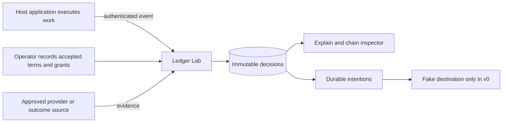
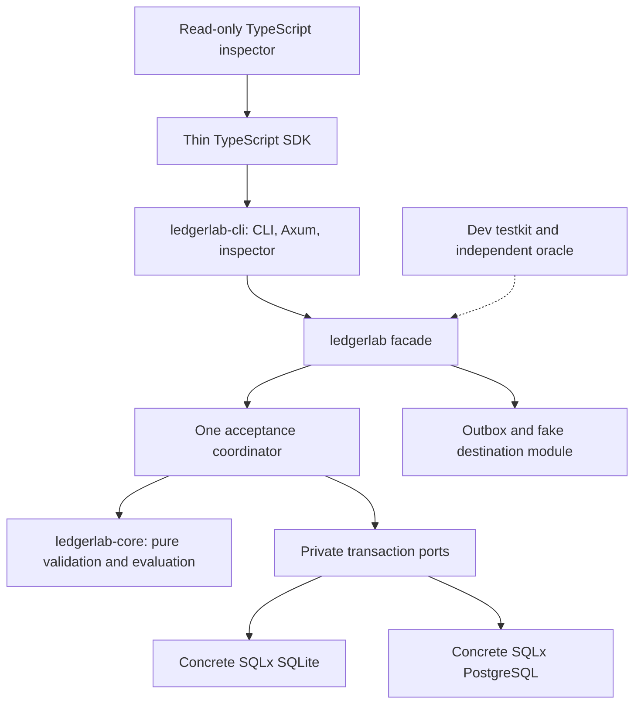
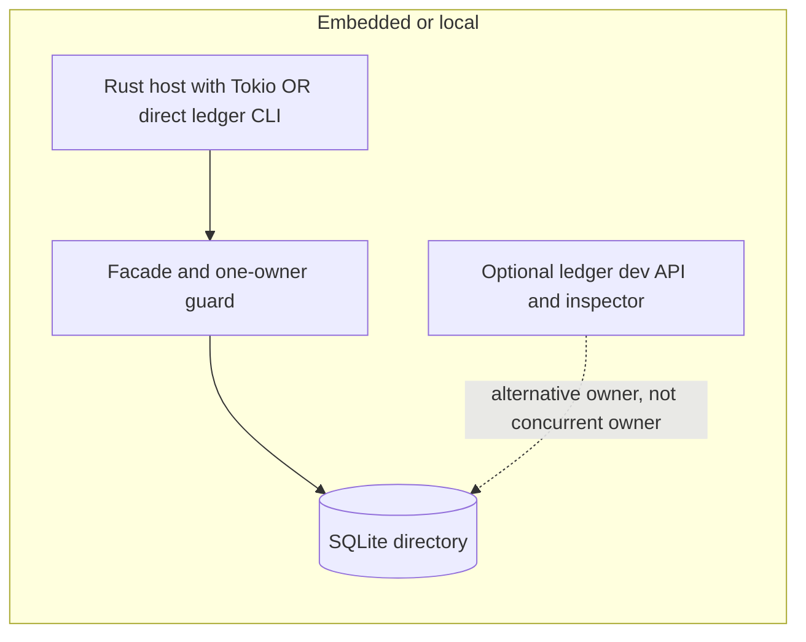
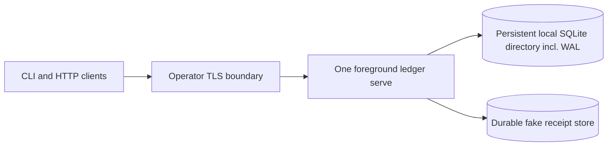
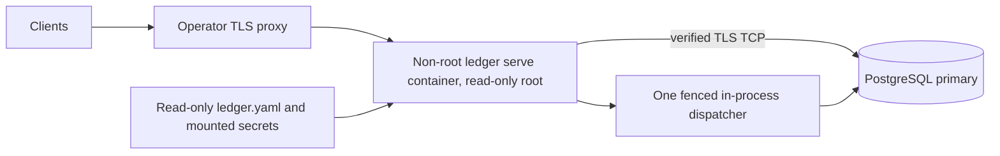
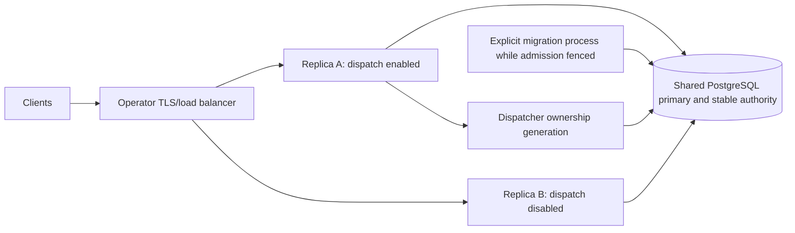

# Ledger Lab v0 — detailed implementation design

Design revision 1 · 20 September 2026 · Apache-2.0 product · **Planning only**

**Promise: “Chain events. Compose pricing. Export the result anywhere.”**

This is a proposed implementation contract, not implemented software or a certification. MUST/SHALL specify the intended implementation. Examples are synthetic. No product code, repository, database or infrastructure was created for this document. The document checks reported at the end are not product test results.

Authority, in increasing specificity: [architecture](/Users/stephenkall/Documents/Codex/2026-09-20/ledger-lab-astra-review/outputs/LEDGER-LAB-ARCHITECTURE.md), [Rust foundation](/Users/stephenkall/Documents/Codex/2026-09-20/ledger-lab-astra-review/outputs/LEDGER-LAB-RUST-FOUNDATION-PLAN.md), [adoption and cost](/Users/stephenkall/Documents/Codex/2026-09-20/ledger-lab-astra-review/outputs/LEDGER-LAB-ADOPTION-COST-REVIEW.md), [platform neutrality](/Users/stephenkall/Documents/Codex/2026-09-20/ledger-lab-astra-review/outputs/LEDGER-LAB-PLATFORM-NEUTRALITY-REVIEW.md). All four were read completely. These local source links were checked against the workspace. §27 records amendments rather than silently choosing an earlier recommendation.

Evidence labels used throughout:

- **Decision:** a normative proposal chosen here, including numeric limits and API names; not a measured optimum.
- **External behavior:** supported by the linked official documentation, checked for this design on 20 September 2026; not a test of Ledger Lab.
- **Gate:** an implementation assumption requiring evidence before the relevant phase exits. Exact dependencies, MSRV, package availability and native artifact certification remain gates.

Reader guide for a coding agent: read §§1–11 before designing data access; use §§12–15 for the persistence boundary; implement §26 through the phased gates in §25. Treat §§6–10 and §26 as semantic contracts, not examples to reinterpret. Public interfaces are §§16–19. Use §28 to find the enforcing module and required test. If a field or outcome cannot be derived from these rules, report the ambiguity before changing a golden journal. File paths below describe the future repository; none imply those files exist today.

## 1. Executive design summary, goals and v0 definition

Ledger Lab is an **event-native economic engine for AI products and composable tools**. Its primitive is an immutable, independently addressable, idempotent atomic event. Authorized typed links supply bounded context. Accepted terms and versioned policies produce immutable charges, costs, premiums, discounts, credits, shares and allocations.

The linearization point is durable commit of identity/deduplication, authorized links, the exact applicable snapshots, all actions, explanations, downstream intentions, receipt and concurrency changes. Either that complete decision commits or none does. Zero-action acceptance is valid and explained. A later event is another atomic decision; a chain is not a transaction spanning external tools.

Goals: remove repeated economic glue code; preserve one economic meaning across SQLite and PostgreSQL; make “who owes whom and why?” locally reproducible; provide a short synthetic onboarding path; preserve IDs and bytes during recovery/migration; require no company-operated runtime, model, collector or account.

v0 includes one binary, three production crates, a dev testkit, five templates, both real stores, embedded Rust, optional HTTP, thin TypeScript SDK, read-only inspector, bounded linked work, accepted first-party/supplier terms, one share pattern, final chain-stage cap, exact full reversals, pending/conflict/retry handling, original-snapshot verification, fake export and verified offline SQLite→PostgreSQL migration.

Non-goals: payment execution/custody, wallets, tax, invoice issuance, collections, accounting/GL, revenue recognition, workflow execution, generic analytics, causal inference, marketplace/discovery, autonomous negotiation, arbitrary policy code, FX, cross-tenant links, distributed/global budgets, live migration, general plugin system, microservices, Kubernetes operator, proprietary telemetry. A provider receipt is evidence, not authority to charge. Accepted terms and explicit parties are required for real obligations.

One organization owns an installation. Tenant/environment scoping is enforced everywhere, but v0 does not certify hostile hosted multi-tenant SaaS isolation. A sandbox installation cannot become real by toggling a mode flag; create a separate real store and bind actual terms.

## 2. Terminology and the public mental model

Public mental model: **record work → apply its agreed price → link related work → explain the receipt**.

| Concept | Visibility | Exact meaning |
|---|---|---|
| Event | Public | One immutable assertion with stable scoped identity and operation/claim identity. |
| Customer | Public | Lookup into accepted retail terms; never an implicit payer authorization. |
| Agreed price / terms | Public | Published price version plus an accepted binding for the applicable parties/scope. |
| Link | Public | Typed reference from current or asserted child to an earlier event; no causal claim. |
| Chain | Public/defaulted | One bounded economic context. Explicit workflow ID, inherited parent chain, or deterministic single-operation chain. |
| Source | Defaulted/public for integrations | Stable registered identity attached to authenticated principal. |
| Provider, cost originator, bearer, payer, beneficiary, recipient | Defaulted for simple preset; explicit for suppliers | Six per-obligation roles. Defaults are named mappings disclosed in terms. |
| Offer | Advanced public | Supplier proposal with immutable hash; creates no debt itself. |
| Binding | Advanced public | Accepted terms, parties, scope, evidence and pinned policy version. |
| Invocation authorization | Advanced public | Pre-work scope/exposure permission and reservation for a paid supplier operation. |
| Policy snapshot | Internal, inspectable | Canonical policy, semantics version and trusted inputs actually used. |
| Claim | Internal | Permanent semantic work/outcome uniqueness independent of delivery ID. |
| Effect | Internal | Stable economic slot; rule rename or price change cannot make it new. |
| Action | Public breakdown/internal identity | One signed booked delta or allocation, with provenance. |
| Obligation | Internal grouping/public “owed by…to…” | Economic responsibility, with bearer and payer distinguished. |
| Intention | Internal | Immutable destination instruction, committed with the decision. |
| Delivery | Operator | Mutable attempt/lease/reconciliation state; not the economic decision. |
| Receipt | Public | Immutable evidence that a complete decision committed; duplicate returns it unchanged. |
| Preview | Public | Noncommitting estimate with missing-authority warnings; never a receipt. |
| Stage | Internal/advanced terms | Declared closure and bounded input set for a cap. |
| Reversal | Advanced public | New event negating an explicitly named complete set of booked effects. |

Simple retail preset maps provider/cost-originator/recipient to host, bearer/payer/beneficiary to the selected customer. This mapping represents only the retail obligation; a provider cost observation or supplier payable gets its own roles and book. BYOK means the customer contracted with the model supplier; it does not create a host supplier payable.

## 3. Context, components and deployment profiles













Embedded Rust provides its Tokio runtime; the facade never nests one. SQLite allows concurrent requests inside its one owning process. Independent writers/replicas require PostgreSQL. A single container may use SQLite only with the entire durable exclusive data directory mounted. Server operation is foreground, headless and configuration-driven. No Mac-specific path, login shell, Keychain, writable HOME or project directory is part of the PostgreSQL contract.

## 4. Exact proposed repository and ownership

```text
Cargo.toml                         # workspace; coordinated versions
Cargo.lock
rust-toolchain.toml                # exact toolchain after Phase 1
LICENSE
NOTICE
README.md
crates/
  ledgerlab-core/
    Cargo.toml
    src/lib.rs
    src/wire/{mod,event,terms,policy,result}.rs
    src/domain/{mod,ids,event,links,parties,authority,terms,actions,decision}.rs
    src/canonical/{mod,parse,normalize,jcs,hash}.rs
    src/money/{mod,decimal,rational,round,allocate}.rs
    src/policy/{mod,ast,compile,match,evaluate,bases,cap,share,reversal}.rs
    src/explain/{mod,codes,render}.rs
    src/limits.rs
  ledgerlab/
    Cargo.toml
    src/lib.rs                      # Ledger, typed service results
    src/config/{mod,dto,resolve,presets,secrets}.rs
    src/service/{mod,accept,normalize,resolve,locks,authority,claims,pending,terms,invocations,read,preview,verify}.rs
    src/store/{mod,ports,errors,records}.rs
    src/store/sqlite/{mod,connect,owner,tx,read,write,backup,migrate}.rs
    src/store/postgres/{mod,connect,tls,tx,read,write,backup,migrate}.rs
    src/store/sqlite/sql/*.sql
    src/store/postgres/sql/*.sql
    src/outbox/{mod,dispatch,lease,reconcile,fake}.rs
    src/transfer/{mod,format,export,import,verify,cutover}.rs
    src/platform/{mod,paths,files,clock,entropy}.rs
    migrations/sqlite/{0001_control,0002_journal,0003_delivery,0004_guards}.sql
    migrations/postgres/{0001_control,0002_journal,0003_delivery,0004_guards}.sql
    .sqlx-sqlite/query-*.json
    .sqlx-postgres/query-*.json
  ledgerlab-cli/
    Cargo.toml                     # binary name ledger, default feature http
    src/{main,args,output,errors}.rs
    src/commands/{init,dev,serve,accept,explain,preview,terms,admin,verify,backup,storage,migrate,export}.rs
    src/http/{mod,routes,auth,dto,errors,health,limits}.rs
    src/platform/{mod,signals,child,browser,terminal}.rs
    src/bin/ledger-contracts.rs     # maintainer-only feature; not distributed
    assets/inspector/              # generated, embedded, no CDN
  ledgerlab-testkit/
    Cargo.toml                     # publish=false, development-only
    src/{lib,fixtures,oracle,history,failpoints,crash,races,stores,artifacts}.rs
    tests/{slice,conformance,authority,concurrency,outbox,transfer,api,cli,onboarding}.rs
contracts/
  README.md
  schemas/v1/{event,link,terms,policy,action,explanation,receipt,invocation,export}.schema.json
  openapi/v1.yaml
  compatibility.json
fixtures/
  canonical/{valid,invalid,expected}/
  journals/{first-slice,first-party,third-party,capped,byok,reversal}/
  authority/
  failures/
  transfer/
sdk/typescript/{package.json,src/generated.ts,src/client.ts,src/link.ts,src/format.ts,tests/}
inspector/{package.json,src/{app,timeline,details,pending}.tsx,tests/}
docs/{quickstart,integrate,server,recovery,compatibility}.md
docs/adr/*.md
release/{targets.toml,compatibility.json,artifact-manifest.schema.json,Dockerfile}
scripts/{check-boundaries,check-contracts,check-sqlx,release-evidence}.sh
fuzz/{Cargo.toml,fuzz_targets/{strict_json,canonical,policy,transfer}.rs}
.github/workflows/{pr,release,periodic}.yml
```

This lists phase-owned files, not an instruction to scaffold empty modules. Only the three production crates are published/coordinated. The maintainer generator is a feature-gated utility target in the CLI crate; the shipped executable remains one `ledger` binary. Runtime fake-adapter code lives in `ledgerlab::outbox::fake`; testkit supplies independent scenarios and never becomes a production dependency. This resolves the adoption report's illustrative placement of fake testing without introducing a fourth production crate.

Dependency direction: CLI→facade→core; testkit→all three; inspector→SDK→HTTP. `ledgerlab-core` permits Serde, schema derivation, SHA-256, a conformant JCS library and bounded exact-integer dependencies. It forbids SQLx, Tokio, Axum, filesystem/network, environment, clock/entropy reads, model clients and first-party unsafe code. Facade owns SQLx/Tokio and configuration expansion, not CLI parsing. Store modules forbid calls to evaluator or independent policy/authority decisions; they implement typed queries and constraints. CLI/TS forbid economic computation. CI checks the resolved graph including default/features, source imports and generated-contract drift.

Use concrete `SqliteStore` and `PostgresStore`, static dispatch inside a small facade enum. No SQLx `Any`, ORM entity hierarchy, plugin loader, or public raw-action append. Parameterized query files and migrations stay separate. Offline query metadata is generated into a temporary per-backend directory and checked against the matching committed directory; source build enables exactly that backend metadata path per compile unit. **Gate:** prove SQLx macro metadata coexistence; if inconvenient use typed runtime parameterized queries with real-store tests, not a combined unverified metadata set.

## 5. Rust domain model and limits

Wire DTOs derive Serde/Schemars with `deny_unknown_fields`; validated types have private fields and fallible constructors. Signatures below are design notation, not compiled Rust. Every collection is bounds-checked before constructing a domain value.

```rust
pub struct TenantId(String); pub struct EnvironmentId(String);
pub struct SourceId(String); pub struct ExternalEventId(String);
pub struct OperationId(String); pub struct ChainId(String); pub struct PartyId(String);
pub struct BindingId(String); pub struct AgreementId(String); pub struct PrincipalId(String);
pub struct ComponentId(String); pub struct Unit(String); pub struct Currency([u8; 3]);
pub struct Digest([u8; 32]);
pub struct EventId(Digest); pub struct LinkId(Digest); pub struct ClaimId(Digest);
pub struct EffectId(Digest); pub struct ActionId(Digest); pub struct IntentionId(Digest);
pub struct DecisionId(Digest); pub struct ReceiptId(Digest); pub struct DocumentId(Digest);
pub struct InvocationId(String); pub struct Revision(u64); // persisted <= i64::MAX
pub struct Micros(i64); pub struct CanonicalBytes(Vec<u8>);
pub struct Scope { tenant: TenantId, environment: EnvironmentId }
pub struct ScopedIdentity { scope: Scope, source: SourceId, id: ExternalEventId }
pub enum EventKind { Generated, Optimized, Published, Acquired, ToolCompleted,
                     LinkAsserted, Reversal }
pub enum Relation { GeneratedFrom, OptimizedFrom, PublishedAs, AttributedTo, ConsumesService }
pub enum Completion { Succeeded, Failed }
pub struct EventRef { source: SourceId, id: ExternalEventId }
pub struct TypedLink { relation: Relation, from: EventRef } // predecessor
pub struct Event {
  identity: ScopedIdentity, operation: OperationId, kind: EventKind,
  chain: ChainId, customer: PartyId, occurred_at: Option<Micros>,
  data: EventData, links: Vec<TypedLink>, extensions: CanonicalBytes,
}
pub enum EventData {
  Work { status: Completion, quantity: Decimal, unit: Unit,
         binding: Option<BindingId>, invocation: Option<InvocationId>,
         evidence: Vec<DocumentId>, corrects: Option<EventId> },
  Outcome { claim: String, occurred_at: Micros, evidence: Vec<DocumentId> },
  LinkAssertion { child: EventRef },
  Reversal { targets: Vec<EventId>, reason: String, evidence: DocumentId },
}
pub struct Roles {
  provider: PartyId, cost_originator: PartyId, bearer: PartyId,
  payer: PartyId, beneficiary: PartyId, recipient: PartyId,
  payer_delegation: Option<DocumentId>,
}
pub enum Book { Retail, Supplier, CostObservation, Allocation }
pub enum Funding { Byok, Platform }
pub struct AcceptedBinding {
  id: BindingId, agreement: AgreementId, version: u32, offer: Option<DocumentId>,
  policy: DocumentId, roles: Roles, currency: Currency, scale: u8,
  scope: BindingScope, assent: DocumentId, acceptor: PrincipalId,
  accepted_at: Micros, starts_at: Micros, ends_at: Option<Micros>,
  funding: Funding, outcome_authority: Option<SourceId>,
}
pub struct PolicySnapshot {
  source: DocumentId, dsl: u16, semantics: u16, context: DocumentId,
  authority_versions: Vec<DocumentId>, prior_actions: Vec<ActionId>,
}
pub enum ActionKind { Charge, Cost, Premium, Discount, Credit, Share, Allocation, Reversal }
pub struct Money { currency: Currency, scale: u8, atoms: i128 }
pub struct Action {
  id: ActionId, effect: EffectId, decision: DecisionId,
  kind: ActionKind, book: Book, component: ComponentId, amount: Money,
  roles: Roles, binding: BindingId, rule: String,
  sources: Vec<EventId>, links: Vec<LinkId>, inputs: Vec<ActionId>,
  snapshot: DocumentId, reverses: Option<ActionId>, allocation_parent: Option<ActionId>,
}
pub enum RuleOutcome { Applied, Skipped, Zero }
pub struct ExplanationStep {
  rule: String, outcome: RuleOutcome, code: ReasonCode,
  binding: BindingId, input_refs: Vec<Digest>,
  basis: Option<ExactRatio>, inputs: Vec<ExplanationInput>, unrounded_atoms: Option<ExactRatio>,
  rounded_atoms: Option<i128>, actions: Vec<ActionId>,
}
pub struct Intention {
  id: IntentionId, destination: String, obligation: Digest,
  actions: Vec<ActionId>, amount: Money, depends_on: Vec<IntentionId>,
  payload: CanonicalBytes,
}
pub struct Receipt {
  id: ReceiptId, event: EventId, decision: DecisionId, content_hash: Digest,
  chain: ChainId, revision: Revision, decision_hash: Digest,
  actions: Vec<ActionId>, intentions: Vec<IntentionId>,
}
pub struct DecisionPlan {
  event: Event, links: Vec<AuthorizedLink>, snapshots: Vec<CanonicalDocument>,
  claims: Vec<Claim>, effects: Vec<Effect>, actions: Vec<Action>,
  explanations: Vec<ExplanationStep>, intentions: Vec<Intention>,
  transitions: Vec<ControlTransition>, receipt: Receipt,
}
pub fn evaluate(input: &ResolvedInput) -> Result<DecisionPlan, DomainError>;
```

`ExplanationInput` is a tagged value (decimal, money, boolean, source ID, binding-field string or document/action reference), never arbitrary executable data. `AuthorizedLink`, `CanonicalDocument`, `Claim`, `Effect`, `ControlTransition` are stored records defined by §§6, 11–12. They contain IDs, scope, canonical bytes/hash and typed references, not driver handles. `BindingScope` contains customer, service, permitted event types, sources, chain selector, unit, maximum quantity/exposure and explicit trusted context. `ResolvedInput` includes the event, bounded prior records, all pinned bindings and authorities, invocation state, stage definition and fixed decision context. It has no lazy loaders or closures that access the environment.

Limits are normative rejection thresholds, counted before and after normalization:

| Item | v0 bound |
|---|---:|
| Candidate UTF-8 body / normalized canonical event / JSON nesting | 262,144 bytes / 262,144 bytes / 32 levels |
| ID strings | 1–128 UTF-8 bytes, no control characters/NUL; source URI 1–256 bytes |
| Component/rule/unit slug | ASCII `[a-z][a-z0-9_.-]{0,63}` |
| Event links / evidence references | 32 / 16 |
| Chain events / traversed hops / inbound children per predecessor | 1,000 / 16 / 128 |
| Applicable bindings / rules per bundle | 16 / 64 |
| Policy AST nodes / predicate depth | 256 / 8 |
| Actions / intentions / explanation steps per acceptance | 128 / 32 / 256 |
| Canonical decision bundle / explanation data | 4 MiB / 1 MiB |
| Individual retained evidence document / aggregate resolved input | 256 KiB / 8 MiB |
| Explicit stage dependencies / reversal target events | 32 / 32, also obey 128-action maximum |
| Export NDJSON record | 8 MiB encoded; stream validation before allocation |
| Pending candidates per scope / bytes / expiry | 10,000 / 256 MiB / 7 days |
| Quantity/rate coefficient digits / scale | 30 / 18 |
| Booked magnitude | `10^30 - 1` atoms |
| Reduced numerator or denominator; temporary arithmetic | at most 512 bits each, including pre-reduction products |

Reversal event targets complete prior decisions, not an arbitrary fractional amount. If later accepted actions depend on a target's economics, all affected decisions must be explicitly included; otherwise `REVERSAL_DEPENDENTS_REQUIRED`. The service derives and reports the closure, bounded by the limits, but never silently reverses extra work. Already reversed targets conflict. Supplier reversals require the original agreement's correction authority; a host discount cannot cancel a supplier debt. Zero-action decisions have no reversible economics and return `NOTHING_TO_REVERSE`.

A replacement is a new ordinary event with `corrects` referencing a fully reversed prior event and a new operation authorization. v0 does not atomically combine reversal and replacement, does not partially reverse, and does not reopen a closed cap stage. A replacement that would affect such a stage needs a newly authorized chain/stage with an explicit new input set. This restriction avoids silently rerating unaffected historical work; §27 records it as a new scope decision.

## 6. Canonical representation, scoped identity and hashes

**Decision:** `ledger-canonical-v1` = bounded strict UTF-8 JSON parse → schema validation/normalization → RFC 8785 JCS UTF-8 bytes. Reject duplicate keys before DTO construction, BOM, lone surrogates, invalid UTF-8, JSON numeric tokens outside integral safe range `[-9007199254740991,9007199254740991]`, negative numeric zero, exponent/fraction tokens, and unsupported schemas. Economic decimals are strings. The stricter numeric profile deliberately excludes otherwise valid JSON.

JCS uses UTF-16 code-unit object-key ordering, leaves arrays ordered and does not normalize Unicode. Those details are external behavior; Ledger Lab additionally defines which domain arrays are sets. [RFC 8785](https://www.rfc-editor.org/rfc/rfc8785)

No NFC/NFD conversion, case folding, URI rewriting or OS filename normalization occurs. IDs `é` and `e`+combining accent differ. Source IDs must equal the registered source URI byte-for-byte. Normalize decimal strings by removing redundant zeros, timestamps to UTC with exactly six fractional digits, and documented defaults only. Accept timestamps with explicit offset, year 0001–9999, 0–6 fractional digits; reject leap seconds and excess precision. Never generate producer occurrence time.

Absent optional fields remain absent; `null` is rejected in economic DTOs. Default `quantity="1"`, `unit="call"`, `status="succeeded"`, `operation_id=id`, `links=[]`, `evidence=[]`, `extensions={}` are inserted only where the event schema defines them. The acquisition/reversal variants have their own fields. Extensions permit at most 16 string→scalar entries and 4 KiB, no policy access; changing them changes event content but not semantic facts. Unknown fields fail. All set arrays sort by canonical element bytes and reject duplicates: links, evidence IDs, binding references, action/intention membership and reversal targets. Rule arrays and explanation execution order remain ordered. SQL queries always specify order; hash-map iteration never does.

Public compact events normalize before identity lookup. Source defaults to the authenticated principal's one configured source. For omitted chain, inherit the single common parent chain after resolution; without links derive `chain = "auto-" + H("chain", [scope,source,operation_id])`. Explicit chains are retained. Multiple parents must share a chain. To avoid mutable defaults changing retry content, store an **ingress hash** of the normalized caller fields before inherited-chain/binding resolution, and compare it first on scoped identity retry. A matching ingress hash returns the original receipt before resolving current terms. Canonical event bytes contain the resolved chain; the ingress bytes/hash are retained alongside them. A caller must repeat its original request shape (including omitted versus explicit source/chain as normalized); switching the source-default or adding a formerly omitted chain is not a guaranteed identical retry. The SDK freezes serialized requests.

All hashes use full SHA-256. Define:

```text
H(kind, value) = lowercase_hex(SHA256(
    UTF8("ledgerlab/" + kind + "/1") || byte(0) || JCS(value)))
ID(kind,value) = prefix(kind) + "_" + H(kind,value)
```

`kind` is a fixed ASCII domain from the table, never user-controlled. Structured tuples are arrays, not concatenated field strings. Digest wrappers display `sha256:<64 lowercase hex>`. Prefixes do not enter their own payload. Database UUIDs, receive time and policy prices cannot influence semantic identity.

| Object / domain | Prefix and exact hash input |
|---|---|
| Event / `event` | `ev_`; `[tenant,environment,source,external_id]` |
| Ingress / `ingress` | hash of normalized compact DTO before mutable resolution |
| Event content / `event-content` | normalized canonical event including resolved chain; excludes authenticated request ID/receive time |
| Document / `document` | `doc_`; `[document_type,schema_version,canonical_document_body]` |
| Claim / `claim` | `cl_`; `[scope,source,operation_id,claim_kind,claim_token]`; token `"completion"` for work, authoritative business claim for outcome, canonical link ID for link assertion |
| Semantic facts / `claim-facts` | event kind, chain, customer, status, normalized quantity/unit, resolved relation-plus-endpoint tuples, explicit requested binding/invocation refs, occurrence time, evidence hashes and correction ref; exclude external delivery ID and extensions |
| Link / `link` | `ln_`; `[scope,relation,child_event_id,predecessor_event_id]` |
| Decision / `decision` | `dc_`; `[event_id]` |
| Effect / `effect` | `ef_`; `[scope,agreement_id,component,claim_id,match_key,namespace]` |
| Action / `action` | `ac_`; `[effect_id]` |
| Obligation / `obligation` | `ob_`; `[scope,agreement_id,book,currency,scale,roles]` |
| Intention / `intention` | `in_`; `[scope,destination_id,obligation_id,sorted_action_ids]` |
| Receipt / `receipt` | `rc_`; `[event_id]` |
| Decision content / `decision-content` | complete ordered decision manifest excluding its own hash and receipt; includes revision, context snapshots and all canonical record hashes |

`scope` in hash tuples is exactly `[tenant,environment]`. Agreement ID is stable across binding versions. `match_key` is `"self"` or a sorted array of LinkIds selected by a fixed matcher. Namespace is `"original"`; reversal effect uses domain `reversal-effect`, tuple `[scope,original_action_id]` and the same `ac_` action derivation. A replacement uses a new operation and `corrects` reference; policy/rule/version renaming never changes original claim/effect identity. A repeated link assertion with a different delivery ID resolves its same link claim; matching facts become an alias. Link assertion facts omit the assertion delivery's operation ID and child source is checked independently.

Claim uniqueness is stronger than per-binding effect uniqueness: changing current bindings cannot re-bill the same operation. First winner is canonical. An authenticated retry with a different ID but equal claim facts returns its existing receipt as `duplicate(kind="semantic")`; no second event. Changed semantic facts return conflict, even if new policy would emit zero actions. Grant checks permit receipt access but never disclose another party's record. The provider cannot select a different source alias to evade uniqueness: grant registration maps one canonical economic source per service operation namespace.

Canonical record encoding convention: each immutable body has `schema:"ledger-<kind>/1"`, an `id` where its identity is not content-derived, and the snake_case wire fields listed in this document. Optional fields are omitted, never null; all persisted revisions/ordinal-independent large counters use canonical unsigned strings, while schema versions/scales/step ordinals use bounded JSON integers. `content_hash = H("record-content", [kind,1,body])` for generic journal rows; event ingress/event-content and document ID use their specifically named domains above. Hash-bearing metadata columns are outside the body whose hash they hold. Canonical document bytes are the document body without its computed DocumentId; `ID(document,[document_type,1,body])` is its identity. A decision manifest body contains sorted `{kind,id,content_hash}` memberships, its event/chain/revision and ordered explanation IDs, but not its own digest or receipt. The receipt refers to the resulting decision hash. No hash cycle exists. `receipt.id`, `event_id`, `decision_id`, `chain_id`, `revision`, `action_ids`, `intention_ids`, `content_hash` and `decision_hash` are the exact public receipt wire field names; Rust field names map explicitly with Serde.

Cross-language fixtures contain input bytes, normalization result, canonical bytes (UTF-8 plus hex), complete hash input and expected digest. Include key-order traps U+1F600 before U+E000 under UTF-16, escaped versus literal characters, composed/decomposed strings, `1.00`→`1`, absent versus forbidden null, large integer strings, duplicate keys and link permutations. A Rust JCS implementation and a separately written test-only Node/Python oracle must match frozen expected bytes; the SDK itself need not canonicalize or price. Example: canonical `{"quantity":"1.00","id":"g1"}` after quantity normalization is `{"id":"g1","quantity":"1"}`. Golden event IDs for §26 are fixed by the exact tuple formula, not hand-invented UUIDs.

## 7. Exact money, quantities, rounding and allocation

Wire money is `{ "currency":"USD", "scale":2, "atoms":"100" }`. `atoms` is a canonical signed decimal integer; scale is a small JSON integer. `Currency` is exactly three uppercase ASCII letters, a code label rather than a live FX/ISO lookup. Each chain pins one currency **and scale** in v0, a deliberate stricter limit than one currency alone. Negative values appear only in effects, not in input quantities, prices or percentages. Policy amounts use major-unit decimal strings which must be exactly representable at the pinned scale for fixed amounts; unit-rate products may require rounding.

`Decimal { coefficient: u128, scale: u8 }` has ≤30 digits and scale≤18 after parsing, but the raw token is limited to 64 bytes and ≤18 fractional digits before removing zeros. Leading plus/exponents/group separators/whitespace are rejected. Positive leading zeros and trailing fractional zeros normalize; negative zero and all negative quantity/rate inputs reject. Zero quantity is allowed only for failed work; successful work requires >0. Percent range is `[0,100]`; a contractual 200% premium must be expressed as a fixed/unit amount, not an unbounded percentage. `ExactRatio { numerator: BigInt, denominator: BigUint }` is reduced with positive denominator.

Algorithm: convert decimal coefficient/10^scale into a ratio; use checked bounded products/sums with GCD cancellation before multiplication; reject any actual intermediate exceeding 512 bits. Unit price × quantity × 10^book_scale produces exact rational atoms. Percentage uses named rounded basis atoms × percent/100. No SQL NUMERIC, float, `usize` or language locale participates. Final posting checks `abs(atoms)≤10^30−1`, fits `i128`, and uses one rounding operation per component. `ARITHMETIC_OVERFLOW`, `INPUT_PRECISION`, `CURRENCY_MISMATCH`, `UNIT_MISMATCH`, `NEGATIVE_BASIS` roll back the entire acceptance. Totals are bounded checked integers too; no saturating/clamping arithmetic except explicit contractual caps.

Signed nearest, ties away from zero: for n/d, let q=abs(n)/d, r=abs(n)%d; result = sign(n)×(q + (2r≥d ? 1 : 0)). Zero has one representation. Book base first; derive percentage adjustments from named **booked** bases; round every adjustment independently. Additive discounts each read the declared unchanged base; sequential discounts read the prior named net in declared order. A sum of discounts may not make its component negative; reject `DISCOUNT_EXCEEDS_BASIS`, do not silently floor. No general floor operator. Revision increment at i64::MAX fails with `REVISION_EXHAUSTED`; no integer wraps or identity reuse.

Cap semantics are narrow: one retail chain-stage closure, fixed expected predecessor operations supplied by trusted stage context before work, one closure claim, same obligation/currency/scale. Compute prior eligible booked net P and current closure component C. Credit is `-max(0,P+C-cap)`. Require `cap≥P`, C≥0 and credit magnitude≤C; otherwise `CAP_BELOW_BOOKED`. Credit reduces only the named current closure component; it cannot cancel previously incurred supplier fees. No zero action is inserted for an inactive cap. Its explanation states `CAP_NOT_BINDING`. Closing freezes new originals in that stage; corrections use §5 restrictions. Optional future acquisitions do not delay current generation; only a submitted closure with required missing inputs waits.

One share pattern: one supplier binding receives percent of `retail.<closure_component>.net_after_cap`, limited by its explicit maximum. Round the share then apply integer-atom ceiling. Bearer is host, recipient supplier, book supplier; the retail customer is not charged again. One share per policy bundle/closure; no recursive shares, shares of supplier costs, or cycles. A share does not mutate the retail action. An accepted supplier binding may set `allocation_view:true` (default false). This emits two informational allocation entries partitioning the capped retail basis into the already-booked supplier share and retained host remainder; it does not split the share a second time. Both entries reference the governing share as `allocation_parent` and the retail basis actions as inputs. Their sum equals that named retail basis, not the share action amount; neither creates another obligation. More general recipient allocation is internal test coverage, not a public v0 DSL operator.

Allocation primitive: for signed integer total T and nonnegative rational weights, require positive weight sum, ≤32 unique recipient keys. Allocate abs(T)×w/sum(w), floor each quotient; distribute remaining atoms by descending fractional remainder, then ascending UTF-8 recipient ID bytes and effect ID bytes. Restore T's sign. Sum must equal T. Reversal negates stored allocation entries individually; it never reruns remainder selection.

Independent required arithmetic vectors (major-unit amounts unless labeled atoms):

| Vector | Exact calculation | Booked result |
|---|---|---|
| First slice | 1.00 base; 20% ×1.00 | +100, −20 atoms; retail net 80 |
| Priority fixture | 1.00 +0.20 −20%×1.00 | 100+20−20=100 atoms |
| Unit/fraction | 0.07×1.5 | 10.5 atoms→11 |
| Positive/negative tie | ±1.005 at scale 2 | ±101 atoms |
| Non-tie | ±1.0049 at scale 2 | ±100 atoms |
| Additive discounts | 100 atoms less 10%, then 10% of original 100 | 80 atoms |
| Sequential discounts | 100 less 10%=90, then 10% of 90 | 81 atoms |
| Allocation | +100 equally to a,b,c | 34,33,33; negative total gives −34,−33,−33 |
| Fractional weights | 11 atoms, a:b:c = 1:2:3 | quotas 11/6,22/6,33/6 →2,4,5 |
| Uncapped supplier example | (80−8)+(30−3)+(40−4)+200 | retail 335; optimizer 10+5=15; publisher 15+50=65 |
| Capped supplier example | P=135,C=200,cap=315; share25% | cap credit −20; basis180; share45; publisher total60 |
| Share ceiling | basis1000 atoms×25%, ceiling50 | 50 atoms |
| Reversal | original discount −20, original premium +500 | +20,−500 regardless of current rates |
| Rounding stage | three postings of 0.004 USD | 0+0+0=0, differs from aggregate 0.012→1 atom |
| Overflow | maximum booked atoms +1 | reject, no records committed |

For the uncapped multi-tool example, total attributable cost is model observation20+optimizer15+publisher65=100 atoms; 335−100=235 atoms margin. Cost observations are not a second payable. The capped variant has cost95 and margin220. These are synthetic economics, not accounting/tax guidance.

## 8. Versioned event and link schemas

Contract files use JSON Schema Draft 2020-12. Schemas are bundled and referenced by local immutable IDs; there is no network resolver. Schema validation establishes shape; source authority, UTF-8 byte limits, timestamp precision, decimal normalization, referenced types and economic constraints are additional Rust validators. The format is a small compact application DTO, with an explicit CloudEvents 1.0 **fixture conversion** (`id/source/type/time/data`); it does not claim that the compact DTO itself is a complete CloudEvents envelope. Never accept both representations in one request. The CLI can convert a CloudEvents fixture to this DTO before submission; HTTP v1 accepts the compact schema only. The conversion refuses unmapped subject/extensions rather than dropping identity-relevant data. [CloudEvents specification](https://github.com/cloudevents/spec/blob/main/cloudevents/spec.md) The existing architecture envelope was illustrative, and this choice follows adoption's smaller public surface.

The following is the normative structural `event.schema.json` (extension scalars intentionally exclude null):

```json
{
  "$schema":"https://json-schema.org/draft/2020-12/schema",
  "$id":"urn:ledgerlab:event:1",
  "type":"object","additionalProperties":false,
  "required":["schema","id","type","customer"],
  "properties":{
    "schema":{"const":"ledger-event/1"},
    "id":{"$ref":"#/$defs/id"},"source":{"type":"string","minLength":1,"maxLength":256},
    "operation_id":{"$ref":"#/$defs/id"},
    "type":{"enum":["content.generated","tool.optimized","content.published","outcome.acquired","tool.completed","link.asserted","economic.reversal"]},
    "customer":{"$ref":"#/$defs/id"},"chain":{"$ref":"#/$defs/id"},
    "occurred_at":{"type":"string","format":"date-time"},
    "status":{"enum":["succeeded","failed"]},
    "quantity":{"type":"string","pattern":"^[0-9]+(\\.[0-9]{1,18})?$","maxLength":64},
    "unit":{"type":"string","pattern":"^[a-z][a-z0-9_.-]{0,63}$"},
    "binding_id":{"$ref":"#/$defs/id"},"invocation_id":{"$ref":"#/$defs/id"},
    "claim_id":{"$ref":"#/$defs/id"},
    "links":{"type":"array","maxItems":32,"uniqueItems":true,"items":{"$ref":"#/$defs/link"}},
    "evidence":{"type":"array","maxItems":16,"uniqueItems":true,"items":{"$ref":"#/$defs/doc"}},
    "child":{"$ref":"#/$defs/ref"},
    "targets":{"type":"array","minItems":1,"maxItems":32,"uniqueItems":true,"items":{"$ref":"#/$defs/eventId"}},
    "reason":{"type":"string","minLength":1,"maxLength":256},
    "corrects":{"$ref":"#/$defs/eventId"},
    "extensions":{"type":"object","maxProperties":16,"additionalProperties":{"type":["string","boolean","integer"]}}
  },
  "allOf":[
    {"if":{"properties":{"type":{"enum":["content.generated","tool.optimized","content.published","tool.completed"]}}},
     "then":{"not":{"anyOf":[{"required":["claim_id"]},{"required":["child"]},{"required":["targets"]},{"required":["reason"]}]}}},
    {"if":{"properties":{"type":{"const":"outcome.acquired"}}},
     "then":{"required":["claim_id","occurred_at","links","evidence"],"properties":{"links":{"minItems":1},"evidence":{"minItems":1}},"not":{"anyOf":[{"required":["status"]},{"required":["quantity"]},{"required":["unit"]},{"required":["child"]},{"required":["targets"]},{"required":["reason"]},{"required":["corrects"]}]}}},
    {"if":{"properties":{"type":{"const":"link.asserted"}}},
     "then":{"required":["child","links"],"properties":{"links":{"minItems":1,"maxItems":1}},"not":{"anyOf":[{"required":["status"]},{"required":["quantity"]},{"required":["unit"]},{"required":["claim_id"]},{"required":["targets"]},{"required":["reason"]},{"required":["corrects"]}]}}},
    {"if":{"properties":{"type":{"const":"economic.reversal"}}},
     "then":{"required":["targets","reason","evidence"],"properties":{"evidence":{"minItems":1,"maxItems":1}},"not":{"anyOf":[{"required":["status"]},{"required":["quantity"]},{"required":["unit"]},{"required":["claim_id"]},{"required":["child"]},{"required":["links"]},{"required":["corrects"]},{"required":["binding_id"]},{"required":["invocation_id"]}]}}}
  ],
  "$defs":{
    "id":{"type":"string","minLength":1,"maxLength":128},
    "doc":{"type":"string","pattern":"^doc_[0-9a-f]{64}$"},
    "eventId":{"type":"string","pattern":"^ev_[0-9a-f]{64}$"},
    "ref":{"type":"object","additionalProperties":false,"required":["source","id"],"properties":{"source":{"type":"string","minLength":1,"maxLength":256},"id":{"$ref":"#/$defs/id"}}},
    "link":{"type":"object","additionalProperties":false,"required":["relation","from"],"properties":{"schema":{"const":"ledger-link/1"},"relation":{"enum":["generated_from","optimized_from","published_as","attributed_to","consumes_service"]},"from":{"$ref":"#/$defs/ref"}}}
  }
}
```

`link.schema.json` exports the same `$defs/link`, with `schema` defaulted to `ledger-link/1`; `from.source` may be omitted only by the SDK link helper, which inserts its known source before sending. Link storage direction is always **child→predecessor**. Visual lineage may show work flowing the opposite way and must label this. A late assertion stores child/predecessor as specified, `asserted_by_event=assertion_event`, and does not rewrite the child's canonical payload.

| Relationship | Allowed child → predecessor | Cardinality / economic use |
|---|---|---|
| `generated_from` | generated → generated | 0–8; version/provenance evidence only, no automatic fee |
| `optimized_from` | optimized → generated | exactly 1 for successful optimization; eligible tool context |
| `published_as` | published → generated or optimized | exactly 1 for successful publication; required lineage for linked publication price |
| `attributed_to` | acquired → published | exactly 1; one approved claim, no attribution inference |
| `consumes_service` | generated/optimized/published → tool.completed | 0–8; supplier evidence, binding must nominate the tool operation |

Failed work may have zero links and always produces no completion price unless a separately accepted policy explicitly prices failures; **v0 templates and compiler disallow pricing failed work**, so v0 failed completion yields zero actions. A completion claim has one final status; correcting a mistaken failed report needs the correction path, not a second success under the same operation. Each child/predecessor must be in the same scope, chain and customer context. No self-edge, cycle or cross-chain/tenant link. Link grants name source, relation and child service. Late links need authority over the child and relation, and are disallowed after that economic stage closes. v0 late assertions may trigger only a previously unbooked link-based component; they cannot rerate a child's base/discount. Use link ID as the link-claim match key so repeating it cannot charge twice.

These complete input examples are schema-valid; evidence IDs are synthetic placeholders with the correct shape, to be replaced by retained fixture documents in the future repository:

```json
{"schema":"ledger-event/1","id":"g2","source":"urn:host:generator","operation_id":"gen-2","type":"content.generated","customer":"agency-a","chain":"campaign-2","occurred_at":"2026-09-20T14:00:00Z","quantity":"1","unit":"call"}
```

```json
{"schema":"ledger-event/1","id":"o2","source":"urn:provider:optimizer","operation_id":"opt-2","type":"tool.optimized","customer":"agency-a","chain":"campaign-2","binding_id":"optimizer-v7","invocation_id":"invoke-opt-2","quantity":"1","unit":"call","links":[{"relation":"optimized_from","from":{"source":"urn:host:generator","id":"g2"}}]}
```

```json
{"schema":"ledger-event/1","id":"p2","source":"urn:provider:publisher","operation_id":"pub-2","type":"content.published","customer":"agency-a","chain":"campaign-2","occurred_at":"2026-09-20T14:02:00Z","binding_id":"publisher-v2","invocation_id":"invoke-pub-2","links":[{"relation":"published_as","from":{"source":"urn:provider:optimizer","id":"o2"}}]}
```

```json
{"schema":"ledger-event/1","id":"a2","source":"urn:approved:attribution","operation_id":"acq-2","type":"outcome.acquired","customer":"agency-a","chain":"campaign-2","claim_id":"sale-2","occurred_at":"2026-09-21T14:02:00Z","evidence":["doc_aaaaaaaaaaaaaaaaaaaaaaaaaaaaaaaaaaaaaaaaaaaaaaaaaaaaaaaaaaaaaaaa"],"links":[{"relation":"attributed_to","from":{"source":"urn:provider:publisher","id":"p2"}}]}
```

An outcome may omit a supplier invocation reference: trusted chain context resolves the prior supplier authorizations affected by this approved outcome. A provider cannot omit another party's applicable policy. `tool.completed` is the pay-per-call template's general bounded completion type, not arbitrary user JSON execution. Event aliases from older illustrative documents (`tool.optimization.completed.v1`, etc.) are fixture-conversion inputs only; no ambiguous aliases in canonical history.

## 9. Accepted terms and authority

Authority is data pinned in snapshots, with mutable heads checked in the transaction. Authentication supplies `PrincipalContext { principal, scope, permissions, credential_version }`; never trust a principal/tenant field in the event body. Credentials identify principals; source grants identify what they may assert. v0 uses operator-provisioned high-entropy bearer tokens, constant-time verification of stored digest, no JWT/OAuth provider requirement. Control-plane administration has distinct permissions.

A binding document contains the §5 fields plus `service`, allowed sources/types/unit, eligibility, maximum quantity, maximum exposure, correction authorities, permitted host modifiers, and immutable input-context document IDs. Required assent document shape:

```json
{"schema":"ledger-assent/1","mode":"demo","agreement_id":"demo-retail","terms_version":"1","acceptor":"demo-admin","bearer":"demo-customer","payer":"demo-customer","recipient":"demo-host","accepted_at":"2026-09-20T14:00:00.000000Z","evidence_ref":"synthetic:fixture-1","evidence_digest":"sha256:aaaaaaaaaaaaaaaaaaaaaaaaaaaaaaaaaaaaaaaaaaaaaaaaaaaaaaaaaaaaaaaa"}
```

Real mode requires `mode="real"`, a retained evidence document (not only a URL), explicit authorized acceptor and actual parties. The engine records asserted commercial assent; it does not obtain it or decide legal enforceability. The local admin's ability to insert a record is not proof that a counterparty agreed. Bind operation shows roles, price basis, permitted modifiers and maximum exposure; operator is responsible for truthful authority evidence.

Terms and invocation wire field dictionary (all objects reject unknown fields; `?` means omitted optional, IDs/decimals/times follow §§5–7; `Micros` means normalized timestamp string on wire and checked i64 internally, `Money` its three-field wire object):

| Object/version | Required exact fields and types |
|---|---|
| `ledger-source-grant/1` | `id:string, principal_id:PrincipalId, source:SourceId, event_types:EventKind[], relations:Relation[], permissions:(submit/read/preview/authorize_invocation/terms_admin/source_admin/operate)[], starts_at:Micros, ends_at:Micros?`; scope supplied by authenticated control command, retained in record; source namespace registered once. |
| `ledger-offer/1` | `agreement_id:string, version:u32, provider:PartyId, service:slug, policy:DocumentId, unit:Unit, currency:Currency, scale:u8, success:"succeeded", maximum_quantity:Decimal, maximum_exposure:Money, allowed_modifiers:slug[], starts_at:Micros, ends_at:Micros?, evidence_requirements:slug[]`. |
| `ledger-binding/1` | `id:BindingId, agreement_id:string, version:u32, policy:DocumentId, roles:DocumentId, assent:DocumentId, context:DocumentId, offer:OfferId?, acceptor:PrincipalId, accepted_at:Micros, starts_at:Micros, ends_at:Micros?, service:slug, customer:PartyId, sources:SourceId[], event_types:EventKind[], unit:Unit, maximum_quantity:Decimal, maximum_exposure:Money?, correction_sources:SourceId[], outcome:OutcomeTerms?, allocation_view:bool`. Supplier requires offer and exposure. |
| `OutcomeTerms` | `source:SourceId, window_us:canonical unsigned string, report_grace_us:canonical unsigned string, claim_namespace:slug, predecessor_type:"content.published"`; window≤90 days, grace≤7 days, timestamps half-open as §9. |
| `ledger-context/1` | `tier:slug?, priority:bool?, funding:"byok"|"platform", currency:Currency, scale:u8, binding_ids:BindingId[], cost_observation:DocumentId?, stage:StageDefinition?`; context controlled by host, immutable per chain. |
| `StageDefinition` | `id:slug, closure_type:"outcome.acquired", expected:[{source:SourceId,operation_id:OperationId,type:EventKind,retail_components:ComponentId[]}], closure_claim_namespace:slug`; 1–32 expected operations, unique, explicit complete membership. |
| `ledger-invocation/1` | `id:InvocationId, agreement_id:string, binding_id:BindingId, operation_id:OperationId, chain_id:ChainId, customer:PartyId, source:SourceId, input_digest:Digest?, unit:Unit, maximum_quantity:Decimal, maximum_exposure:Money, authorized_at:Micros, start_before:Micros, outcome_deadline:Micros?, issuer:PrincipalId`; identity immutable on retry. |
| `ledger-payer-delegation/1` | `bearer:PartyId, payer:PartyId, agreement_ids:string[], maximum_exposure:Money, starts_at:Micros, ends_at:Micros, acceptor:PrincipalId, assent:DocumentId`. |

A stage's declared expected set is closed before its first ordinary acceptance. A successful cap closure requires all listed completion claims, correct customer/roles, and no undeclared component in the capped set. The chain context chooses one retail binding and at most15 supplier/observation bindings. New binding versions do not enter an existing context. No stage object is needed for pay-per-call or the two-event quickstart. An outcome claim namespace plus designated source scopes a sale/conversion identity across delivery labels; a single cap stage accepts at most one qualifying closure outcome.

Control-plane commands publish immutable versions and append transitions. Simple first-party terms omit an offer but still require an accepted binding. An explicitly agreed standing first-party per-call tariff needs no per-call invocation; its accepted source/customer/service/unit/quantity limits supply authority. Supplier payables always require the explicit invocation. The difference is authorization packaging, not a second evaluator. External flow: retain supplier offer → verify named supplier identity and allowed terms → bind exact hash with host/counterparty assent → authorize invocation before work → accept authorized completion. No live protocol signature verification in v0; local authenticated upload plus retained evidence is the supported mode. Protocol adapters are deferred.

Invocation API pins operation, chain, supplier binding/version, input digest when material, unit/quantity ceiling, bearer/payer, audience/source, `authorized_at`, `start_before`, outcome deadline and total maximum exposure. It reserves that exposure in a **per-invocation** bucket; there is no global spend budget. Its call fee consumes part; remaining contingent premium/share exposure is held until a qualifying outcome or explicit expiry release. Consumption plus actions commit together. A failed completion releases only components contractually conditional on success, with an audit transition. Once a completion is accepted, contingent outcome fees may only consume the remaining held amount; closure/expiry releases any remainder. Reversal does not replenish authorization or reopen spent capacity: it appends a signed economic reversal while the original reservation consumption audit remains. A replacement needs a new invocation. New work beyond the ceiling needs a new authorization before execution, never a retroactive enlargement. Idempotent authorization uses `(scope,binding agreement,operation)` and canonical command hash.

Payer delegation is a retained document specifying delegator bearer, consenting payer, allowed agreements, currency/scale, maximum exposure and interval. Bearer≠payer requires it. Beneficiary never substitutes for either. Supplier fee and customer price are independent; a customer discount affects only host retail proceeds unless supplier terms explicitly authorize a modifier. The one-share formula is such an explicit accepted supplier term.

| Authority | Transaction rule |
|---|---|
| Submission/source grant | Currently active at serialized acceptance; principal can submit this source/type and read resulting scope. |
| Link grant | Currently active for asserted child/relation; endpoint access and bounded topology checked. |
| Retail binding | Chain pins binding set on first event; real assent must exist. New chains resolve one unambiguous active accepted version. |
| Supplier binding | Invocation pins exact version before work; source cannot select a different fee. |
| Outcome authority | Exact designated source, unique claim token, evidence, publication link and occurrence window `[publication_time, deadline)`; occurrence is signed/authorized evidence, not host clock inference. |
| Correction authority | Explicit in original binding; all impacted supplier agreements checked. |
| Revocation | Conflicting lock orders determine whether acceptance precedes revocation. No retroactive mutation. |

Current permission to submit and historical permission to incur are different. Revocation of a binding prevents new invocations/chains. An invocation issued while valid can report eligible work later; `start_before` governs authorized work start attested in retained invocation evidence, not report-arrival time. Ordinary revocation does not erase that fee. Revoked submission credentials cannot submit even historically authorized work; an authorized replacement principal may report for the same registered source. An outcome reporting deadline of 7 days after its contractual occurrence window is a proposed v0 bound; pinned binding may shorten it. Reports beyond it return `AUTHORITY_REVIEW_REQUIRED`, with no claim that real-world debt vanished.

Time used for report-arrival eligibility is an injected `received_at` fixed for the attempt/pending record, stored in decision context. On fresh HTTP retry after an unknown result, identity resolution precedes eligibility; if no prior commit exists, the new request's receipt time applies. Monotonic time drives deadlines only. Authority heads have monotonically increasing revisions; service rechecks all mutable heads after locking. Caches store immutable documents only. Demo grants/assent cannot cross to a real scope; `terms apply` never creates real customer consent automatically.

## 10. Policy DSL v1 and templates

Two input forms compile into one AST: beginner `prices` presets in `ledger.yaml`, or advanced `ledger-policy/1` JSON/YAML. YAML uses the YAML 1.2 JSON scalar profile (only true/false are booleans; `on` remains a string key) and accepts JSON-compatible scalars only, duplicate keys rejected, no custom tags/anchors/aliases/merge keys, no environment interpolation or expressions. Amounts must be quoted strings. Store canonical JSON source and semantics `ledger-evaluator/1`; executable compiler caches are disposable.

Structural schema below defines the complete rule vocabulary; the compiler adds cross-field/type/authority checks described afterward.

```json
{
 "$schema":"https://json-schema.org/draft/2020-12/schema","$id":"urn:ledgerlab:policy:1",
 "type":"object","additionalProperties":false,"required":["schema","id","currency","scale","rules"],
 "properties":{
  "schema":{"const":"ledger-policy/1"},"id":{"$ref":"#/$defs/slug"},
  "currency":{"type":"string","pattern":"^[A-Z]{3}$"},"scale":{"type":"integer","minimum":0,"maximum":18},
  "rounding":{"const":"nearest_ties_away"},
  "rules":{"type":"array","minItems":1,"maxItems":64,"items":{"$ref":"#/$defs/rule"}}
 },
 "$defs":{
  "slug":{"type":"string","pattern":"^[a-z][a-z0-9_.-]{0,63}$"},
  "decimal":{"type":"string","pattern":"^[0-9]+(\\.[0-9]{1,18})?$","maxLength":64},
  "predicate":{"type":"object","additionalProperties":false,"required":["field","eq"],"properties":{"field":{"enum":["status","binding.tier","binding.funding","binding.priority","source"]},"eq":{"type":"string","maxLength":128}}},
  "amount":{"oneOf":[
   {"type":"object","additionalProperties":false,"required":["fixed"],"properties":{"fixed":{"$ref":"#/$defs/decimal"}}},
   {"type":"object","additionalProperties":false,"required":["unit_price","unit"],"properties":{"unit_price":{"$ref":"#/$defs/decimal"},"unit":{"$ref":"#/$defs/slug"}}},
   {"type":"object","additionalProperties":false,"required":["percent","basis"],"properties":{"percent":{"$ref":"#/$defs/decimal"},"basis":{"type":"string","minLength":1,"maxLength":128}}}
  ]},
  "match":{"type":"object","additionalProperties":false,"required":["relation","target_type","hops"],"properties":{"relation":{"enum":["optimized_from","published_as","attributed_to","consumes_service"]},"target_type":{"enum":["content.generated","tool.optimized","content.published","tool.completed"]},"hops":{"type":"integer","minimum":1,"maximum":2}}},
  "rule":{"type":"object","additionalProperties":false,"required":["id","on","op","component","book"],"properties":{
   "id":{"$ref":"#/$defs/slug"},"on":{"enum":["content.generated","tool.optimized","content.published","outcome.acquired","tool.completed","link.asserted"]},
   "op":{"enum":["base","premium","discount","cap","share","observe_cost"]},
   "component":{"$ref":"#/$defs/slug"},"book":{"enum":["retail","supplier","cost_observation"]},
   "when":{"type":"array","maxItems":8,"items":{"$ref":"#/$defs/predicate"}},
   "match":{"$ref":"#/$defs/match"},"amount":{"$ref":"#/$defs/amount"},
   "ceiling":{"$ref":"#/$defs/decimal"},"stage":{"$ref":"#/$defs/slug"},
   "basis":{"type":"string","minLength":1,"maxLength":128},
   "discount_mode":{"enum":["additive","sequential"]},
   "exclusive_group":{"$ref":"#/$defs/slug"},"priority":{"type":"integer","minimum":0,"maximum":255}
  },"allOf":[
   {"if":{"properties":{"op":{"const":"cap"}}},"then":{"required":["ceiling","stage","basis"],"not":{"required":["amount"]}},"else":{"required":["amount"]}},
   {"if":{"properties":{"op":{"const":"share"}}},"then":{"required":["ceiling"]}},
   {"if":{"properties":{"op":{"const":"discount"}}},"then":{"required":["discount_mode"]}}
  ]}
 }
}
```

Concrete first-slice policy:

```yaml
schema: ledger-policy/1
id: demo-retail-v1
currency: USD
scale: 2
rounding: nearest_ties_away
rules:
  - id: generation-base
    on: content.generated
    op: base
    component: generation.base
    book: retail
    amount: {fixed: "1.00"}
  - id: tier-discount
    on: content.generated
    op: discount
    component: generation.discount
    book: retail
    when: [{field: binding.tier, eq: enterprise}]
    amount: {percent: "20", basis: self.generation.base}
    discount_mode: additive
```

Action-kind mapping is fixed: retail base→charge; supplier base→cost; observe_cost→cost in cost_observation book; premium→premium; discount→discount with negative sign; cap→credit with negative sign; share→share in supplier book; internal allocation→allocation; reversal→reversal with the original book/roles and exact negated atoms. A zero rounded component produces a ZERO_ROUNDED explanation and no action/effect/intention; its semantic work claim still commits. No generic credit editor is exposed.

Compiler freezes order: base/observed cost → premium → discount → cap → share → internal allocation. Within a phase use binding purpose (retail before supplier before observation), agreement ID UTF-8 byte order, then declared rule position. Same-phase references must point backward in declared order; cross-binding references are limited to the share's final retail basis. Every rule has stable component semantics; two rules may not emit the same component for the same match. Exclusive groups select greatest priority among matching members; equal-priority matches fail compile when statically overlapping and fail acceptance `POLICY_AMBIGUOUS_MATCH` otherwise. Skipped members still have explanations.

Named bases are typed slots, not arbitrary strings evaluated dynamically:

- `self.<stage>.base`: sum of booked base actions in the current binding/decision for that stage.
- `self.<stage>.net`: base + eligible premiums − preceding discounts in that decision; sequential discount only.
- `self.<stage>.premium`: current decision's booked premiums.
- `stage.<stage>.prior_net`: immutable declared predecessor retail components; cap only.
- `retail.<stage>.net_after_cap`: current closure premium plus its cap credit; share only, resolved from the chain's one retail binding.

Predicate conjunction uses all listed tests; absent optional context makes its predicate false with an explanation. `binding.priority` compares the typed boolean to literal string `"true"` or `"false"`; other spellings fail compilation. This supports the architecture priority-premium fixture without trusting an event label. The compiler resolves every basis to specific typed component IDs and binding slots. An additive discount basis must be a nonnegative base/premium slot; sequential must name prior net. A fixed discount also declares top-level `basis` to enforce nonnegative remaining amount. Cap's top-level `basis` identifies current closure component and `stage` identifies declared input set; prior amount is loaded from stage context. A share's `amount` must be percent with the last basis form. `ceiling` is legal only for cap/share. `stage` only for cap. `priority` requires `exclusive_group`, both absent otherwise. `discount_mode` only for discount. `observe_cost` only cost_observation, from an explicitly retained accepted supplier cost record; it cannot synthesize an unknown cost or payable. `base`/`premium` can be retail or supplier. All parties derive from bindings; no event-supplied arbitrary debtor/creditor expression.

Five preset expansions (the table fully specifies generated rule values; preset names are not extra evaluators):

| Template | Required inputs → expansion |
|---|---|
| `pay-per-call` | service event, price P, unit U, customer binding → one `base` retail rule with `{unit_price:P,unit:U}`, successful status implicit. Demo P=0.10,U=call,on=tool.completed. |
| `funding-mode` | trusted binding funding; retail P; optional verified cost C → retail base as above; platform + known accepted cost creates `observe_cost` using C; BYOK emits no host cost/payable; unknown emits `COST_UNKNOWN` explanation. No estimate converted to a debt. |
| `chained-tool-fee` | retail price R, supplier fee F, accepted supplier binding and invocation, predecessor relation → retail base R + separate supplier base F, both matched to the same authorized completion/link; each binding owns its roles. |
| `outcome-premium` | approved outcome source/window/claim, predecessor published, retail P → one premium on outcome.acquired; optional nominated supplier fixed premium + one share of capped retail outcome under its accepted terms. |
| `customer-tier-discount` | accepted tier T, percent D or fixed D, named base B → discount after premiums, `when binding.tier=T`, explicit additive/sequential; never trusts an event tier. |

The capped outcome portion of the multi-tool example expands to these exact advanced rules. They belong to separate accepted retail and supplier policies as indicated; concatenate only their rule lists in the typed resolved bundle, preserving their binding ownership:

```yaml
schema: ledger-policy/1
id: capped-outcome-retail
currency: USD
scale: 2
rules:
  - id: acquisition-premium
    on: outcome.acquired
    op: premium
    component: acquisition.premium
    book: retail
    match: {relation: attributed_to, target_type: content.published, hops: 1}
    amount: {fixed: "2.00"}
  - id: chain-cap
    on: outcome.acquired
    op: cap
    component: acquisition.cap-credit
    book: retail
    stage: campaign-close
    basis: self.acquisition.premium
    ceiling: "3.15"
```

```yaml
schema: ledger-policy/1
id: publisher-outcome-share
currency: USD
scale: 2
rules:
  - id: publisher-share
    on: outcome.acquired
    op: share
    component: publisher.share
    book: supplier
    match: {relation: attributed_to, target_type: content.published, hops: 1}
    amount: {percent: "25", basis: retail.acquisition.net_after_cap}
    ceiling: "0.50"
```

`retail.acquisition.net_after_cap` resolves to acquisition.premium plus acquisition.cap-credit in the designated retail policy; the stage's expected prior component set contributes135 atoms to the cap only. The compiler binds the share to the publisher agreement; it cannot infer that agreement from a relationship alone.

`content-chain` is a convenience starter combining two supported rules: generated base1.00 and published premium0.20 matched through `published_as`. It is not a sixth pricing primitive. Its canonical total is120 atoms. It has no tier discount; §26's separate driver fixture does.

General floors, running/monthly caps, cross-chain scope, automatic late rerating, arbitrary arithmetic/SQL/JS/WASM, recursion, regex predicates, network evidence fetching, loops, dynamic party discovery, multiple shares and graph patterns beyond the fixed matcher paths are compile errors. A two-hop matcher is only acquired→published→optimized via the fixed typed path. Maximum traversed hops16 is a graph validation limit, not permission for a 16-hop DSL query.

Compile errors include `POLICY_UNKNOWN_FIELD`, `POLICY_UNSUPPORTED_OP`, `POLICY_CYCLE`, `POLICY_MISSING_BASIS`, `POLICY_CURRENCY`, `POLICY_UNIT`, `POLICY_NEGATIVE_AMOUNT`, `POLICY_PERCENT_RANGE`, `POLICY_AMBIGUOUS_MATCH`, `POLICY_LIMIT`, `POLICY_UNAUTHORIZED_MODIFIER`. Runtime reason codes include `BASE_APPLIED`, `PREMIUM_APPLIED`, `DISCOUNT_APPLIED`, `CAP_APPLIED`, `CAP_NOT_BINDING`, `SHARE_APPLIED`, `SHARE_CEILING`, `PREDICATE_FALSE`, `FAILED_WORK`, `NO_MATCH`, `ZERO_ROUNDED`, `COST_UNKNOWN`, `BYOK_NO_HOST_COST`, `EXACT_REVERSAL`. Stable codes and structured rational/rounded values are authoritative; prose may change.

Draft/preview/apply: editing YAML changes only a draft. Preview compiles and evaluates against a bounded read snapshot with `committed:false`, snapshot revision and missing-authority list; no claims, actions, IDs usable for settlement or runnable intentions. Apply requires expected draft hash and expected terms-head revision, stores an immutable new policy version, and changes future binding selection only through explicit binding/activation commands. Existing chains/invocations retain pinned versions. Demo apply may generate a new synthetic binding for new chains; real apply only publishes the price. Original-version replay uses retained inputs/semantics and emits no outbox; hypothetical replay is `preview --policy FILE`, never promotion of history.

## 11. Shared acceptance service

Public facade shape (proposed):

```rust
impl Ledger {
  pub async fn open(config: ResolvedConfig) -> Result<Self, OpenError>;
  pub async fn accept(&self, cmd: AcceptCommand) -> Result<AcceptResult, ServiceError>;
  pub async fn explain(&self, query: ExplainQuery, who: PrincipalContext) -> Result<Explanation, ReadError>;
  pub async fn get_chain(&self, query: ChainQuery, who: PrincipalContext) -> Result<ChainPage, ReadError>;
  pub async fn preview(&self, cmd: PreviewCommand) -> Result<PreviewResult, ServiceError>;
  pub async fn authorize_invocation(&self, cmd: AuthorizeInvocation) -> Result<InvocationReceipt, ServiceError>;
}
pub struct AcceptCommand { pub bytes: Vec<u8>, pub principal: PrincipalContext,
                           pub context: RequestContext }
pub enum AcceptResult {
  Accepted(Receipt), Duplicate { kind: DuplicateKind, receipt: Receipt },
  Waiting { pending_id: String, missing: Vec<DependencyRef> },
  Conflict(ConflictDetail), Rejected(DomainRejection),
}
pub enum ServiceError {
  Retryable { code: String, retry_after_ms: u32 },
  OutcomeUnknown { event: ScopedIdentity, lookup: String },
  Unavailable, IntegrityFailure,
}
```

No `Receipt` can be constructed for Waiting/Rejected/Preview. `RequestContext` includes injected received time, stable request correlation, cancellation/deadline and config revision; only selected normalized decision inputs are canonical. In-process APIs require a principal, except `Ledger::open_local(path)` convenience which resolves a generated local principal. No public method accepts arbitrary actions.

Narrow infrastructure port (signatures show intended ownership, not proven driver lifetimes):

```rust
trait AcceptanceStore: Send + Sync {
  type Tx<'a>: AcceptanceTx + Send where Self: 'a;
  fn begin(&self, deadline: Deadline) -> impl Future<Output=Result<Self::Tx<'_>, StoreError>> + Send;
}
trait AcceptanceTx: Sized + Send {
  fn lock_scopes(&mut self, scopes: &[LockScope]) -> impl Future<Output=Result<(),StoreError>> + Send;
  fn load_identity(&mut self, key: &ScopedIdentity) -> impl Future<Output=Result<Option<StoredDecision>,StoreError>> + Send;
  fn resolve(&mut self, request: &ResolveRequest) -> impl Future<Output=Result<SnapshotOrMoreLocks,StoreError>> + Send;
  fn append(&mut self, plan: &ValidatedPlan) -> impl Future<Output=Result<(),StoreError>> + Send;
  fn commit(self) -> impl Future<Output=Result<(),CommitError>> + Send;
  fn rollback(self) -> impl Future<Output=Result<(),StoreError>> + Send;
}
```

`ValidatedPlan` is constructed only by the shared coordinator after core validation. Stores map rows and enforce integrity, not business rules. Read/pending/control/transfer ports are separate private interfaces; they cannot produce accepted actions. The first slice may use one facade enum over two concrete transaction handles if GAT ergonomics prove excessive; that changes dispatch plumbing only.

Pre-transaction: authenticate, enforce body/rate limits, strict parse, normalize static defaults, compute identity+ingress hash, verify locally available immutable evidence documents, collect candidate dependency IDs and an initial lock plan. No network retrieval or pricing occurs inside the write transaction. A cached identity lookup can optimize but never decide a fresh write. Missing terms/evidence may require waiting only if an explicitly referenced ID is expected; no accepted terms with no explicit pending reference returns `TERMS_NOT_ACCEPTED`, not indefinite waiting.

Ordered lock classes: installation admission fence (shared for acceptance, exclusive maintenance); source/link/correction authority heads (shared); binding-selection and binding-revocation heads (shared); per-invocation reservation heads (exclusive); chain head/stage heads (exclusive); invocation consumption heads (exclusive); reversal target guard rows (exclusive). Within a class sort full scoped key UTF-8 bytes. All control commands obey the same order, taking exclusive locks when modifying a head. There are no cross-chain spend budgets in v0, but an invocation/authority is a shared scope beyond the chain and must be locked. Use precreated `scope_locks` for mutable scopes; absent chain/operation rows are serialized by insert-on-conflict and unique keys, never by locking “nothing.” Discovery may precreate empty lock rows in a short operational transaction; these contain no acceptance/claim reservation and are safe to retain.

Complete algorithm:

1. Start tracked `BEGIN IMMEDIATE` (SQLite) or SERIALIZABLE (PostgreSQL). Check durable admission mode, cancellation and remaining deadline.
2. Acquire initial scopes in order. Read the shared delivery key and its accepted scoped identity/alias. If matching ingress bytes/hash, check current receipt-read permission and return original receipt after ending the read transaction. Different ingress is identity conflict; no rerating.
3. Resolve source, chain, link endpoints and semantic claim. Resolve aliases to existing canonical endpoints. Existing claim with matching facts yields original receipt and an operational alias after rollback/read completion; different facts conflict. Different delivery IDs never create a second accepted event. Do not require current price activation to return an old authorized receipt.
4. Discover every binding (host retail and all implicated suppliers), authority head, reservation, stage and reversal scope from trusted configuration plus bounded predecessor snapshots. If additional locks are needed, rollback, union/sort lock set and restart. Maximum three expansions, then `CONTEXT_LOCK_LIMIT`; count within five attempt/deadline budget. Never lock out of order.
5. On a complete locked snapshot recheck active source/link rights, historical binding/invocation validity, evidence references, currency/scale, chain customer, typed DAG/cardinality, semantic claims, quantities/exposure, outcome window and stage inputs. A stale serializable snapshot is retried. A missing prerequisite returns a dependency list after rollback.
6. Snapshot every immutable document and mutable authority revision relied on, plus selected prior action bytes/hash and fixed decision inputs. New chain pins its full binding-set/context document now. No supplier-supplied subset controls retail applicability.
7. Evaluate pure core once against this snapshot. Produce ordered applied/skipped/zero explanations, actions, exact amount provenance, effects, reservation transitions and immutable intentions. All policies apply or the whole event rejects. Zero-action produces one decision explanation and receipt, zero intentions.
8. Validate complete plan: references, uniqueness, totals, authority/exposure, no zero-money actions, permitted books/roles, bounds, allocation conservation and exact reversal. Allocate next chain revision under lock. Build canonical manifest and receipt without circular hashes.
9. Append document copies and snapshots; chain bootstrap if new; event and original delivery key; links and claims; effects/actions/source edges; explanations; manifest; intentions and initial delivery states; control transitions and heads; receipt; chain revision. This is one transaction; ordering honors deferrable constraints. No dispatch.
10. Check cancellation before starting commit. Once commit starts, continue it under the bounded drain policy even if client disconnects. Commit acknowledgment establishes accepted. Return the stored receipt only after acknowledgment; lost reply resolves through identity.
11. If missing dependencies: write a separate bounded pending-inbox record keyed by ingress hash and identity; no canonical identity/claim reservation. If invalid/conflict: retain a redacted operational diagnostic if configured. Errors in diagnostics cannot turn rejection into acceptance.

```text
accept(command):
  prepared = prepare(command)
  locks = discover_minimum(prepared)
  for attempt in 1..=5 within 5 seconds:
    tx = store.begin()
    try:
      tx.lock_scopes(sort(locks))
      outcome = resolve_and_check(tx, prepared)
      if outcome.duplicate_or_conflict: end tx; return outcome
      if outcome.more_locks: rollback; locks += outcome.more_locks; continue
      if outcome.missing: rollback; return retain_pending(prepared, outcome.missing)
      plan = core.evaluate(outcome.snapshot)
      validated = validate_complete_plan(plan, outcome.snapshot)
      tx.append(validated)
      tx.commit()
      return Accepted(validated.receipt)
    on known_rollback_retryable: rollback_or_discard; bounded_backoff; continue
    on commit_unknown: discard_connection; return resolve_or_unknown_same_identity()
    on invalid_or_integrity: rollback_or_discard; return classified_error
  return Retryable(deadline_exhausted)
```

Commit ambiguity: reconnect to the authoritative primary and look up original scoped identity/claim. Found matching receipt resolves accepted. Absence while an old transaction may still be active does **not** prove rollback. Retry the same command through the same locks/uniqueness; it may wait for the first transaction and then become duplicate. If unable to establish outcome within deadline return `OUTCOME_UNKNOWN` (HTTP503), never rejected. No generated replacement event ID or export key.

Cancellation before transaction rolls back/no mutation; during reads/writes explicitly rollback or discard uncertain connection; after commit begins wait within shutdown budget or mark unknown. A dropped SQLx transaction must not leave a live transaction in the pool. Driver-drop/cancellation behavior is a Phase 1 gate, tested at every await boundary. If cleanup cannot be confirmed, close the connection. No detached unbounded commit tasks.

Pending state: `waiting→eligible→retrying→accepted_alias` or `rejected/conflict/expired`. Promotion re-enters the full coordinator with the original candidate and receipt time, but **current submission authority**. Scan at startup and every 5 seconds as well as after predecessor commits. Limit 100 promotions per scan and normal acceptance concurrency. Preserve different pending payloads for one identity; first valid acceptance wins, others become visible conflicts. Expiry is operational removal after diagnostic retention, not deletion of an accepted event. Queue full returns429 and preserves no acceptance. Pending retry must not rely only on an in-memory notification.

## 12. Logical database model and physical designs

All economic tables are scope-qualified. In the table below `S=(tenant TEXT, environment TEXT)`, both NOT NULL; `K` means the primary key is `(S,id)` unless stated otherwise. `B` means canonical bytes plus `content_hash TEXT NOT NULL`, `schema_version INTEGER NOT NULL`. Every immutable record uses `B`. Every reference to another scoped table is a composite FK including S. Document references use `documents(S,id)`. All non-optional fields are NOT NULL, all identity/claim/effect uniqueness columns are NOT NULL, all FKs use RESTRICT/NO ACTION, never cascading deletion. Empty string is not a substitute for an optional reference.

Immutable journal/control records (I) and mutable operational/control heads (M) are explicitly separated:

| Table | Columns beyond S and key | Constraints and indexes |
|---|---|---|
| `installation` M, singleton | logical_store_id, mode sandbox/real, admission open/frozen/import_incomplete/retired, dispatch_hold bool, logical_schema, generation BIGINT, transfer_id optional | One row; scope/mode/store ID immutable after init; generation increases on maintenance. |
| `documents` I K | kind, B | Unique hash/type profile; content recomputed on read/verify. |
| `parties` I K | role_metadata_doc, B | Named party version; no PII needed for pricing. |
| `source_grants` I K | principal_id, source, grant_doc, B | Index(S,principal_id,source). |
| `authority_heads` M K | grant_id, revision, active bool | FK grant; revision checked≥0; append transition on change. |
| `offers` I K | agreement_id, version, provider_id, document_id, B | Unique(S,agreement_id,version). |
| `bindings` I K | agreement_id, version, policy_doc, assent_doc, offer_id optional, roles_doc, context_doc, currency, scale, B | Unique(S,agreement_id,version); currency/scale checks. |
| `binding_heads` M K | selector_doc, binding_id, revision, active | Explicit customer/service selector; overlapping active selections rejected under selector lock. |
| `payer_delegations` I K | document_id, bearer, payer, B | Roles reference retained parties. |
| `invocations` I K | agreement_id, binding_id, operation_id, chain_id, source, authorization_doc, B | Unique(S,agreement_id,operation_id); chain_id may precede chain creation, no chain FK until consumption. |
| `invocation_heads` M K | invocation_id, completion_event optional, state authorized/completed/failed/closed, revision | Unique(S,invocation_id); completion consumption exactly once under lock. |
| `reservations` M K | invocation_id, currency, scale, max_atoms, consumed_atoms, held_atoms, released_atoms, revision | All atom text validated; service invariant max=consumed+held+released; FK invocation. |
| `control_transitions` I K | control_kind, control_id, from_revision, to_revision, event_id optional, document_id, B | Unique(S,control_kind,control_id,to_revision); event FK when acceptance caused transition. |
| `scope_locks` M | class, scoped_key | PK(S,class,scoped_key); infrastructure rows only. |
| `chains` M K | customer, currency, scale, binding_set_doc, context_doc, revision, event_count | Unique S+external chain ID; initial0; max1000; binding set/context immutable. |
| `chain_revisions` I | chain_id, revision, event_id, decision_id, B | PK(S,chain_id,revision); unique(S,event_id); revision≥1. |
| `stage_heads` M | chain_id, stage_id, definition_doc, closed_by optional, revision | PK(S,chain_id,stage_id); one closure; definition pinned. |
| `events` I K | source, external_id, operation_id, kind, chain_id, ingress_bytes, ingress_hash, claim_facts_hash, occurred_us optional, decision_id, B | Unique(S,source,external_id); unique(S,decision_id); index(S,chain_id,id). |
| `links` I K | relation, child_id, predecessor_id, asserted_by_event, B | Unique(S,relation,child_id,predecessor_id); FK all three events; index(S,predecessor_id,relation,child_id). |
| `claims` I K | source, operation_id, kind, token, facts_hash, event_id, B | Unique(S,source,operation_id,kind,token); link assertion uses link ID token and fixed operation namespace as §6 addendum below. |
| `snapshots` I K | event_id, document_id, purpose, B | Unique(S,event_id,purpose,document_id). |
| `effects` I K | agreement_id, component, claim_id, match_key_bytes, namespace, facts_hash, action_id, B | Unique(S,agreement_id,component,claim_id,match_key_bytes,namespace); one action per effect. |
| `actions` I K | event_id, decision_id, effect_id, obligation_id, kind, book, component, currency, scale, atoms, binding_id, snapshot_doc, roles_doc, reverses optional, allocation_parent optional, B | Unique(S,effect_id); snapshot_doc FK documents; FK original reversal target; partial unique(S,reverses) WHERE reverses IS NOT NULL. |
| `action_sources` I | action_id, event_id | PK(S,action_id,event_id); both FKs. |
| `action_dependencies` I | action_id, input_action_id | PK(S,action_id,input_action_id); reverse index input→dependents. |
| `action_links` I | action_id, link_id | PK(S,action_id,link_id). |
| `explanations` I K | event_id, ordinal, code, rule_id optional, B | Unique(S,event_id,ordinal); bounded ordered steps. |
| `decision_manifests` I K | event_id, chain_id, revision, decision_hash, B | Unique(S,event_id); lists every accepted record ID/hash and transition; no receipt/hash recursion. |
| `accepted_receipts` I K | event_id, decision_id, B | Unique(S,event_id); immutable original result. |
| `intentions` I K | event_id, obligation_id, destination_id, idempotency_key, B | Unique(S,destination_id,idempotency_key); payload contains exact action list/net and role mapping. |
| `intention_dependencies` I | intention_id, predecessor_id | PK(S,intention_id,predecessor_id); acyclic; reversal export follows original. |
| `delivery_state` M | intention_id, state, attempts, next_attempt_us, lease_owner optional, generation, lease_until_us optional, last_observation optional | PK(S,intention_id); FK intention; index(state,next_attempt_us,intention_id); CHECK valid state/lease field combinations. |
| `dispatch_attempts` I K | intention_id, generation, started_us, request_hash, B | Append before sending; records destination and stable key, no secret. |
| `delivery_observations` I K | attempt_id optional, intention_id, observation_kind, remote_receipt optional, observed_us, B | Durable evidence; remote IDs never overwrite economic history. |
| `dispatcher_head` M, singleton per store | owner optional, generation, lease_until_us, enabled bool | Acquisition increments generation, updates require matching owner+generation. |
| `inbox` M K | source, external_id, ingress_hash, ingress_bytes, state, missing_bytes, first_received_us, last_attempt_us, expires_us, diagnostic_code | Unique(S,source,external_id,ingress_hash); index(state,last_attempt_us); no FK pretending an accepted event exists. |
| `delivery_keys` I, operational mapping | source, external_id, ingress_hash, canonical_event_id, kind original/alias, observed_us | PK(S,source,external_id); unique(S,source,external_id,canonical_event_id); FK canonical event. Original mapping commits with event; alias maps to original receipt without a new event. Never expires. |
| `diagnostics` M K | category, event_identity_bytes, ingress_hash, code, request_id, expires_us | No secrets/raw evidence; bounded30-day default. |
| `projection_rows` M | chain_id, revision, projection_kind, key, bytes | PK(S,chain_id,projection_kind,key); derived only. |
| `projection_checkpoints` M | chain_id, format_version, revision, status | PK(S,chain_id,format_version). |
| `migration_history` I | backend_version, logical_version, checksum, applied_us, binary_version | PK backend_version; SQLx migration history retained as well. |
| `transfer_sessions` M K | source_store_id, target_store_id optional, state, root_digest, checkpoint, acceptance_enabled_us optional | Durable freeze/import/verification state; no runnable lease imported. |
| `fake_receipts` I, isolated simulator namespace | destination_id, idempotency_key, request_hash, receipt_bytes, received_us | Unique(destination_id,idempotency_key); different hash under key is fatal conflict. |

Claim key clarification: work uses kind=`completion`, token=`completion`; acquisition uses kind=`acquisition`, token=contract's claim ID and operation_id is normalized to that same authoritative claim ID for semantic uniqueness, regardless of delivery operation label. The original operation label remains event evidence. Link assertion uses source equal to the authorized child economic source, operation_id=`link`, kind=`link`, token=LinkId. Thus neither a new outcome operation label nor a new assertion source can bypass the canonical business claim. The authenticated asserting source remains in the event and authority snapshot. These overrides apply to both hash tuples and SQL uniqueness.

Every original event also has a deferred composite FK `(S,source,external_id,id)` to `delivery_keys(S,source,external_id,canonical_event_id)`. Both original and alias insertions contend on that single delivery-key primary key. The coordinator reads this mapping before claims; a changed ingress under an alias is an identity conflict. Alias registration is a short operational transaction after the winner is known; a race with an original insertion is resolved by the same unique key and winner comparison. An alias never permits a second accepted event and is retained/exported permanently. The manifest includes its own original mapping; later aliases remain operational and do not alter the manifest.

Journal completeness is enforced by coordinator, one transaction, FKs and manifest verification. SQL cannot alone prove that a particular policy ought to have emitted a missing discount; that is the shared evaluator plus conformance tests. Never claim DB constraints fully prove economics. Cyclic event↔manifest and effect↔action references are DEFERRABLE INITIALLY DEFERRED; all must hold at commit. Documents and link inputs are inserted before dependents where possible. Accepted history tables reject UPDATE/DELETE. Operational aliases/inbox are excluded from decision hashes.

Physical SQLite decisions: STRICT tables, TEXT COLLATE BINARY identifiers, BLOB canonical bytes, INTEGER checked booleans/revisions/microseconds, signed atom TEXT. SHA IDs are 67-character `ev_`/etc or variable prefix+64, checked by specific prefix/length and service validator. Store no SQLite numeric money. All FK checks enabled on each connection.

```sql
-- SQLite sketch; full migrations expand the logical definitions above.
CREATE TABLE events (
 tenant TEXT NOT NULL COLLATE BINARY, environment TEXT NOT NULL COLLATE BINARY,
 id TEXT NOT NULL COLLATE BINARY, source TEXT NOT NULL COLLATE BINARY,
 external_id TEXT NOT NULL COLLATE BINARY, operation_id TEXT NOT NULL,
 kind TEXT NOT NULL, chain_id TEXT NOT NULL, decision_id TEXT NOT NULL,
 ingress_bytes BLOB NOT NULL, ingress_hash TEXT NOT NULL,
 claim_facts_hash TEXT NOT NULL, occurred_us INTEGER,
 canonical_bytes BLOB NOT NULL CHECK(length(canonical_bytes)<=262144),
 content_hash TEXT NOT NULL, schema_version INTEGER NOT NULL CHECK(schema_version=1),
 PRIMARY KEY(tenant,environment,id),
 UNIQUE(tenant,environment,source,external_id),
 UNIQUE(tenant,environment,decision_id),
 FOREIGN KEY(tenant,environment,chain_id) REFERENCES chains(tenant,environment,id),
 FOREIGN KEY(tenant,environment,decision_id) REFERENCES decision_manifests(tenant,environment,id)
   DEFERRABLE INITIALLY DEFERRED
) STRICT;
CREATE INDEX events_chain ON events(tenant,environment,chain_id,id);
CREATE TRIGGER events_no_update BEFORE UPDATE ON events BEGIN
 SELECT RAISE(ABORT,'IMMUTABLE_RECORD'); END;
CREATE TRIGGER events_no_delete BEFORE DELETE ON events BEGIN
 SELECT RAISE(ABORT,'IMMUTABLE_RECORD'); END;
CREATE UNIQUE INDEX one_reversal ON actions(tenant,environment,reverses)
 WHERE reverses IS NOT NULL;
```

Physical PostgreSQL decisions: dedicated schema `ledgerlab`, TEXT COLLATE "C" identities, BYTEA canonical bytes, BIGINT revisions/microseconds, BOOLEAN, SMALLINT scale; money remains TEXT with regex plus service range check. No sequence supplies public identity or a commit cursor. Schema search_path is fixed; qualify table names. No optional extension required.

```sql
-- PostgreSQL sketch; same columns/keys/FKs as SQLite, with these substitutions.
CREATE TABLE ledgerlab.events (
 tenant TEXT COLLATE "C" NOT NULL, environment TEXT COLLATE "C" NOT NULL,
 id TEXT COLLATE "C" NOT NULL, source TEXT COLLATE "C" NOT NULL,
 external_id TEXT COLLATE "C" NOT NULL, operation_id TEXT NOT NULL,
 kind TEXT NOT NULL, chain_id TEXT NOT NULL, decision_id TEXT NOT NULL,
 ingress_bytes BYTEA NOT NULL, ingress_hash TEXT NOT NULL,
 claim_facts_hash TEXT NOT NULL, occurred_us BIGINT,
 canonical_bytes BYTEA NOT NULL CHECK(octet_length(canonical_bytes)<=262144),
 content_hash TEXT NOT NULL, schema_version SMALLINT NOT NULL CHECK(schema_version=1),
 PRIMARY KEY(tenant,environment,id), UNIQUE(tenant,environment,source,external_id),
 UNIQUE(tenant,environment,decision_id),
 FOREIGN KEY(tenant,environment,chain_id) REFERENCES ledgerlab.chains(tenant,environment,id),
 FOREIGN KEY(tenant,environment,decision_id) REFERENCES ledgerlab.decision_manifests(tenant,environment,id)
   DEFERRABLE INITIALLY DEFERRED
);
CREATE INDEX events_chain ON ledgerlab.events(tenant,environment,chain_id,id);
CREATE UNIQUE INDEX one_reversal ON ledgerlab.actions(tenant,environment,reverses)
 WHERE reverses IS NOT NULL;
-- Migration owner installs immutable-row triggers on every I table and grants
-- runtime SELECT/INSERT only there; mutable operational tables receive bounded DML.
```

The runtime is not table owner and has no DDL/TRUNCATE rights. A defensive trigger rejects immutable mutations even by accidental migration queries; deliberate restore uses a separate exclusive maintenance path. SQLite file owners and PostgreSQL owners can bypass protections; external trusted manifest anchoring is not a v0 guarantee. JSONB may be a disposable index only: it does not preserve the original representation. [PostgreSQL JSON types](https://www.postgresql.org/docs/18/datatype-json.html)

Migration directories remain separate as §4 shows. Version1 may consolidate numbered files before first release; after release applied migration bytes never change. A shared logical schema version maps to separate SQLite/PostgreSQL migration checksums. Init constructs an empty store; serve checks schema compatibility and refuses newer/older unsupported write schemas. Explicit migrate fences admission/dispatch, checks a verified backup, uses exclusive ownership/migration lock and transactional DDL where supported. No rolling mixed-schema upgrades or automatic down migration in v0.

## 13. SQLite implementation and recovery

Bundle one patched SQLite build in every official artifact, minimum 3.51.3 and latest tested patched line at release. Check the actually linked `sqlite_version()`, `sqlite_source_id()` and compile options, store them in diagnostics/release evidence and fail a mismatched build. The WAL-reset defect through 3.51.2 and fix in3.51.3 are documented by SQLite. [SQLite WAL-reset bug](https://www.sqlite.org/wal.html#wal_reset_bug)

One owning process, one dedicated write connection with a bounded queue64, read pool2. All mutations—including inbox, authority, delivery and projection maintenance—use that writer gate. SQLx SQLite already uses a worker thread; do not add a thread per query. [SQLx SQLite connection](https://docs.rs/sqlx/latest/sqlx/sqlite/struct.SqliteConnection.html) The queue provides backpressure, not durable acceptance. Default read deadline 2s, write queue wait500ms, SQLite busy timeout 250ms, whole acceptance deadline 5s. Return retryable overload when exhausted. No shared-cache/read-uncommitted mode.

Initialization sets WAL outside a transaction, then verifies every connection's `foreign_keys=ON`, `synchronous=FULL`, normal locking, busy timeout and read-only/query-only settings for readers. Writers use SQLx's tracked custom transaction begin with the literal `BEGIN IMMEDIATE`. Use a transaction guard, not untracked `BEGIN` sent to an arbitrary pooled connection. SQLx documents custom tracked begin; actual cleanup behavior still needs tests. [SQLx Connection](https://docs.rs/sqlx/latest/sqlx/trait.Connection.html)

On macOS set/read back `fullfsync=ON` on write/maintenance connections and verify the setting on all connections; `synchronous=FULL` remains required. Unknown pragmas can silently fail, so absent/mismatched responses reject startup. SQLite documents `F_FULLFSYNC` on supported Mac systems. [SQLite pragmas](https://www.sqlite.org/pragma.html#pragma_fullfsync)

`owner.rs` takes an OS-backed exclusive advisory lock on an inode in the data directory, retained for process lifetime; never unlink/replace the locked file while open. Canonicalize directory/DB location, reject symlink switches during acquisition, and verify the opened database belongs to that directory. PID is diagnostic only. Embedded and direct CLI use the same guard. With an authenticated `runtime.json` local server discovery record, CLI calls HTTP; if owner is busy but discovery is absent/stale, fail with “use the running service or stop it,” never bypass. SQLite itself still supplies transactional uniqueness. Unsupported hostile filesystem aliases/hardlinks are operator misuse, not a claim of mandatory locking against the owner.

Storage contract: whole directory on durable same-host filesystem; no NFS/SMB, object-filesystem, synchronized desktop directory, disposable container layer, independent multi-writer mounts. Linux block-backed persistent volumes can qualify if exclusive ownership and flush semantics hold. WAL readers can delay checkpoints; use short reads and passive maintenance, monitor growth, never delete WAL/SHM to “repair.” The WAL constraints are external SQLite behavior. [SQLite WAL](https://www.sqlite.org/wal.html)

Backup: command acquires maintenance mode and drains writes/dispatch, creates `VACUUM INTO` a new explicit destination on the same filesystem as its final backup path, runs integrity/foreign-key and canonical-manifest checks, fsyncs file and containing directory, then atomically publishes a backup descriptor with logical store/generation/heads/hashes. Never overwrite a backup. `VACUUM INTO` creates a consistent compact copy; Ledger Lab adds verification and publication safeguards. [SQLite VACUUM](https://www.sqlite.org/lang_vacuum.html)

Restore: stop owner, preserve suspect original, restore into a new directory, verify DB integrity plus all canonical/reference/manifest totals, increment operational generation, set dispatch_hold before service use, and reconcile fake destination state. Read-only views can be available while dispatch is held. Do not copy a live main DB alone. A backup on the same failing disk is not disaster recovery.

Error behavior: BUSY/LOCKED due to supported contention retries whole known-rolled-back transaction; BUSY_SNAPSHOT restarts and is investigated under immediate mode. Disk-full, IOERR, CORRUPT, NOTADB, failed integrity or uncertain durability disable writes/readiness. Never retry arithmetic/authorization errors as infrastructure failures. On ambiguous commit discard/reopen/recover then resolve original identity; report unknown if unresolved. Ordinary process kill tests do not establish power-loss safety on storage that lies about flush completion. Record that accepted v0 operational limit.

## 14. PostgreSQL implementation

Certify majors 17 and 18 using exact current tested minors per release. Official versions at this design check are 17.11 and 18.6; these are dated observations, not permanent patch floors. [PostgreSQL version policy](https://www.postgresql.org/support/versioning/)

Use SQLx with Rustls, no native OpenSSL/Keychain prerequisite. Proposed feature recipe uses Tokio, concrete postgres+sqlite, migrations/macros as needed and Rustls with WebPKI roots; disable SQLx defaults and native-roots/native-tls features. **Gate:** freeze exact tested0.9.x-compatible package/feature names and bundled SQLite after the driver slice. Build `PgConnectOptions` explicitly rather than relying on ambient `PG*` environment or `~/.postgresql` files. Reject URL query options conflicting with explicit TLS/timeout settings.

TLS contract: `verify-full` for real remote DBs; hostname must match server certificate, chain trusted by either bundled WebPKI roots (explicit `trust: public`) or the supplied PEM root set alone (`trust: pem`, `ca_file`). Never silently combine custom and system roots or fall back to plaintext. `insecure-local` is allowed only in sandbox with a loopback TCP address and an explicit config selection. SQLx documents Prefer as its default and feature-dependent roots; Ledger Lab must override both. [SQLx SSL modes](https://docs.rs/sqlx/latest/sqlx/postgres/enum.PgSslMode.html), [SQLx connection options](https://docs.rs/sqlx/latest/sqlx/postgres/struct.PgConnectOptions.html)

Because the driver's exact custom-root behavior is version-dependent, Phase 1 tests must prove PEM-only trust. If the pinned driver adds public roots unconditionally, use its supported custom TLS connector if available or select a compatible Rustls integration behind `tls.rs`; do not claim a trust mode the dependency cannot implement. No client-certificate or cloud IAM auth claim in v0. Database credentials come through the same environment/secret-file contract as HTTP credentials.

Pool max5 per API process, min0, acquire timeout 1s, connect timeout 3s. Dispatcher-enabled process reserves one additional direct connection for ownership; fake destination simulator uses a separate short transaction borrowed within that process's five-connection pool after acceptance has released its connection. Migration/backup use at most two separate operator connections. Installation budget is `5×API_processes + 1 dispatcher + 2 maintenance + operator headroom`; config includes expected replicas and maximum allowed connection budget and rejects an over-budget declaration. The engine cannot discover unrelated database clients or guarantee server capacity.

Acceptance uses SERIALIZABLE, explicit ordered locks from §11 and `synchronous_commit=on`. Require server fsync/full_page_writes enabled and permanent tables. Operator-controlled replication/failover can still lose acknowledged primary commits without the chosen durability configuration; default promise is one durable authoritative primary, not automatic HA. All correctness reads and ambiguity resolution use primary, no replica reads. PostgreSQL's documented isolation permits serialization aborts; ordered row locks reduce contention but do not remove retry requirements. [Isolation](https://www.postgresql.org/docs/18/transaction-iso.html), [locking](https://www.postgresql.org/docs/18/explicit-locking.html), [WAL settings](https://www.postgresql.org/docs/18/runtime-config-wal.html)

Set application_name, statement timeout 2s, lock timeout 500ms, idle-in-transaction timeout 5s, always clamped to remaining 5s acceptance deadline. At most5 whole-transaction attempts; jittered backoff 10ms→250ms cap. Jitter is operational only. SQLSTATE 40001 and 40P01 restart everything. Known lock timeout 55P03 may retry whole rollback within deadline.23505 triggers rollback and specific constraint/winner comparison; only identity/claim/effect matches may become duplicates. Check/FK/type errors are integrity/validation defects, not blanket retries. Connection loss before commit is retryable only after confirmed rollback; during commit is unknown. PostgreSQL explicitly requires retrying the complete transaction for serialization failures. [Retry guidance](https://www.postgresql.org/docs/18/mvcc-serialization-failure-handling.html)

Shared-scope locking is mandatory for source revocation, binding activation, reservation and invocation consumption, even on separate chains. Missing control rows are created under unique keys before use. A SERIALIZABLE snapshot that waited on a changed row must restart rather than pretending it refreshed itself. Authority administrative commands participate in the same order. Chain revisions are local committed counters; sequence allocation order is not a global commit cursor.

Migration owner and runtime role are distinct; revoke PUBLIC schema CREATE, avoid search_path ambiguity, no optional extensions. Operator explicitly runs migrations against a direct primary connection while admission is durably fenced. A session-level advisory maintenance lock is useful for DDL ownership but not the sole application admission gate. Default admin state updates lock the installation row exclusive, while acceptance holds shared. This serializes maintenance against all writers without serializing unrelated accepting chains.

One worker-enabled API process acquires `dispatcher_head`: a dedicated connection holds an advisory ownership lock, then increments durable generation in a short transaction; renewal every 5s with lease15s. Every claim/update checks generation and the head; owner loss stops attempts. A second dispatcher refuses startup as active worker (`DISPATCHER_OWNED`) while API-only mode may continue. Automatic leadership election is not a v0 feature; after failure the operator starts a replacement, which must acquire the lock and a new generation. Fencing cannot cancel a request already received by a remote destination; stable idempotency/reconciliation handles that boundary.

TLS gate on Linux x64/ARM64 images and macOS: public trust fixture success, private-CA success, unknown-CA rejection, wrong hostname rejection, expired certificate rejection, plaintext server rejection in verified mode, and no ambient Keychain/HOME trust. Use a local controlled certificate fixture infrastructure; no mandatory paid cloud account. Native Mac PostgreSQL uses TCP and verified test certs, not Docker Desktop as a prerequisite.

## 15. Outbox and durable fake adapter

Economic acceptance and delivery are separate commits. An intention is immutable and exists even while dispatch is paused. Group same-decision actions by destination and obligation; one net instruction per group with full action breakdown. Net zero produces no intention but remains explained. Supplier, retail and cost-observation books never collapse into one group. Cost observations export as observation payloads and do not request a payment. There is one configured destination ID (`fake`) in v0; absence/paused dispatch does not suppress intended records.

```text
Immutable intention: exists forever, no delivery status inside its canonical bytes.
Mutable delivery:
  held -> pending -> leased -> delivered
                    |       -> retry_wait -> pending
                    |       -> unknown -> reconciling -> delivered
                    |                                  -> pending (confirmed absent)
                    |                                  -> needs_review
                    |       -> needs_review (permanent mismatch)
  expired lease -> unknown if an attempt may have been sent; otherwise pending
```

Stable downstream idempotency key is exactly IntentionId for the logical store's stable destination; restore/import preserves it. Destination identity is not host process ID or connection URL. Attempts get operational IDs and generation, but never a new idempotency key. Intention dependencies enforce original-before-reversal. A reversal whose original was never delivered still exports in that order; no silent netting away audit history.

Claim transaction is short: verify dispatcher ownership/head and not dispatch_hold; select eligible rows respecting intention dependencies; mark one leased with owner/generation/expiry30s; append attempt record; commit. Call destination outside transaction, timeout 5s. Observation+state update occurs in another short transaction guarded by owner/generation. Failed fenced update cannot overwrite current state; append the late response as an observation in a separate evidence path for current owner's reconciliation. Attempts are at-least-once; no remote exactly-once promise.

Fake destination is durable and independent of acceptance transactions. SQLite uses `.ledger/fake-destination.db` with separate connection/transaction/lock; PostgreSQL uses separate `ledgerlab_fake.receipts` schema and independent transaction, requiring no local disk. The logical `fake_receipts` table in §12 maps there. It accepts key+canonical payload digest, stores one receipt, returns same receipt for repeats and conflicts on different payload. It supports deterministic fixture modes: fail before receipt, commit receipt then lose response, delayed response after lease change, permanent reject, unknown lookup and confirmed absent. Testkit controls these modes; real-mode server remains explicitly labeled fake, never a payment destination.

Reconciliation queries destination by stable key. Exact matching receipt→delivered; authoritative absent→pending with same key; mismatching amount/payload→needs_review; unreachable→unknown. Retry transport failures with bounded exponential delay1s–5min, maximum 20 automatic attempts then needs_review. Deterministic permanent input mismatch never retries. Fake lookup has durable indefinite key retention for v0.

Restore/import increments operational generation, clears all runnable leases, marks delivered mappings as historical observations requiring reconciliation and sets dispatch_hold. Reconcile **all potentially sent intentions**, not merely rows previously labeled unknown. A DB backup cannot roll back independently durable fake receipts. Preserve even deliveries of intentions created after the restored backup: destination inventory detects orphan remote keys and requires operator review; do not synthesize missing economic history. Acceptance may resume after verified recovery, but dispatch stays held until reconciliation is complete and explicit `export resume --reconciliation DIGEST`. The future live-adapter contract must offer capability/idempotency-retention disclosure; none is implemented in v0.

## 16. CLI contract

Executable is `ledger`. Main help lists `init`, `dev`, `accept`, `explain`, `preview`, `terms`, then “Server and operations: serve, admin, verify, backup, restore, storage, migrate, export”. All commands support `--help`. Global flags: `--config PATH`, `--format text|json` (default text), `--no-color`, `--timeout DURATION`, `--endpoint URL`, `--token-env NAME` or `--token-file PATH`. Secret values are never positional CLI arguments. Stable JSON is one object to stdout; progress/errors to stderr. `serve` uses JSON logs to stdout instead. Interactive confirmation is not required for an explicit complete command; destructive targets must be new/empty and operations require specific source/hash identifiers.

| Command and precise primary flags | Behavior/output |
|---|---|
| `init [DIR] --template NAME [--demo] [--backend sqlite|postgres] [--authority-file PATH]` | Refuse overwrite; create ledger.yaml/examples and ignored local state. Without demo no real accepted binding. PostgreSQL must be provisioned/empty, URL via config/env; explicit init can migrate empty schema. Default DIR current directory, template pay-per-call. |
| `dev [--listen 127.0.0.1:8787] [--open] [-- COMMAND ARGS...]` | Sandbox local lifecycle only, generated local token/discovery, API/inspector; optional child inherits LEDGER_ENDPOINT and credential-file reference. No shell interpolation; forwards signals, reaps child, removes discovery. |
| `serve --config PATH [--listen HOST:PORT] [--dispatch enabled|disabled]` | Foreground, stable configured identities, no generated credentials/browser/child/discovery files. Verify schema before listen/readiness. |
| `accept FILE [--preview] [--source SOURCE]` | One event JSON from file or `-`; source option fills omitted source and is normalized input. Preview delegates exact preview result type. Text shows accepted/already recorded/waiting/conflict, amount and receipt. |
| `explain RECORD_ID [--detail]` or `explain --chain ID [--at-revision N]` | Fetch stored explanation/event/action, never rerate. Bare human external event ID requires `--source` if not unique within authenticated source. |
| `preview FILE [--policy PATH] [--events NDJSON]` | Noncommitting. At most1000 preview candidates/16MiB streamed; one result per line under `--events`, explicitly no batch atomicity. Hypothetical policy shown alongside original context. |
| `terms preview [--file ledger.yaml] [--events NDJSON]` | Compile draft, show hash/diff/affected future scope, errors, missing consent. |
| `terms apply --name NAME --expected-draft HASH [--expected-revision N]` | Publish immutable terms version; exact hash guards edit-after-preview. Demo binds new synthetic scope only. JSON returns terms ID/version/hash, no real binding. |
| `admin bind CUSTOMER --terms NAME:VERSION --acceptance FILE [--supplier-offer ID] [--roles FILE] [--delegation FILE]` | Record accepted binding after validation; all real assent/evidence explicit. Roles default only through disclosed first-party preset. |
| `admin source grant --file FILE`, `admin source revoke ID --expected-revision N` | Scoped immutable grant plus transactional head transition. |
| `admin invocation authorize --file FILE` | Same idempotent command as HTTP; outputs invocation/reservation receipt. Does not invoke tool. |
| `admin invocation close ID --evidence FILE` | Release unused contingent reservation after contractual deadline/explicit permission; audited control transition. |
| `admin pending list [--state STATE]`, `admin pending retry ID` | Bounded operational view/manual redrive through coordinator. |
| `verify [--chain ID] [--replay original] [--rebuild-projections]` | Hash/reference/manifest checks; original-semantic replay optional; rebuild only derived state. JSON separates structural verified/replay unavailable/mismatch. |
| `backup --output PATH` | Quiesced verified native backup descriptor; SQLite VACUUM INTO, PostgreSQL operator-tool workflow below. Explicit destination required. |
| `restore --from PATH --into NEW_PATH_OR_CONFIG` | Empty destination only; verifies and holds dispatch, emits recovery report. Never overwrites live store. |
| `storage export --output DIR` | Frozen consistent ledger-export/1 bundle; output new directory. |
| `storage import --input DIR --target-config PATH --expected-root HASH` | Empty initialized fenced target only; preserved IDs/bytes, no accept/rerate. |
| `storage move --to postgres --url-env NAME --output DIR [--target-ca-file PATH] [--target-tls verify-full|insecure-local]` | Guided offline cutover against empty target; emits verified target config/report; preserves fenced source. Explicit local YAML update only after verification using atomic replacement. |
| `storage cutover --transfer ID --expected-root HASH` | Enable target acceptance after verify; old source remains retired/fenced. Dispatch separately held. |
| `migrate [--check] [--backup PATH]` | Check schema or perform explicit maintenance upgrade with verified backup; requires migration credentials. No implicit startup migration. |
| `export run --adapter fake [--limit N]` | One-shot dispatcher with same ownership/fencing as service; default 100/max1000. |
| `export pause` / `export reconcile --adapter fake [--output PATH]` | Durable pause; reconciliation report digest and unresolved keys. |
| `export resume --reconciliation HASH` | Only if required complete report matches current store generation/intent set; otherwise conflict. |
| `admin diagnostics` | Redacted effective config, versions/limits, linked SQLite or PG server version, readiness/export state. |

`--endpoint` explicitly uses HTTP for supported application operations. Operational commands requiring exclusive storage do not run through a remote management API; they require local/operator DB access and fence. Local SQLite CLI forwards application operations to the owner discovered in `.ledger/runtime.json`; it must authenticate and verify the logical store ID before use. Explicit endpoint mismatch is an error, not a fallback to another local ledger.

Exit codes:0 successful accepted/duplicate/read/valid preview/verified command;2 syntax/config/unsupported schema;3 rejected or terms not accepted;4 identity/semantic conflict or optimistic head mismatch;5 waiting dependencies;6 auth failure;7 retryable busy/unavailable;8 outcome unknown;9 integrity/verification mismatch;10 maintenance/reconciliation needed;130 interrupted before acknowledged commit. If interruption occurs after commit ambiguity, machine JSON says unknown and exit8. A valid preview with missing authority exits0 with `can_accept:false`; malformed preview exits3. Serve exits1 for startup/fatal runtime errors,0 for drained stop; readiness failures alone do not terminate it.

Primary quickstart, after downloading/verifying a native archive and placing `ledger` on PATH:

```sh
ledger init ledger-demo --template content-chain --demo
cd ledger-demo
ledger accept examples/generated.json
ledger accept examples/published.json
ledger explain --chain demo-1
ledger accept examples/published.json
```

Expected total is $1.20, unchanged by retry. Native archive installation is measured as part of onboarding. Node, Docker, database provisioning and cloud signup are absent. Commands are specified here, not currently available from this document.

## 17. HTTP/OpenAPI and TypeScript SDK

Pin OpenAPI 3.1.1 with bundled JSON Schema 2020-12. Rust DTO schema generation is the one source for checked-in reviewed contracts; hand-written cross-field constraints supplement generated schemas. Changes must update fixtures and compatibility metadata together. These standards are published specifications; generator compatibility remains a test gate. [OpenAPI 3.1.1](https://spec.openapis.org/oas/v3.1.1.html), [JSON Schema 2020-12](https://json-schema.org/draft/2020-12)

| Route | Operation/permission | Success |
|---|---|---|
| `POST /v1/events` | `accept`, submit scoped source |201 accepted,200 duplicate,202 waiting |
| `GET /v1/explain/{record_id}` | `explain`, read; ev_/ac_/rc_ supported |200 stored structured explanation and receipt |
| `GET /v1/chains/{chain_id}?after_revision=0&at_revision=N&limit=100` | `getChain`, read |200 bounded chain page; max100 decisions |
| `POST /v1/preview` | `preview`, preview permission; `{event,policy?}` |200 noncommitting result, missing facts visible |
| `POST /v1/invocations` | `authorizeInvocation`, explicit authorization permission |201 created or200 idempotent duplicate |
| `GET /v1/pending/{pending_id}` | scoped submitter/read or operator |200 status/dependencies/redacted error |
| `GET /v1/operations?state=pending|conflict&limit=100&cursor=...` | inspector operator diagnostics permission |200 operational records, not canonical chain events |
| `GET /v1/capabilities` | authenticated read |API/schema/DSL/evaluator/limits/store ID/backend, no secret |
| `GET /health/live` / `GET /health/ready` | unauthenticated minimal probes |200 or503 ready; liveness no DB query |
| `GET /metrics` | operator token or configured private listener policy |Prometheus text, bounded labels |
| `GET /` and immutable asset paths | static inspector |No secret or credential embedded |

Admin terms, source grants, backup/migration/export controls are CLI-only. No public generic CRUD for actions, bindings or journal tables. Read event/action detail is contained in explain and chain responses; no larger SDK object framework. Chain first page chooses `at_revision=current`; subsequent pages retain that revision and `after_revision`, preventing shifting pages while new events arrive. Cursor is chain-scoped, never global sequence. Unrelated chain commit order is not exposed as causal/economic order.

Request example:

```json
{"schema":"ledger-event/1","id":"generation-1","type":"content.generated","customer":"demo-customer","chain":"demo-1","quantity":"1"}
```

Accepted response shape (IDs below are shape examples, not a hashed version of the previous request):

```json
{"status":"accepted","receipt":{"id":"rc_bbbbbbbbbbbbbbbbbbbbbbbbbbbbbbbbbbbbbbbbbbbbbbbbbbbbbbbbbbbbbbbb","event_id":"ev_aaaaaaaaaaaaaaaaaaaaaaaaaaaaaaaaaaaaaaaaaaaaaaaaaaaaaaaaaaaaaaaa","decision_id":"dc_cccccccccccccccccccccccccccccccccccccccccccccccccccccccccccccccc","chain_id":"demo-1","revision":"1","action_ids":["ac_dddddddddddddddddddddddddddddddddddddddddddddddddddddddddddddddd"],"intention_ids":["in_eeeeeeeeeeeeeeeeeeeeeeeeeeeeeeeeeeeeeeeeeeeeeeeeeeeeeeeeeeeeeeee"],"content_hash":"sha256:ffffffffffffffffffffffffffffffffffffffffffffffffffffffffffffffff","decision_hash":"sha256:1111111111111111111111111111111111111111111111111111111111111111"}}
```

Duplicate response changes wrapper to `status:"duplicate", duplicate_kind:"identity"|"semantic"` and returns byte-identical receipt. `request_id` lives in HTTP headers/operational logs, not receipt. Receipt has no received timestamp that changes cross-store economic identity. Decision context retains any time that actually affects eligibility, and tests inject it identically.

```json
{"status":"waiting_dependencies","pending_id":"pending-demo-p1","missing":[{"kind":"event","source":"urn:host:generator","id":"generation-1"}],"accepted":false}
```

```json
{"error":{"code":"OUTCOME_UNKNOWN","message":"Retry the same event identity to resolve the committed result.","retryable":true,"request_id":"req-demo-7","identity":{"source":"urn:host:generator","id":"generation-1"}}}
```

Mapping:400 malformed JSON/duplicate key/unsupported content type;401 missing/invalid token;403 authorized principal lacks permission;404 inaccessible or absent record (avoid existence leaks);409 identity/semantic conflict, stage closed, stale head;413 body/record size;422 schema/economic/authority-evidence validation or overflow;429 admission/rate/pending bound;503 known temporary unavailability or unknown outcome with distinct error code;500 unexpected integrity defect. Waiting alone is202, never a committed receipt. `Retry-After` for429/503 is a hint. All errors have stable code, safe message, retryable and request_id; field violations use JSON pointers. Clients treat unknown codes conservatively, never as accepted.

Idempotency is the event's scoped identity and semantic claim, not an HTTP header cache. Optional `Idempotency-Key` must equal external event ID or reject400; it cannot create a new identity namespace. A client timeout is not a rejection. SDK retries only network/429/503 transient outcomes, maximum 3 client attempts by default with same frozen bytes/source/time and total deadline 15s; outcome unknown remains explicit when exhausted. Semantic conflict is never automatically retried as a new event. Caller owns durable operation identity and its app's work→submission outbox.

Auth: require bearer token on all economic routes, including loopback. Local dev generates a256-bit token stored mode0600, passes a file reference to a child, never query string/localStorage. Inspector keeps token in memory after explicit local session input; browser refresh can ask again. No cookies, no wildcard CORS; default same-origin only, exact optional allowlist. Validate Host and Origin; refuse unexpected browser origins including null unless non-browser request lacks Origin. Non-loopback serve requires configured stable credentials plus explicit `http.tls_boundary=trusted-proxy`; v0 app itself serves ordinary HTTP behind operator TLS. A private loopback/internal upstream must not be publicly cleartext. Proxy headers never supply identity; trust forwarded metadata only from configured proxy CIDRs.

Limits: max event256KiB, preview total512KiB including policy; no compression request bodies in v0; header16KiB; read/header timeout 5s, body10s, handler10s with acceptance5s nested budget; concurrent acceptance32 per process, pending queue64 and per-principal60 requests/sec burst120 defaults. Config may lower but not raise hard domain limits. A disconnected HTTP handler signals cancellation; it does not unconditionally abort a commit in flight. Bind default 127.0.0.1:8787; container example0.0.0.0:8080; IPv6 loopback is tested, no unauthenticated fallback.

SDK API shape:

```typescript
class Ledger {
  static fromEnv(): Ledger; // endpoint + token/file reference; server-side Node
  constructor(options: { endpoint: string; token: string; source?: string });
  accept(event: EventInput, options?: { signal?: AbortSignal }): Promise<AcceptResult>;
  explain(recordId: string): Promise<Explanation>;
  getChain(chainId: string, options?: { afterRevision?: string; atRevision?: string }): Promise<ChainPage>;
  preview(event: EventInput, options?: { policy?: PolicyInput }): Promise<PreviewResult>;
  authorizeInvocation(input: InvocationInput): Promise<InvocationResult>;
}
function link(relation: Relation, from: {source: string; id: string}): LinkInput;
```

Generated `openapi-typescript` types plus `openapi-fetch` and a small reviewed retry wrapper. TS has no evaluator, canonical ID authority, party inference or automatic consent. Money/counters remain strings; display formatting uses string manipulation/BigInt only, never Number for authoritative amounts. Browser use requires explicit token injection and never exposes operator credentials. Schema IDs/versioned discriminators are strict; additive response fields are tolerated, unknown economic kinds are displayed as unsupported rather than interpreted.

## 18. Read-only inspector

Bundled assets, no CDN, no Node at runtime. Main route opens a chain or most recent local demo and shows **event → links → actions → why**. Cards show accepted/already recorded/waiting/conflict without conflating them. Accepted timeline is sorted by chain revision; occurrence time is a labeled fact, not the sort authority. Display base/premium/discount and separate retail/supplier/observation subtotals supplied by Rust. Zero-action events show a visible explanation such as failed work, no match or unknown cost.

Expand a row for accepted terms/version, roles, named basis, exact rational intermediate, rounding, rule outcome, referenced link, action and destination intention. “Export pending/delivered/needs review” comes from delivery state and never means paid. ID/bytes details are optional. Pending/conflict operational panel is visually separate and permission-gated, with missing prerequisite IDs and safe error text. No arbitrary HTML from events; escape all labels, render URLs as inert text by default, CSP self-only and no inline script execution.

Inspector has no terms editor, policy builder, accept button, live replay promotion, aggregate analytics, marketplace or workflow execution. Preview comparison can display a server result if invoked elsewhere, but browser code cannot recalculate it. UI checks cover keyboard navigation, screen-reader labels, status not conveyed only by color, large/negative string amounts and honest truncation with pagination. Raw evidence requires stronger permission; never show tokens, prompts or unnecessary personal data.

## 19. One configuration contract

User-visible file is `ledger.yaml`, schema `ledger/v1`. Generated local state is `.ledger/{local.db,local-credentials.json,runtime.json,fake-destination.db}` plus normal SQLite sidecars and owner lock. Accepted terms and snapshots live in the store; YAML prices are drafts. `.ledger` is ignored by version control. Server config and secrets are explicitly mounted; PostgreSQL serve creates no local generated files.

Precedence is **explicit flag > allowlisted environment > YAML > defaults**. No ambient home-directory search for server mode. Scope tenant/environment identifiers form a globally distinct logical ledger namespace when sharing a destination: generate a random tenant namespace for local installations or provision a unique operator namespace. Reuse it only for verified migration/restore, not unrelated stores. Default CLI config is `./ledger.yaml`; explicit paths resolve relative file references against the config file's directory, not CWD. Environment variables: `LEDGER_CONFIG`, `LEDGER_LISTEN`, `LEDGER_BACKEND`, `LEDGER_DATA_DIR`, `LEDGER_DISPATCH`, `LEDGER_LOG_LEVEL`, `LEDGER_POSTGRES_URL`/`LEDGER_POSTGRES_URL_FILE`, `LEDGER_AUTH_CREDENTIALS`/`LEDGER_AUTH_CREDENTIALS_FILE`. Flags exist only for documented equivalents; command-specific flags do not silently rewrite YAML.

A secret source is either inline environment name (`url_env`, `credentials_env`) or file path (`url_file`, `credentials_file`) in YAML, never a secret value. `_FILE` reads bytes from a regular bounded file (≤64KiB) with at most one final newline stripped. If both value and `_FILE` are set, or two sources survive precedence, fail `CONFIG_SECRET_CONFLICT` rather than pick one. A higher-precedence reference replaces a lower-precedence reference as a unit; explicitly setting both flags is an error. No `${...}`, shell evaluation, home tilde expansion or remote secret-manager SDK. Local credential file0600; server mounted secrets must not be world-readable, with explicit documented operator override for constrained mounted-volume permissions. URLs/tokens are redacted everywhere including parse errors.

Allowed configuration groups:

| Key | Type/default/rules |
|---|---|
| `schema` | required ledger/v1 |
| `mode` | sandbox by local demo; real must be explicit and match immutable store mode |
| `identity.tenant`, `.environment`, `.store_id` | stable strings; generated for local init, provisioned for server; store_id must match DB |
| `currency`, `scale` | USD/2 only for demo; real terms choose explicit currency/scale; this is draft default, not override of accepted chains |
| `storage.backend` | sqlite default; postgres explicit |
| `storage.data_dir` | .ledger for local; required absolute server SQLite directory |
| `storage.postgres.{url_env,url_file,tls,trust,ca_file,pool_max,expected_replicas,connection_budget}` | one URL source; verified TLS default; public or PEM trust; max5 default; no sqlite path accepted here |
| `auth.{credentials_env,credentials_file}` | one stable source; local init default generated file; serves principal IDs whose DB grants exist |
| `http.{listen,tls_boundary,allowed_origins,trusted_proxy_cidrs}` | loopback default; explicit trusted proxy for non-loopback; exact lists |
| `dispatch.{enabled,destination}` | local demo enabled/fake; serve disabled unless explicit; destination only fake |
| `limits.{accept_concurrency,pending_count,pending_bytes}` | defaults32/10000/268435456; may lower hard limits |
| `timeouts.{accept_ms,shutdown_ms}` |5000/20000; accept max5000 in v0, shutdown1–60s |
| `logging.{level,format}` | info/json server; no payload logging switch |
| `prices` | preset rules: on, charge/unit_price/unit, premium/from, discount/percent/basis/tier; draft only |

Unknown keys, duplicate YAML keys, unsupported enum, incompatible backend fields, invalid sources or divergent store identity fail startup. No “best effort ignore” for economic or security configuration. `admin diagnostics` prints redacted effective values with origins. Credential reload is an explicit controlled restart in v0; DB grant revocation takes effect transactionally across replicas.

Local demo minimal file (init supplies the generated sandbox identity and accepted synthetic terms in its local state):

```yaml
schema: ledger/v1
mode: sandbox
currency: USD
scale: 2
prices:
  - on: content.generated
    charge: "1.00"
  - on: content.published
    from: {type: content.generated, relation: published_as}
    premium: "0.20"
```

Single-server SQLite file:

```yaml
schema: ledger/v1
mode: real
identity: {tenant: acme, environment: production, store_id: store-acme-1}
storage: {backend: sqlite, data_dir: /var/lib/ledgerlab}
auth: {credentials_file: /run/secrets/ledger-principals.json}
http:
  listen: "0.0.0.0:8080"
  tls_boundary: trusted-proxy
  allowed_origins: ["https://ledger.example.test"]
  trusted_proxy_cidrs: ["10.0.0.0/24"]
dispatch: {enabled: false, destination: fake}
timeouts: {accept_ms: 5000, shutdown_ms: 20000}
logging: {level: info, format: json}
```

PostgreSQL read-only-root container file:

```yaml
schema: ledger/v1
mode: real
identity: {tenant: acme, environment: production, store_id: store-acme-1}
storage:
  backend: postgres
  postgres:
    url_file: /run/secrets/postgres-url
    tls: verify-full
    trust: pem
    ca_file: /run/secrets/postgres-ca.pem
    pool_max: 5
    expected_replicas: 2
    connection_budget: 20
auth: {credentials_file: /run/secrets/ledger-principals.json}
http:
  listen: "0.0.0.0:8080"
  tls_boundary: trusted-proxy
  allowed_origins: ["https://ledger.example.test"]
  trusted_proxy_cidrs: ["10.0.0.0/24"]
dispatch: {enabled: false, destination: fake}
timeouts: {accept_ms: 5000, shutdown_ms: 20000}
logging: {level: info, format: json}
```

Start one worker-enabled replica with explicit `--dispatch enabled` only after init/reconciliation; others remain disabled. Example TCP URL shape is `postgresql://USER@db.example.test:5432/ledgerlab`; actual password comes from the mounted secret, never copied into docs/logs. Local sandbox uses127.0.0.1 and explicit insecure-local if TLS is intentionally absent. Init/admin provisioning supplies the referenced party/grant/binding records; a server config alone does not fabricate them.

## 20. Portable ledger-export/1 and offline cutover

Format is a directory with canonical `manifest.json`, ordered NDJSON files and optional retained evidence byte files. No symlinks, absolute paths, `..`, duplicate paths or unbounded archive extraction. v0 does not require compression. Records contain `kind`, `schema`, `scope`, `id`, `canonical_b64`, `content_hash`, and normalized indexed references/operational fields needed to rebuild storage. Base64 is RFC4648 standard padded encoding, preserving exact original canonical/signature bytes. Validate original bytes/hash; do not parse and reserialize them to “repair.”

Manifest fields: `format="ledger-export/1"`, `logical_store_id`, `mode`, tenant/environment, snapshot_id, freeze_generation, logical/backend source versions, canonical/hash profiles, supported DSL/evaluator versions present, `chain_heads` sorted by chain ID, `files` sorted by ASCII relative path with bytes/record count/SHA256, `omissions`, `canonical_record_root`, `root_digest`. `snapshot_id` is an operational opaque UUID generated outside core. `root_digest=H("export-manifest", manifest_without_root_digest)`; file digests hash raw bytes. Canonical record root hashes a sorted list `[kind,scope,id,content_hash]` for all immutable records and the explicit normalized control heads. Root is an integrity checksum, not exporter authentication; accept an expected digest from a separate trusted channel. Public signature infrastructure is deferred.

Record order is fixed by file ordinal, then S and primary key in canonical UTF-8 byte order; ordered explanation steps use ordinal. Forward references in cyclic event/decision/action rows are checked after staged load:

```text
00-store.jsonl                identities, modes, version requirements, freeze state
01-documents.jsonl            original evidence/policy/terms/context documents
02-authority.jsonl            parties, grants, offers, bindings, delegations, versions/heads
03-invocations.jsonl          authorizations, reservation and consumption heads
04-chains.jsonl               chain/stage definitions and heads
05-events.jsonl              ingress + canonical events, identities, aliases separately
06-links-claims.jsonl         links, permanent claims
07-decisions.jsonl            snapshots, effects, actions, source/dependency/link edges,
                              explanations, manifests, receipts, chain revisions
08-control-transitions.jsonl  immutable transitions
09-intentions.jsonl           immutable payloads and dependencies
10-delivery.jsonl             mappings, attempts, observations; leases rendered non-runnable
11-inbox.jsonl                optional bounded pending candidates and conflicts, marked operational
```

Within07 use subtype order snapshots→effects→actions→edges→explanations→manifests→receipts→revisions. Indexed columns must agree with canonical bytes. Temporary staging tables in an inaccessible target allow forward references; final insertion uses deferred FKs and post-load verification. Do not disable constraints and expose an unverified database. Chunk checkpoints include file/record index and running digest, each idempotently matched against imported IDs; collision with different bytes aborts.

Include all permanent claim/effect IDs, original receipts, exact snapshots, reservations/control transitions, intention keys, delivery evidence. Exclude credentials, active leases, connection/process IDs, cache/projection data and compiled ASTs. Source authority IDs remain, but new deployment credentials are supplied separately. Fake destination receipts are external simulator state and **not** silently rewound/imported with the economic store; copy only as a separately identified destination backup when intentionally moving that simulator too. Reconciliation always checks the durable destination actually used.

Procedure:

1. Preflight source integrity/schema/free space and target empty primary/TLS/versions/privileges. Failure here leaves source admission untouched. Create verified native backup before cutover.
2. Acquire maintenance ownership, durably freeze admission, stop pending promotion/dispatch, drain acceptance and network attempts. Increment generation. Old binaries must honor frozen mode after restart. Record transfer ID and freeze heads.
3. Inventory all possibly sent keys. Reconcile where possible, retaining explicit unknowns. Lease expiry alone is not proof of absent remote effects.
4. Export a consistent frozen snapshot to new explicit directory, fsync/publish manifest, verify hashes/counts/references and independent book/party totals.
5. Initialize target in `import_incomplete`, dispatch held, empty migrated schema. Preserve logical store ID/scope/mode but assign fresh operational generation greater than source. Import exact bytes/IDs without calling accept or current policy evaluator.
6. Verify all hashes, constraints, manifestations, authority/history references, chain heads, outstanding reservations and exact retail/supplier/observation totals. Original-semantic replay must report available/verified versus unavailable; v0's released semantics1 must be available, so missing1 blocks cutover.
7. Canonically re-export and compare record root plus required portable operational state. Ignore only enumerated destination operational generation/import timestamps/cleared leases/cache omissions; never ignore economic bytes, receipt, revision, facts hash or intention key.
8. Mark target verified/frozen. Publish target config with expected root/store ID. Explicit cutover enables target acceptance and retires source. Dispatch remains held until complete reconciliation report and `export resume`.
9. Retain original source and backup read-only. Rollback may reopen source only if target has accepted/exported nothing and target is now durably fenced. After any target acceptance, rollback requires another verified transfer including new history; pointing clients back is forbidden.

Cross-architecture release fixture: export SQLite on ARM64 Mac→import PG on Linux x64→re-export→verify canonical record equality on Linux ARM64. Also test reverse architecture roles. This tests interchange, not a promised convenience PG→SQLite migration command. Native backups remain backend-specific; this logical format preserves product identity across stores.

## 21. Platform and release contract

“Certified” is a release gate still to be earned, not a claim established here. Runtime correctness and clean-download onboarding are distinct evidence.

| Target | v0 promise |
|---|---|
| `x86_64-unknown-linux-gnu` | Production reference Ubuntu 22.04 build/native full tests; Ubuntu 24.04 actual archive compatibility smoke. |
| `aarch64-unknown-linux-gnu` | Same production contract, natively executed ARM64. |
| `aarch64-apple-darwin`, macOS 15 | Local development CLI/embedded/SQLite/local HTTP/inspector; PostgreSQL 17/18 TCP contract; no Mac production service certification. |
| OCI `linux/amd64`, `linux/arm64` | One multi-platform index, pinned Debian12 slim base digests, native tests of each exact image digest, non-root/read-only-root PostgreSQL. |
| `x86_64-pc-windows-msvc`, Windows Server 2022 | Production workspace build-only including DB/TLS features; no downloadable binary or runtime guarantee. |
| Other GNU Linux, macOS 26, Intel Mac, Windows ARM64, Linux musl | Source/best effort, no v0 archive or release certification. |
| 32-bit, big-endian, browser/WASM/edge isolates | Unsupported engine; ordinary HTTP clients may call a supported service. |

Linux intended ABI floor is the Ubuntu 22.04 build environment; inspect actual dynamic symbols/glibc requirements in final archives. Do not assume target triple proves universal Linux, Alpine or minimum kernel compatibility. Generic CPU baseline; never `target-cpu=native`. Record toolchain, compiler, target, linked ABI, native libraries, kernels, runner image and SQLite source ID. No macOS-only absolute paths or Unicode filesystem assumptions in economics.

Artifacts per coordinated version V: three `ledger-v<V>-<triple>.tar.gz`; source archive with Cargo.lock/toolchain; one immutable public OCI index plus both platform digests; SHA256SUMS and canonical release manifest; SPDX JSON SBOM for each archive/image including SQLite/native/base packages; signed CI provenance with verification identity; thin TS SDK package with matching contract version. Archive includes ledger, LICENSE/NOTICE, minimal README, bundled inspector and schema export capability. No Node needed to run ledger. `ledger admin schema export --output DIR` writes the bundled versioned schemas without a database connection. Source needs fetched dependencies or prepared vendor/cache bundle for offline build; do not call source alone network-free.

Artifact manifest fields: product/version/commit/dirty=false, target/OS reference/CPU baseline, Rust version/MSRV, Cargo.lock hash, SQLx version, SQLite version/source/compile options, PostgreSQL tested minors, API/DSL/evaluator/canonical/export/logical-schema versions, storage readable/writable ranges, archive/image digest, SBOM digest, provenance path, test evidence digest and onboarding status. Startup reports versions; imports reject unsupported semantics before loading. v0 minor releases may break SDK/CLI with release notes, patch releases preserve contracts except explicit correctness/security fixes; accepted history is never silently rewritten.

Keyless signed CI provenance can attest reviewed source/workflow without buying an OS signing certificate. Verify repository/workflow identity, not merely any valid signature. It does not prove reproducible builds or economic correctness. [GitHub artifact attestations](https://docs.github.com/en/actions/concepts/security/artifact-attestations)

Under the zero mandatory founder-service budget, Mac archive may be unsigned. Test the actual downloaded launch path and document security prompts honestly; never require disabling Gatekeeper. No claim of frictionless five-minute Mac download if that gate fails. Optional notarization/signing is separately budgeted. Npm binary launcher is optional, exact artifact digest verified, no silent compilation fallback. Defer Homebrew/deb/rpm/MSI/service installers, auto-updater and universal Mac binary.

Cloud process contract: explicit config/secrets, one standard HTTP port, stable provisioned identity across replicas, auth for non-loopback, operator TLS boundary, probes, stdout logs, non-root, PostgreSQL read-only root, graceful shutdown20s and host grace≥30s. SIGTERM/SIGINT stop new admission/promotion/dispatch, mark unready and drain. Long-running server/container only. Request-driven/scale-to-zero functions and edge isolates are unsupported as the full engine. Kubernetes is a compatible generic PostgreSQL recipe, not cluster certification; no Helm/operator. Cloud providers must satisfy background CPU, persistent state, TLS and connection limits; an OCI image does not certify every provider default.

No company runtime hosting, model API, broker, license check, telemetry upload or registry access after installation. Founder cash can remain zero using existing tools and current public distribution/standard CI policies; maintenance, patching, engineering time, storage and user production compute/backups remain real costs. GitHub documents free standard public-repository runner use; labels/quotas are verified at pipeline setup, paid/private/larger-runner usage is separately budgeted. [GitHub Actions billing](https://docs.github.com/en/billing/concepts/product-billing/github-actions)

## 22. Threat model and security boundaries

Trusted computing base: supported binary/dependencies, OS/storage/DB administrator, configured identity/authority records, and accepted evidence sources within their grants. Events/policy drafts/import bundles/HTTP clients are untrusted. Authenticated source honesty about real work is an accepted external business trust assumption; authentication cannot establish causal truth or commercial consent.

| Threat | Required mitigation / negative test |
|---|---|
| Malformed/hostile event body | Strict bounded parser, duplicate-key/Unicode/numeric rejection, no external schema/evidence resolution; parser fuzz and size tests. |
| Source impersonation | Principal→registered source/type grant; ignore claimed tenant/principal; source mismatch403 and no identity reserved. |
| Self-awarded charges/outcomes | Complete host binding set, accepted supplier terms/invocation, designated outcome authority; provider amount/tier/payer fields fail schema. |
| Link abuse/confused deputy | Scoped endpoint access, child authority, fixed relation types/cardinality, DAG/hop bounds; late assertion cannot mutate original decision or bypass same link effect. |
| Replay/duplicate attacks | Scoped identity+ingress hash, permanent claim/effect constraints, stable source namespace, same operation renamed delivery collapse; changed facts conflict. |
| Policy tampering | Immutable canonical source/snapshot digest, expected draft/head apply guard, authorized publisher, retained assent for allowed modifiers. |
| Secret leakage | Secret references, URL/token redaction before logging errors, no raw payload logging, scoped explanation/evidence access, no browser persistent operator token. |
| SQL injection | Parameterized SQL; identifiers/order enums chosen from compiled allowlist; fixed schema/search_path; no policy SQL. |
| Resource exhaustion | Body/node/graph/number bounds, queue/pending quotas, per-principal rate limit, transaction deadlines and bounded explain pagination. |
| Migration/export tampering | Path validation, byte/hash/reference/root verification, trusted expected digest, import_incomplete fence and no serving partial state. Unsigned checksum cannot defeat malicious owner substitution. |
| Authority/revocation races | Shared/exclusive ordered scope locks and recheck, immutable transition audit; barrier race tests on both stores. |
| Fake/export duplicate remote effect | Intention key, independent durable destination, fenced worker, explicit unknown state and reconcile after restore. |
| Local browser CSRF/DNS rebinding | Bearer auth even on loopback, Host/Origin allowlists, no cookie auth, same-origin assets/CSP. |
| Operator database tampering | Least-privilege runtime, append guards, hashes/trusted exports detect differences; owner can bypass, not tamper-proof. |
| Sensitive evidence/PII retention | Prefer hashes/redacted retained documents, minimize fields, operator-managed encrypted storage/backups; immutable record deletion is not a v0 API. |

Explicit accepted v0 risks: no independent security audit implied; operator can falsify consent or tamper with owned DB; approved sources can lie; clock correctness matters to authority windows; storage/hardware can violate durability; application can lose work before submission without its own outbox; delivery to future external systems cannot be globally atomic; no certified hostile multi-tenant isolation; no automatic legal/tax/compliance determination. These limits must be documented, not “solved” by a new hosted trust service.

## 23. Observability and operations

Structured stdout JSON fields: timestamp (operational), level, component, request_id, logical_store_id, scope IDs, event/claim/receipt IDs when known, code, retry_attempt, duration_ms, backend. User labels/evidence/raw event/policy bodies/DB URLs/tokens never enter routine logs. Sanitize line breaks and cap error-message bytes. Do not put customer IDs or event IDs in metric labels. Traceparent is diagnostic only, never idempotency or a price input.

Metrics: accept_total by result/code/backend, accept_duration, tx_retries by class, queue_depth, lock_wait, pending_count/oldest_age, conflicts_total, sqlite_wal_bytes, db_pool_in_use/wait, integrity_failures, outbox_pending/unknown/oldest_age, dispatch_fence_loss, reconciliation_mismatch, readiness. Use static bounded reason labels. Metrics and logs are local/exportable through ordinary interfaces; no required collector or telemetry upload.

Liveness is process/request-loop health without DB access. Readiness requires config/schema/authority match, admission open, no integrity lockout and a usable primary/store; cache DB probe≤1s with timeout 500ms. Draining/import/frozen/corruption means503. Paused or failed fake delivery does not make a healthy acceptor unready; show export health independently. A temporarily unavailable PostgreSQL should not trigger endless liveness restarts.

Operator runbooks:

1. **Normal stop/restart:** mark unready, drain bounded work, verify process exit, retain SQLite directory or PG connection config, restart same store/authority; check readiness and pending scan. Never regenerate identities per replica.
2. **SQLite backup/restore:** follow §13; verified new output; off-device retention operator-owned. Restore new directory with dispatch held; verify and reconcile before resume.
3. **PostgreSQL backup:** use supported `pg_dump`/`pg_restore` for small installations with explicit tool versions at least compatible with server; `ledger backup` supervises available operator tools using argument arrays/password file/environment, never shell interpolation. Quiesce application for v0 portable head/delivery consistency. Back up ledger schema/control/version data; fake destination separately to preserve remote-survival tests. Store roles/config/secrets through operator procedures. Restore into empty DB/schema with dispatch held, verify hashes/heads and reconcile. Production PITR/base-backup policies are operator responsibilities with a tested recovery drill; Ledger Lab does not ship a backup service. [PostgreSQL backup](https://www.postgresql.org/docs/18/backup.html)
4. **Unknown commit:** keep the original request; query/retry same identity against primary; report unknown until resolved; never manually insert a replacement charge.
5. **Unknown delivery:** pause dispatcher, reconcile stable key, inspect mismatch evidence, resume only with report matching current generation. Do not delete intention rows.
6. **Disk/corruption incident:** stop writes, preserve original/WAL/backups, collect redacted diagnostics, restore verified copy; never “fix” totals by rerating.
7. **Upgrade:** backup+verify, fence/drain, migration role/direct connection, migrate explicit version, run verify, start same supported version across replicas, reopen acceptance, then dispatch reconciliation where required. No automatic downgrade; restore before any new writes or perform verified reverse transfer.

Set retention policy for operational inbox/diagnostics separately from immutable economics. Deleting projections is safe only through rebuild command, which never rerates. Measure resource/latency on named hardware before advertising throughput, memory minimums or recovery time. No performance number in this design is a measured capacity claim.

## 24. Test and verification program

The production implementation is never its own oracle. Frozen journal fixtures are reviewed independently using exact fractions/integers; changing a fixture to make an implementation pass requires semantic review. Existing TS prototype output is evidence to inspect, not production authority. Testkit can contain a simple independent reference model; it must not call core evaluate to calculate expected economics.

Required suites:

| Suite ID | Coverage / required assertion |
|---|---|
| `GOLDEN` | First slice; architecture first-party priority/enterprise example; multi-tool335/315 caps; all six roles; BYOK/platform funding/unknown cost; one share and full reversal. Expected exact amounts, bytes/IDs, skipped reasons, intentions. |
| `CANON` | Duplicate keys, UTF-16 order, Unicode distinction, decimal/time normalization, arrays/sets, null/absence, unsupported version; Rust and independent language fixture equality. |
| `MATH` | Bounds/precision, signed ties, fixed/unit/percent stages, sequential/additive difference, conservation, reversal negation, checked overflow. |
| `MODEL` | Independent histories for pending/accepted/duplicate/conflict, activation/revocation, invocation reserve/consume/release, closure and delivery/reconciliation. Compare after each operation. |
| `ATOMIC` | Fail each SQL statement before/after, each record write boundary, commit before-send/after-send/lost-ack, receipt serialization/lost response. Reopen and observe whole decision or none. |
| `CANCEL` | Cancel each await; request disconnect/shutdown during commit; no open transaction returned to pool, bounded drain/discard. |
| `RACE` | Identical/different body same ID, renamed delivery same facts/different facts, chain bootstrap, two outcomes same claim, two reversals, shared invocation across chains, grant revoke/activation, stage closure, two dispatchers, late lease result. Real barriers/overlap, no sleep-only proof. |
| `STORE` | Same coordinator/command histories on real file SQLite and real PG 17/18 with production durability settings; same canonical economics under same explicit decision context. |
| `DELIVERY` | Fake commit+lost response, unknown lookup, fenced late worker, dependency order, independent destination survives local rollback/restore, orphan remote keys. |
| `TRANSFER` | Byte/ID/root-preserving SQLite→PG import, cross-architecture roundtrip, interrupted staging, hostile paths/digest mismatch, source restart fence, post-target-write rollback refusal. |
| `RECOVERY` | Native backup restore, WAL present, disk-full, process kills, schema upgrade failure, dispatch hold/reconciliation. Record power-loss limits. |
| `HTTP-SDK-CLI` | Identical result types/errors, no TS precision loss, stable retry bytes, body/origin/auth/timeout limits, pagination revision, CLI exit codes, no accidental accepted preview. |
| `ONBOARD` | Native installed archive, clean user, no cloud/model/compiler/Node requirement; two events120 atoms plus duplicate; pending predecessor clarity; terms change only new scope. |
| `PLATFORM` | Native CPU equality, paths with spaces/Unicode, signals, read-only-root PG, non-root mounts, exact artifacts, TLS failures and OS versions. |

Core property tests include normalization idempotence, exact determinism, allocation conservation, reversal cancellation and supported required-DAG delivery permutations after pending settles. Do not assert associativity of rounded postings or invariance under differing concurrent authority orders. Assert causal dependency closures are explicit in cap/reversal tests. Fuzz strict JSON/JCS/DSL/import framing with bounded seeded smoke on relevant PRs and longer periodic/manual campaigns; retain minimized regressions. Loom is unnecessary unless custom synchronization is introduced; it cannot replace DB races.

Exact CI matrix from the platform amendment:

| Native lane | Pull requests | Every public release |
|---|---|---|
| Ubuntu 22.04 x64 | fmt/lint, core/property goldens, full SQLite contract, PG 18 contract/concurrency | Same plus PG 17, migration/export/restore, targeted crash/cancellation; archive and amd64 image build. |
| Ubuntu 22.04 ARM64 | core goldens, SQLite contract, PG 18 contract | Native same-backend correctness, PG 17, archive/image lifecycle and recovery. |
| macOS 15 ARM64 | core goldens, SQLite contract, CLI smoke | Full local SQLite recovery/lifecycle, PG 17/18 TCP, local API/inspector, downloaded-archive install. |
| Ubuntu 24.04 x64+ARM64 | packaging/runtime-dependency changes | Run exact released archives: accept, retry, explain, shutdown; no rebuild substitution. |
| Both OCI architectures | packaging changes | Exact digests natively: SQLite persistent mount restart; PG/TLS; non-root/read-only root; health/shutdown/outbox recovery. |
| Windows Server 2022 x64 | compile when portable boundaries change | `cargo check --locked` production workspace including selected DB/TLS features; explicitly build-only. |
| Cross-target comparison | golden decision bundles | Exact canonical equality, source/lockfile, SBOM/provenance verification and release evidence manifest. |

Freeze labels (`ubuntu-22.04`, `ubuntu-22.04-arm`, `macos-15`, `windows-2022`, compatibility 24.04 equivalents), actions by commit and Rust toolchain; record actual runner images. GitHub lists native reference architectures, but availability must be proven by the Phase 0/1 pipeline spike. [Hosted runner reference](https://docs.github.com/en/actions/reference/runners/github-hosted-runners)

Native Mac PostgreSQL uses an available verified installation route and records the actual server version, no Docker Desktop dependency. Cross-compilation/emulation helps development but cannot replace native Linux release evidence. Test declared MSRV and release toolchain plus source offline build with prepared dependency cache. Golden comparison uses injected clock/context; operational request IDs/durations and unrelated-chain order are excluded by schema, not ad hoc ignored failures.

Onboarding targets from adoption remain targets: accepted≤3min, explained≤4min, linked+retried120-atom chain≤5min, custom-policy exercise≤10min; small SQLite→PG switch≤5min operator work beginning with reachable empty target, transfer/provisioning reported separately. At least4/5 fresh competent developers complete main route without help; report failed attempts and OS/install route. Unsigned Mac installation failures cannot be hidden by timing after launch. Also test one JS integration, one embedded Rust integration and one explicit supplier workflow.

## 25. Phased implementation plan

Every phase produces reviewable artifacts and stops dependent work if its exit gate fails. These are future engineering review points, not permission requests or completed tests.

| Phase | Owned files/modules and deliverables | Required tests and exit criteria | Stop/review questions |
|---|---|---|---|
| **0 — Contract freeze** | `contracts/`, `fixtures/journals`, `docs/adr/`, `release/targets.toml`; transpose this design into reviewed schemas/IDs/journals, explicit authority and support contracts. | Independent arithmetic/schema/Unicode vectors; no ambiguous party/claim/cap/reversal meaning; runner availability inventory. | Do two reviewers derive identical obligations? Is closed-stage replacement restriction acceptable? Are exact package names available? Stop if semantics diverge. |
| **1 — Driver/boundary slice** | Three crate manifests, `core/{wire,domain,canonical,money}`, facade `service/accept`, `store/{ports,sqlite,postgres}`, first migrations, testkit slice, offline metadata. Implement only §26's fixed contract. | Both real stores, all write/commit/cancel failpoints, duplicates/lost response, correct bundled SQLite, Rustls verification, clean core graph. | Can SQLx implement tracked begin/cancellation and trust contract? Does static transaction lifetime shape remain small? Fix driver boundary before adding features. |
| **2 — Pure engine** | `core/policy/*`, full validated domain, exact arithmetic, templates/compiler, explanations, independent oracle/fixtures. | GOLDEN/MATH/CANON, fixed matcher bounds, cap/share/reversal closure, no environmental dependencies. | Are effect keys independent of price/version? Can provider inputs alter authority? No new operators without contract review. |
| **3 — Complete acceptance** | Shared resolve/locks/authority/claims/pending/invocations/terms; all two-store rows/migrations/guards. | Real RACE/ATOMIC/STORE, pending permutations, zero-action, revocation and exposure, cross-chain lock safety. | Does either adapter contain economics? Can a second event consume/charge the same claim? Stop if any incomplete manifest or divergent store result. |
| **4 — Explain/replay/fake export** | `service/read,preview,verify`, outbox modules, CLI accept/explain/preview/export, derived projections, fake schema. | Exact original replay no outbox; DELIVERY fencing/ambiguity; conservation and projection rebuild. | Does delivered mean only fake receipt? Can restore/lost response duplicate destination intent? Keep real adapters deferred. |
| **5 — Migration/recovery** | `transfer/*`, native backup/restore, schema upgrade paths, CLI storage/migrate, runbooks. | TRANSFER/RECOVERY incl. malformed/interrupted import, byte equality, source fence and cross-architecture rehearsal. | Does anything rerate/change IDs? Can old source or imported target dispatch prematurely? No external production trial until recovery passes. |
| **6 — API/SDK/UI** | CLI http/assets/dev/serve, schemas/OpenAPI generator, SDK and inspector, config/secrets/lifecycle. | HTTP-SDK-CLI, auth/origin/timeout/read-only-root, embedded and JS routes, money strings, initial ONBOARD study. | Can a new user explain one price without internal jargon? Does browser calculate money? Is source consent explicit? Remove extra UI scope. |
| **7 — Platform/release hardening** | Workflow matrix, release manifest/SBOM/provenance, native archives/OCI, compatibility docs, security/dependency inventory. | Full exact §24 matrix, TLS, fuzz regressions, fresh install, recovery drill, MSRV/offline build, measured resource observations. | Every advertised target has native evidence? Any financial correctness defect? Are cash/storage assumptions still true? Withhold unsupported artifacts/claims; no certification by compilation. |

One repository/release throughout; build both stores from Phase 1, not “SQLite now, PostgreSQL later.” No calendar or throughput commitment is justified before the driver/race gates. Coding tasks must name allowed files, invariant, validation commands and stop condition. Product code starts only in a separately authorized implementation task.

## 26. First code slice: exact acceptance and failure oracle

The first slice proves one authorized `content.generated` event under accepted **demo** binding with base100 and discount−20 atoms. It is intentionally different from the120-atom onboarding chain. The full future policy compiler can arrive in Phase 2, but Phase 1 must validate a typed constant fixture AST through the same pure evaluator boundary; do not implement a special SQL discount path.

Preseed state is committed by fixture initialization, not part of the event under test:

- Scope `tenant="demo", environment="sandbox"`; logical store `store-demo-slice`; mode sandbox, admission open, dispatch disabled/held.
- Parties `demo-host`, `demo-customer`; principal `demo-app` with source `urn:demo:app`, permission content.generated/read, active source grant revision 1.
- Agreement `demo-retail`, binding `demo-retail-v1`, version1, policy exactly §10's first-slice policy, tier enterprise, currencyUSD/scale 2. Roles provider/cost_originator/recipient=`demo-host`, bearer/payer/beneficiary=`demo-customer`; no payer delegation needed.
- Retained canonical documents: policy, roles, synthetic assent, source grant, binding, chain context (six). Their IDs follow §6 and hashes are materialized from the fixture files at Phase 0; no arbitrary placeholder hashes may remain in executable fixtures.
- Chain `demo-slice` exists with revision 0/event_count0 and binding set `[demo-retail-v1]`; no stage, invocation, reservation, accepted event/action/intention or fake receipt.
- Fixed injected receipt time `2026-09-20T14:00:00.000000Z`, but no rule uses time, so operational timestamp is not economic content. Dispatcher remains stopped throughout atomic acceptance tests.

Exact input:

```json
{"schema":"ledger-event/1","id":"generation-1","source":"urn:demo:app","operation_id":"generation-1","type":"content.generated","customer":"demo-customer","chain":"demo-slice","quantity":"1"}
```

Normalized ingress/event adds `status:"succeeded",unit:"call",links:[],evidence:[],extensions:{}`; no occurrence time, binding_id, invocation_id or corrects is inserted. Here explicit chain means resolved canonical event and ingress objects have the same bytes, but different domain-separated content digests. Canonical bytes are exactly the following single line, with no final newline in the hash input:

```text
{"chain":"demo-slice","customer":"demo-customer","evidence":[],"extensions":{},"id":"generation-1","links":[],"operation_id":"generation-1","quantity":"1","schema":"ledger-event/1","source":"urn:demo:app","status":"succeeded","type":"content.generated","unit":"call"}
```

Identity constants: `E=ID(event,[demo,sandbox,urn:demo:app,generation-1])`; `C=ID(claim,[[demo,sandbox],urn:demo:app,generation-1,completion,completion])`; `D=ID(decision,[E])`; `R=ID(receipt,[E])`. Base effect `F1=ID(effect,[[demo,sandbox],demo-retail,generation.base,C,self,original])`, discount `F2` replaces component with generation.discount. Actions `A1=ID(action,[F1])`, `A2=ID(action,[F2])`. Hash tuples contain JSON strings as specified in §6, never bare symbols; constants below are mathematical aliases for their derived IDs.

Independently derived ASCII/JCS identity vectors for this slice (actual SHA-256 values, not placeholder IDs):

| Alias | Expected ID |
|---|---|
| E | `ev_f4810ef7aa53d2de62eabc0067824efcd635f5f830901d9f1ae09b204ef1cb8b` |
| C | `cl_e94c2786c33d6bd2586843bdd896215c0e2afcff37196b9e7e1f42cdd356ff2e` |
| D | `dc_2b34a8ec22d757c7a07a02e9bac1a6f5810a2c5e9716ea0783158472be600982` |
| R | `rc_01b0da31e91538160d2fbe857c6b69358457d6ec3a0dc85c7689385e031954ae` |
| F1 | `ef_36f01e872c7261a3ee38d53c77705cfcc1c8f24be63b7377bad89f89d73d094e` |
| F2 | `ef_0f34830f90d5a8ff0a0d67894530be2a90b641cebbfe5b99f8dfae0c9e85600d` |
| A1 | `ac_70ece6b17fa43aed5cb85d652f8b2c2e18ef8ecea0f7664fd4e59763a2eb71d1` |
| A2 | `ac_86b5a003686d863e721cde7d27d79c27cbdb4b1e8c5afb30b040e67f1fa374ee` |
| O | `ob_174b2b8a9bc19c15c0b1405655327e341f77b8867bd4996d36324b494951b82e` |
| I | `in_848f5bcafa2f73068fd08eaf67eef3578afc4d4996dd5899e329687279fbedf8` |

Optional payer_delegation is absent from the canonical roles object; including null would change these vectors and is forbidden.

| Expected accepted record | Exact semantic fields |
|---|---|
| Event E | input above + normalized defaults, original ingress bytes/hash, one chain, content digest; no links. |
| Claim C | scope/source/operation/completion/completion; facts include canonical customer/chain/status/quantity/unit and empty evidence/links; event E. |
| New decision snapshot document S | schema ledger-snapshot/1; DSL1/semantics1; six preseed document IDs; tier enterprise; prior actions empty; authorized principal/source and grant rev1; currencyUSD/scale 2; no environmental pricing input. |
| Effects F1,F2 | same agreement/claim/match/self/original; generation.base or generation.discount; facts hash records the exact respective action economics. |
| Action A1 | decision D, event E, effect F1, kind charge, book retail, component generation.base, USD scale 2 atoms `"100"`, binding demo-retail-v1, rule generation-base, roles above, sources[E], links[], inputs[], snapshot S. |
| Action A2 | decision D, event E, effect F2, kind discount, book retail, component generation.discount, USD scale 2 atoms `"-20"`, binding demo-retail-v1, rule tier-discount, same roles/sources/snapshot, inputs[A1]. |
| Explanation ordinal 0 | BASE_APPLIED, basis absent, unrounded_atoms100/1, rounded100, action[A1], rule generation-base. |
| Explanation ordinal 1 | DISCOUNT_APPLIED, tier enterprise, named basis self.generation.base=100/1 atoms, percent20/1, unrounded_atoms−20/1, rounded−20, action[A2], reference A1. |
| Obligation O | ID(obligation,[[demo,sandbox],demo-retail,retail,USD,2,roles]); no standalone obligation row required, canonical definition in actions/intention. |
| Intention I | ID(intention,[[demo,sandbox],fake,O,sort([A1,A2])]); destination fake, same key I, type obligation_delta, USD scale 2 atoms `"80"`, sorted actions, roles above, depends_on[]. |
| Delivery state I | held, attempts 0, generation0, no owner/lease/receipt. |
| Chain/control | chain revision 0→1/event_count0→1; one immutable chain_revisions row E/D/rev1 and one control_transition from0/to1 referencing S. |
| Manifest D | revision 1; exact event/claim/snapshot/effect/action/explanation/intention/transition ID+hash membership; decision_hash per §6; no delivery metadata, no self-hash/receipt recursion. |
| Receipt R | event E, decision D, chain demo-slice, revision `"1"`, content/decision hashes, sorted[A1,A2], intention[I]. |

Exact row deltas after acceptance: documents+1; snapshots+7 (six input document associations plus S, distinct purpose IDs); events+1; delivery_keys+1 (original); claims+1; effects+2; actions+2; action_sources+2; action_dependencies+1 (A2→A1); explanations+2; intentions+1; delivery_state+1; decision_manifests+1; accepted_receipts+1; chain_revisions+1; control_transitions+1. Links/action_links/intention_dependencies/invocations/reservations/fake_receipts/inbox all+0. Existing chain head changes once. Pure operational request logs are not in this oracle. Stable association/step/transition IDs use domain-specific §6 hash extension tuples `[event_id,purpose,document_id]`, `[event_id,ordinal]`, `[scope,control_kind,control_id,to_revision]`; these domains are `snapshot-ref`, `explanation`, `control-transition`, with prefixes `sr_`, `xp_`, `ct_`.

Write-boundary schedule is explicit: insert S; insert 7 snapshot refs; insert E and its original delivery key as separately tested writes; insert C; insert 2 effects; insert 2 actions; insert 2 source edges; insert dependency; insert 2 explanations; insert I; insert initial delivery; insert chain transition; update chain head; insert revision; insert manifest; insert receipt; commit. Use deferred FKs for forward references. Each numbered operation and each loop item has before/after failpoints; statement batching cannot hide untested boundaries. Driver initialization/control fixture writes are tested separately, not counted as failed acceptance residue.

Required slice cases on **real file-backed SQLite and real PostgreSQL 18**, then17 before public v0:

| Case | Required observation |
|---|---|
| Fresh authorized accept | Exactly listed rows/deltas;80 atoms, one held intention, committed receipt. |
| Same input, same ID | Duplicate identity; original receipt byte-identical; no new canonical rows or chain revision. |
| Same ID, quantity2 | Conflict identity; existing80 unchanged. |
| Different delivery ID, same explicit operation and facts | Duplicate semantic; original receipt; operational alias only; no second event. |
| Different delivery ID, same operation, quantity2 | Semantic conflict; no added effect. |
| Equivalent quantity1.00 | Normalizes to same bytes, duplicate. |
| Extra unknown economic field/null/duplicate JSON key | Reject before write; no identity reservation. |
| Unauthorized source or missing accepted real binding | Reject; no canonical rows. Demo setup cannot authorize real mode. |
| Base succeeds but discount invalid/overflow | Entire event rejects; no base-only record. |
| Every before/after write failpoint | Reopen: preseed state exactly intact, zero accepted deltas. |
| Failure before commit send | Confirmed rollback or explicit unknown if driver cannot prove; never receipt without committed manifest. |
| Commit completes, response lost | Retry returns original receipt and only one economic decision. |
| Connection dropped during commit | Result may be unknown; subsequent same-ID resolution produces exactly none→one or existing one, never two. |
| Cancel every async boundary | Rollback/discard or committed complete journal; next pool borrower sees no leaked transaction. |
| Concurrent identical accepts | Exactly one Accepted, remaining Duplicate after retry; one revision. |
| Two real PG connections compete | Same outcome; capture actual lock/retry/unique behavior, not mock it. |
| Zero-action failed fixture | Separate event/operation; one FAILED_WORK explanation, receipt, revision; zero actions/intention. |
| Enable fake and lose downstream reply | One durable fake receipt80; local unknown then reconciliation delivered with same I. |

Validation commands to implement in the future repo: `cargo test -p ledgerlab-core`; `cargo test -p ledgerlab-testkit --test slice -- --backend sqlite`; same with `--backend postgres` and test-only URL environment; `cargo test -p ledgerlab-testkit --test concurrency`; `cargo tree` boundary check; linked-SQLite diagnostic and TLS harness. Test harness argument syntax is a design target to implement, not a claim Cargo already supplies backend selection. No validation command here was run against a product.

Exit requires persisted journals re-read after reopen, independent expected arithmetic and exact bytes/IDs, and cancellation/unknown-commit evidence. Do not proceed to UI because a happy-path receipt printed once.

## 27. ADR register, amendments and unresolved gates

| ADR | Decision/status | Consequence |
|---|---|---|
|001 Language | Accepted: Rust authority; TS UI/SDK only | Architecture TS engine packages superseded. |
|002 Purity | Accepted: one pure core, environment supplied as data | Tokio/SQLx only infrastructure. |
|003 Storage | Accepted: SQLite and PG both in first slice/v0 | No placeholder PG adapter. |
|004 SQLx | Accepted subject to driver gate | Concrete drivers, separate SQL/migrations; fallback driver change only by reviewed ADR. |
|005 Coordinator | Accepted: exactly one shared algorithm | No economics in adapter/HTTP/TS. |
|006 Transactions | Accepted: immediate SQLite; serializable PG plus ordered shared scopes | Retry whole transaction, preserve unknown outcomes. |
|007 Representation | Accepted: canonical1/JCS/SHA256, bounded exact math | Freeze normalization/semantic claim variants and per-chain scale here. |
|008 History | Accepted: immutable booked actions/full exact reversal | New correction events; no historical rerating. |
|009 Runtime | Amended: three crates, CLI with optional Axum, separate dev/serve | Earlier ten-crate layout rejected. |
|010 Export | Amended: one fenced dispatcher, fake only | No general multi-worker/live-payment scope. |
|011 Migration | Accepted: offline verified SQLite→PG | No dual writing/merge; dispatch held. |
|012 Cost/operation | Amended: native archives primary, no mandatory founder infrastructure | Optional npm/signing; user owns production resources. |
|013 Compatibility | Accepted: versions independent, bytes retained | Preserve v0 evaluator1 for original replay; no indefinite arbitrary historic-code execution promise. |
|014 DSL bounds | Amended: general floors/running caps deferred | One closure cap, one share, fixed matcher paths. |
|015 Platform | Accepted platform amendment verbatim | Linux x64/ARM64 production, Mac15 local, Windows build-only, exact native matrix. |
|016 Authority | Decision here: chain pins accepted binding set; supplier invocation historical permission; current source permission | No ambiguous latest-policy choice during retries. |
|017 Identity | Decision here: dual ingress/content hashes; acquisition/link semantic key override | Stable retry despite later mutable bindings; prevent renamed business claims. |
|018 Closed-stage correction | Decision here: full dependency-closure reversal; no stage reopen/partial/compound replacement | New authorized chain for replacement touching closed stage. Founder review item, not an implementation free choice. |
|019 TLS/process | Accepted: explicit verified Rustls trust; read-only-root PG; one port/proxy boundary | No ambient Keychain/OpenSSL/HOME requirement. |
|020 Fake simulator placement | Decision here: facade runtime module, testkit independent fixtures | Testkit stays dev-only; no production crate explosion. |

Contradictions resolved explicitly: architecture floors→deferred by adoption; ten foundation crates→three; foundation broader CLI/API→four main SDK operations plus invocation; npm-first and Unix-socket migration examples→native archive/TCP; vague Linux/Mac support→exact reference matrix; generic many-worker outbox→single fenced owner; frozen SQLite3.51.3/PG minor floors→latest tested patched releases with stated minimum SQLite fix; prototype browser calculations→non-authoritative UI/fixture input; Mac workstation success→separate clean-install gate. The atomic-event product model, all six roles and separate retail/supplier obligations remain intact throughout.

Unresolved **engineering gates**, with owner/stop point:

| Gate | Owner/phase | Required resolution |
|---|---|---|
| Exact stable Rust, MSRV, SQLx/SQLite/Rustls/JCS pins | facade/platform Phase 1 | Resolve lockfile, conformance and native feature builds; record exact versions. No invented MSRV. |
| Transaction lifetime/drop/cancellation ergonomics | facade Phase 1 | Prove guard/rollback/discard on both stores; choose concrete enum if needed. |
| Rustls PEM-only/public root behavior | postgres Phase 1 | Negative trust tests against pinned code; unsupported recipe blocks release. |
| Offline query metadata layout | stores Phase 1 | Prove separate sets or choose tested typed runtime queries. |
| Crate/npm/image namespace availability | release Phase 0 | Confirm names before publication; no economic impact if renamed. |
| Native free runner availability/ABI/toolchain | release Phase 0/1 | Actual smoke jobs then exact §24 gates, no emulation substitution. |
| Mac unsigned download friction | release Phase 7 | Record clean-account behavior; withdraw five-minute route claim if it fails, or budget signing separately. |
| Performance/resource sizing | facade Phase 7 | Named measurements; no unsupported throughput/RAM promises. |

Financial behavior, event/link directions, correction scope, canonical fields, numeric limits, lock order, API status and storage ownership are decided in this document. They are not hidden in “implementation detail.” Changing them requires an ADR/fixture review. Legal sufficiency of real assent evidence remains the operator's business responsibility; v0 does not certify it.

## 28. Invariant and API traceability

`Constraint` lists the concrete DB enforcement where possible; `service-only` explicitly marks what SQL does not prove.

| Defining invariant or public promise | Enforcing module | Constraint / persistence boundary | Required test |
|---|---|---|---|
| Atomic independently addressable event | service/accept, core/decision | one tx; events unique scoped identity; manifest/receipt deferred FK | ATOMIC, §26 |
| Same identity same input returns original | canonical/normalize, service/claims | delivery_keys PK(S,source,external_id), events scoped unique, stored ingress bytes | CANON, RACE duplicate |
| Changed identity content conflicts | service/claims | same unique identity; byte/hash comparison | HTTP-SDK-CLI409 |
| Renamed operation delivery cannot charge again | core/hash, service/claims | claims unique semantic tuple; effect unique key | RACE semantic |
| Outcome claim/late link cannot evade dedupe | core/links, claims key override | canonical claim token/operation namespace; unique link tuple | MODEL/outcome alias |
| Provider evidence is not charging authority | service/authority, terms/invocations | binding/assent/invocation FKs; locked grants | authority adversarial |
| Complete retail and supplier terms apply | service/resolve | pinned chain binding_set_doc; snapshot refs | GOLDEN multi-tool |
| Explicit bearer/payer/beneficiary | domain/parties | roles_doc, delegation FK; service authority checks | GOLDEN six roles |
| Pure deterministic economics | core/* | canonical BLOB/BYTEA retained; no DB calculation | boundary/CANON/MATH |
| Exact money, overflow fail closed | core/money | text atoms; scale/checks; transaction rollback | MATH limits |
| Authorized bounded DAG context | core/links, service/resolve | link scoped FKs/unique; DAG service-only | fuzz/RACE link |
| No cross-scope reference | store/records + service auth | composite scope FKs everywhere | scope adversarial |
| Zero-action acceptance explained | core/evaluate, service/accept | event/manifest/receipt; explanations required by plan | GOLDEN zero |
| Pending is not accepted history | service/pending | separate inbox, no accepted claim/event FK | MODEL permutations |
| Discounts do not erase supplier fee | core/bases/share | independent obligation/book/roles; typed plan | GOLDEN335/315 |
| Stage cap is deterministic at closure | core/cap, service/locks | stage_head closure unique and locked input set | RACE closure |
| One share is not another customer charge | core/share | supplier book; retail basis dependencies | GOLDEN shares |
| Exact full reversal once | core/reversal, service/authority | unique non-null reverses; dependency graph | RACE two reversals |
| Historical versions retained | core/snapshot, store | immutable documents/snapshots and guards | original replay |
| Unknown commit never becomes false rejection | service/accept, store/errors | primary identity lookup/uniqueness, guard discard | ATOMIC/CANCEL |
| Revocation/exposure races serialized | service/locks | authority/reservation/invocation scope locks | RACE shared scopes |
| Delivery separate from economic acceptance | outbox/dispatch | immutable intentions vs mutable state | DELIVERY |
| Same stable key after retry/restore | core/hash, transfer, outbox | unique destination+key; dispatch hold/generation | RECOVERY/TRANSFER |
| One fenced dispatcher | outbox/lease, pg/sqlite ownership | dispatcher_head generation; guarded lease updates | two-dispatcher race |
| accept public operation | facade + HTTP/CLI/SDK | coordinator only write entry | §26, API statuses |
| explain never rerates | service/read, explain/render | reads canonical explanations/manifest | policy-change explain |
| getChain bounded stable cursor | service/read | chain revisions unique, at_revision filter/index | pagination during writes |
| preview cannot commit/export | service/preview | read-only port; no ValidatedPlan persistence access | no-row-delta tests |
| Invocation authorization does not execute work | service/invocations | unique operation + reservation/control transition | auth duplicate/limits |
| CLI small/native onboarding | cli/commands, presets | generated demo only; immutable mode | ONBOARD120 atoms |
| HTTP auth/body/errors match contract | cli/http | authenticated scope; prewrite limits | HTTP-SDK-CLI |
| TS never loses precision/calculates economics | SDK/inspector | server-produced string amounts | large/negative amount tests |
| SQLite one owner durable filesystem | sqlite/owner/connect | OS lock, immediate/WAL/FULL, checked pragmas | RECOVERY/container |
| PG multi-writer same semantics | postgres/tx + shared service | SERIALIZABLE/order locks/FKs/uniques | STORE/RACE17/18 |
| Verified PG TLS | postgres/tls | explicit mode/trust, no plaintext fallback | PLATFORM TLS negative |
| Byte-preserving migration | transfer/* | staging fence + record/root verification | cross-arch TRANSFER |
| Explicit schema migration | stores/migrate | migration ownership/checksum/version | interrupted upgrade |
| Cloud-neutral foreground/read-only-root | cli/serve/platform/config | PG state in DB, explicit paths/secrets | OCI exact digests |
| Exact support/release claims | release/workflows | evidence manifest per digest, not DB | full §24 matrix |
| Zero mandatory company runtime/model | dependency/config/release | no call-home/remote schema/model path | offline runtime/network deny |

## 29. Final implementation checklist and deferred features

Founder review checklist:

- [ ] Confirm the small public model still reads as work, agreed price, customer and optional link.
- [ ] Review100−20=80 first slice,120 onboarding chain,335/315 multi-tool cases and separate supplier responsibilities.
- [ ] Accept the declared closure cap and full-dependency reversal limits; replacements touching closed stages require new authorized context.
- [ ] Confirm real assent/payer/supplier authority cannot be generated by demo defaults or event evidence.
- [ ] Confirm two real stores, one coordinator, three production crates and one fenced dispatcher are funded with maintenance time.
- [ ] Accept the precise Linux/Mac/Windows support labels, unsigned Mac tradeoff and zero mandatory company-service boundary.

Coding-agent completion checklist:

- [ ] Phase 0 schemas, exact fixture document bytes, hashes and journals reviewed independently.
- [ ] Phase 1 proves both real stores, not mock persistence; all write/commit/cancel boundaries exercised.
- [ ] All economic decisions enter the one coordinator; no TS/store/handler rater.
- [ ] Claim/effect keys withstand new delivery IDs, renamed rules and policy updates.
- [ ] Source/link/binding/outcome/correction permissions and concurrent revocation enforce the written authority contract.
- [ ] Every action has complete provenance, every accepted event has explanation/manifest/receipt, every obligation instruction is durable.
- [ ] Pending, unknown commit and unknown delivery remain distinct in CLI/API/UI.
- [ ] Backups, restore, exact migration and dispatch reconciliation demonstrated before production trials.
- [ ] Every advertised native archive/image passes its exact release lane and evidence is retained.
- [ ] Fresh-user onboarding measured honestly; no unrun test, platform or cost claim presented as verified.

Deferred features: live Stripe/billing/payment/protocol adapters; custody/payments/tax/invoices/GL; marketplace/tool discovery; general workflow execution and collectors; causal attribution; arbitrary code/predicate DSL; general floors, running-period/global/cross-chain caps/budgets; multiple recursive shares; FX/multi-currency chains; partial reversals/compound atomic reversal+replacement/closed-stage rerating; cross-tenant graph sharing; generic analytics/policy builder; public signing/Merkle anchoring; plugin ABI/dynamic loading; Redis/Kafka/microservices; live migration/dual writes/merge; read replicas/active-active; managed HA/PITR service; native Python/Node FFI/WASM engine; OS service installers/auto-update; Windows runtime certification; broad cloud/Kubernetes certification. Optional npm executable launcher can follow the native release.

Document checks completed on 20 September 2026:

- All 29 numbered sections and the reader/founder checklists are present; all four authoritative local source links resolve.
- All 12 JSON blocks parse; both embedded Draft 2020-12 schemas pass schema validation; six event examples and three policy examples validate against the relevant schemas. All six YAML blocks parse under the specified JSON-compatible YAML 1.2 scalar interpretation. Cross-field semantic checks remain explicitly assigned to Rust; JSON Schema validation is not a proof of authority or economic correctness.
- Independent exact-fraction calculations check base/discount, signed ties, unit quantities, additive/sequential discounts, largest-remainder examples, cap/share totals and reversals. Ten first-slice SHA-256 IDs match independent Python and Node calculations; the UTF-16 supplementary-character ordering vector is checked.
- Manual consistency review reconciled the four source reports, required one delivery-key uniqueness guard for originals and semantic aliases, fixed allocation to partition the capped basis rather than re-split the supplier share, and made YAML boolean interpretation explicit.

These are document/example checks only. Rust signatures and DDL are uncompiled design sketches; no database was created, no product implementation or test suite was run, and no release/platform/onboarding claim has been verified. The remaining technical feasibility gates are named in §27.
